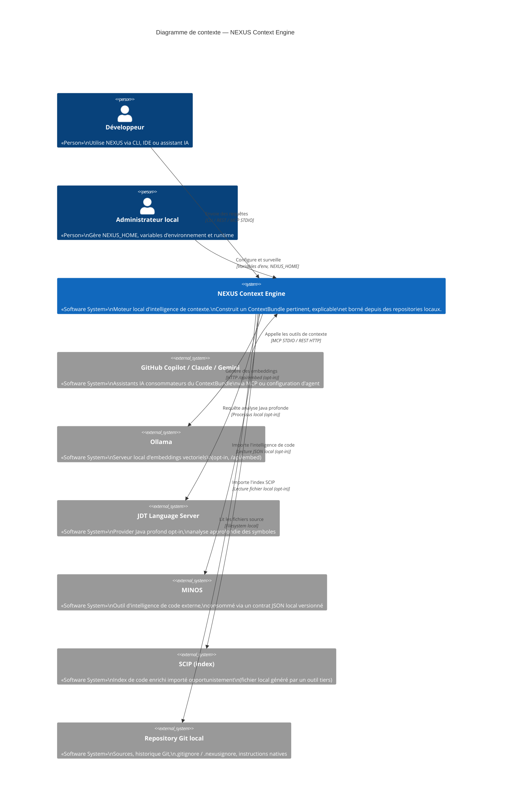

# Section 3 — Contexte et périmètre

## 3.1 Frontière du système

NEXUS Context Engine est un processus local qui :

- **reçoit** des requêtes de contexte ou de recherche (CLI, REST, MCP) ;
- **lit** des repositories de code enregistrés localement ;
- **écrit** dans `NEXUS_HOME` (SQLite + Lucene) ;
- **appelle optionnellement** des services locaux externes (Ollama, JDT LS) ou consomme
  des fichiers locaux fournis par des outils tiers (MINOS JSON, SCIP).

NEXUS ne :

- génère pas de réponses textuelles ;
- route pas de modèles de langage ;
- exécute pas de code utilisateur, de hooks ou de scripts ;
- accède pas à Internet.

## 3.2 Diagramme C4 Niveau 1 — Contexte du système

## 3.3 Acteurs et systèmes externes

### Acteurs humains

| Acteur | Interaction |
|--------|-------------|
| Développeur | CLI directe, configuration d'un assistant IA |
| Administrateur local | Variables d'environnement, NEXUS_HOME, monitoring |

### Systèmes externes

| Système | Couplage | Protocole | Optionnel |
|---------|----------|-----------|-----------|
| Repository Git local | Fort (source de données) | Filesystem | Non |
| GitHub Copilot / Claude / autres assistants | Faible (consommateur) | MCP STDIO ou REST HTTP | Oui |
| Ollama | Faible | HTTP `/api/embed` (batches) | Oui — `NEXUS_SEMANTIC_PROVIDER=ollama` |
| JDT Language Server | Faible | Processus local sous timeout | Oui — `NEXUS_JDTLS_HOME` |
| MINOS | Très faible | Lecture JSON local | Oui — contrat versionné |
| SCIP | Très faible | Lecture fichier local | Oui — import opportuniste |

## 3.4 Interfaces exposées par NEXUS

| Interface | Protocole | Endpoint / Point d'entrée | Authentification |
|-----------|-----------|---------------------------|-----------------|
| CLI | Processus JVM | `com.nexus.cli.NexusCli` (fat JAR) | N/A |
| REST API | HTTP/1.1 JSON | `127.0.0.1:8080/api/v1/` | Bearer token optionnel (H6) |
| MCP STDIO | JSON-RPC 2.0 sur stdin/stdout | `com.nexus.mcp.NexusMcpServer` | N/A (transport local) |
| Métriques | HTTP Prometheus | `/q/metrics` (Quarkus) | N/A |
| Health | HTTP | `/q/health/live`, `/q/health/ready` | N/A |
