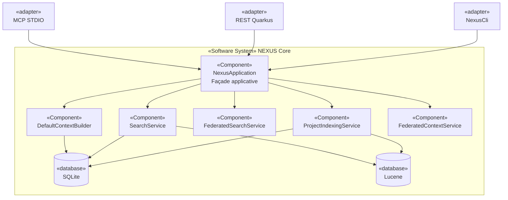

# Section 4 — Stratégie de solution

## 4.1 Principes architecturaux

| Principe | Formulation | ADR |
|----------|-------------|-----|
| **Local-first** | Aucun appel réseau obligatoire ; l'index est entièrement local | ADR-0005 |
| **Ports / adaptateurs** | Le cœur Java n'a aucune dépendance vers Quarkus, MCP ou un IDE | ADR-0003, ADR-0039, ADR-0040 |
| **Source de vérité unique** | SQLite est canonique ; tout autre index est dérivé et reconstructible | ADR-0006, ADR-0022 |
| **Opt-in strict** | Chaque provider externe (Ollama, JDT LS, MINOS, SCIP) doit être activé explicitement | ADR-0005, ADR-0009 |
| **Déterminisme / explicabilité** | Scores, ranking et sélection doivent être reproductibles et auditables | ADR-0010, ADR-0025, ADR-0029 |
| **Budget strict** | Le ContextBundle ne peut jamais dépasser le budget déclaré | ADR-0013, ADR-0027 |
| **Fédération isolée** | Le contexte fédéré multi-projets conserve la provenance et n'étend pas implicitement les sources natives | `docs/architecture.md` Invariant 9 |

## 4.2 Style de décomposition

NEXUS utilise un style **ports / adaptateurs** (Architecture Hexagonale) :

- Le **cœur** (`nexus-context-engine`) contient toute la logique métier : indexation,
  recherche, ranking, construction du contexte et fédération.
- Les **adaptateurs** (REST-Quarkus, MCP-Java, assistant-clients) traduisent les protocoles
  externes vers les opérations du cœur et n'en contiennent aucune logique métier propre.
- `NexusApplication` est le **composition root** partagé par les trois adaptateurs.

## 4.3 Technologies structurantes

| Technologie | Rôle | Optionnel |
|-------------|------|-----------|
| **Java 21** | Langage et runtime | Non |
| **Maven 3.9+** | Build multi-module (reactor) | Non |
| **SQLite (Xerial JDBC)** | Persistance canonique structurelle | Non |
| **Apache Lucene** | Index de recherche lexical dérivé | Non |
| **JavaParser** | Analyse AST Java embarquée | Non |
| **JGit** | Règles .gitignore / .nexusignore, contexte Git | Non |
| **Jackson** | Sérialisation JSON | Non |
| **SnakeYAML-Engine** | Parsing frontmatter YAML (skills, instructions) | Non |
| **Quarkus + JAX-RS** | Adaptateur REST | Oui (module séparé) |
| **MCP Java SDK** | Adaptateur MCP STDIO | Oui (module séparé) |
| **Micrometer + Prometheus** | Métriques REST | Oui (avec l'adaptateur REST) |
| **Ollama HTTP API** | Embeddings sémantiques | Opt-in strict |
| **JDT Language Server** | Analyse Java profonde | Opt-in strict |
| **MINOS** | Intelligence de code enrichie | Opt-in strict |
| **SCIP** | Index de code statique externe | Opt-in opportuniste |

## 4.4 Mécanismes permettant d'atteindre les objectifs qualité

| Objectif | Mécanisme |
|----------|-----------|
| Correctness | Ranking déterministe (`DeterministicContextRanker`), hash SHA-256 pour la détection de changements, transactions SQLite atomiques |
| Fiabilité / Sécurité locale | `ProjectPathGuard`, `SafeFileIO` (`NOFOLLOW_LINKS`), `FileLock` OS par projet, verrou JVM single-flight |
| Indépendance fournisseur | Interfaces `ContextSourceProvider`, `CodeIntelligenceProvider`, `CodeIndexImporter` ; pas d'import Quarkus/MCP dans le cœur |
| Opérabilité | `NexusLivenessCheck` / `NexusReadinessCheck` Quarkus, métriques Micrometer, codes de sortie CLI normalisés |
| Évolutivité | Nouveaux providers ajoutés sans modifier `NexusApplication`, ADR pour chaque décision structurante |

## 4.5 Liens vers les ADR structurants

| Décision | ADR |
|----------|-----|
| Positionnement comme moteur de contexte indépendant | [ADR-0001](../../adr/0001-positionner-nexus-comme-moteur-intelligence-contexte.md) |
| Java 21 | [ADR-0002](../../adr/0002-compiler-le-coeur-en-java-21.md) |
| Cœur sans framework | [ADR-0003](../../adr/0003-conserver-un-coeur-java-sans-framework-applicatif.md) |
| Local-first et opt-in | [ADR-0005](../../adr/0005-adopter-un-fonctionnement-local-first-et-opt-in.md) |
| SQLite canonique | [ADR-0006](../../adr/0006-utiliser-sqlite-comme-source-de-verite-structurelle.md) |
| Lucene dérivé | [ADR-0007](../../adr/0007-utiliser-lucene-comme-index-de-recherche-local.md) |
| Ranking hybride | [ADR-0010](../../adr/0010-adopter-un-ranking-hybride-deterministe-et-explicable.md) |
| ContextBundle sous budget | [ADR-0013](../../adr/0013-construire-un-contextbundle-sous-budget-de-tokens.md) |
| Adaptateur REST Quarkus | [ADR-0039](../../adr/0039-isoler-l-adaptateur-rest-quarkus-du-coeur-nexus.md) |
| Adaptateur MCP STDIO | [ADR-0040](../../adr/0040-exposer-nexus-via-un-adaptateur-mcp-stdio-mince.md) |
| Fédération locale | [ADR-0043](../../adr/0043-federer-la-recherche-locale-par-projet-avant-un-moteur-externe.md) |
