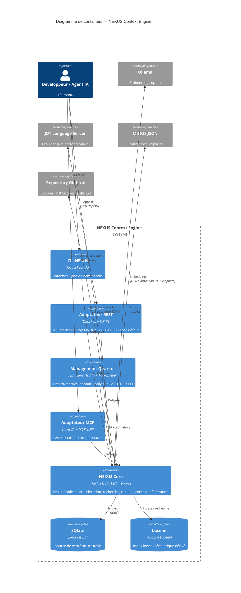
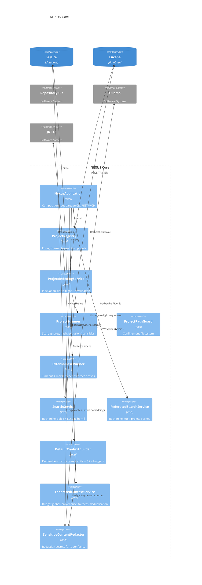
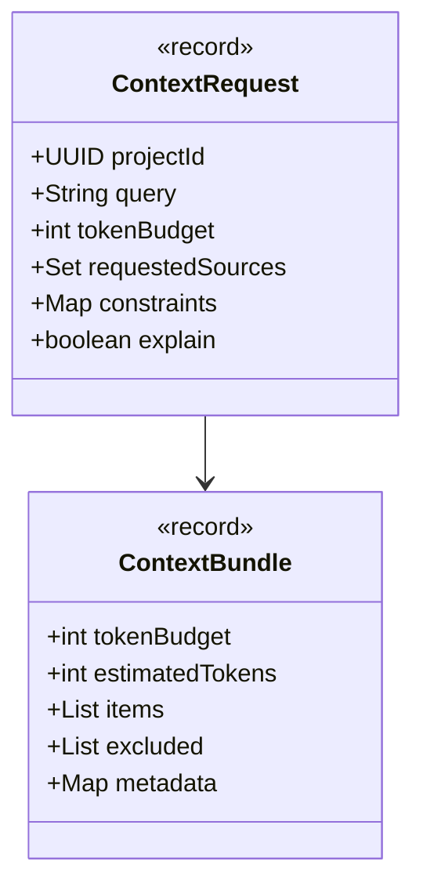
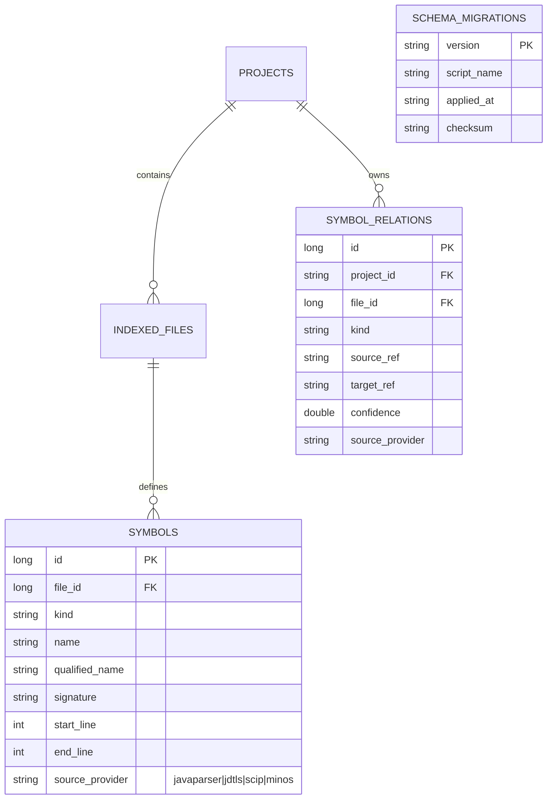

# Section 5 — Vue des blocs (C4 Container et Component)

Cette vue décrit les blocs **courants** de NEXUS 0.2.0.

## 5.1 Containers



Le listener management est séparé du listener applicatif : `/q/*` ne doit pas être exposé par le reverse proxy métier.

## 5.2 Composants du cœur



## 5.3 Modèle de contexte



`constraints` est conservé dans le contrat pour compatibilité, mais **une map non vide est actuellement rejetée** : NEXUS n'ignore jamais silencieusement une contrainte qu'il ne sait pas appliquer.

## 5.4 Persistance SQLite



Depuis V005, `SYMBOLS` impose :

```text
start_line >= 1
end_line >= start_line
```

## 5.5 Frontières de sécurité des blocs

- `ProjectPathGuard` : chemins projet canoniques, traversal/symlinks refusés.
- `NexusPaths` : stockage persistant privé sur POSIX et chemins persistants symboliques durcis refusés.
- `JdtJsonRpcFrameReader` : message 16 MiB, headers 64 KiB, ligne 8 KiB, backlog 256.
- `ExternalTaskRunner` : max 8 workers externes actifs.
- `LuceneSearchIndex` : max 128 termes analysés uniques avant expansion sur cinq champs.
- `SensitiveContentRedactor` : redaction avant embeddings et fragments retournés.
- `NexusRestExposureGuard` / transport policy : exposition API hors loopback fail-closed.
- management Quarkus : loopback-only, distinct du listener API.
