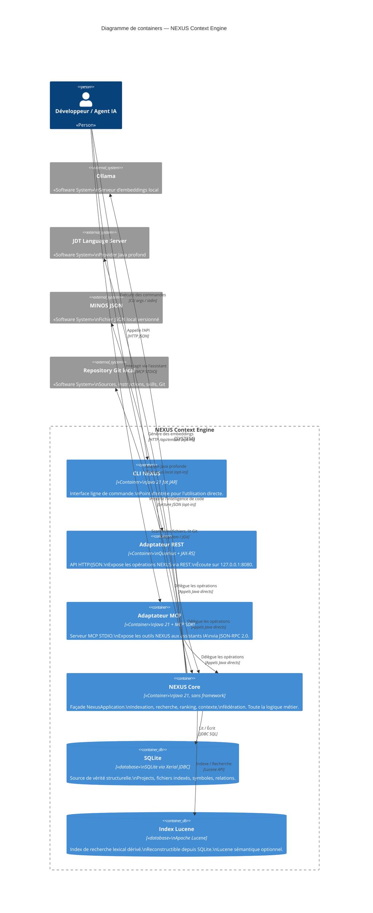
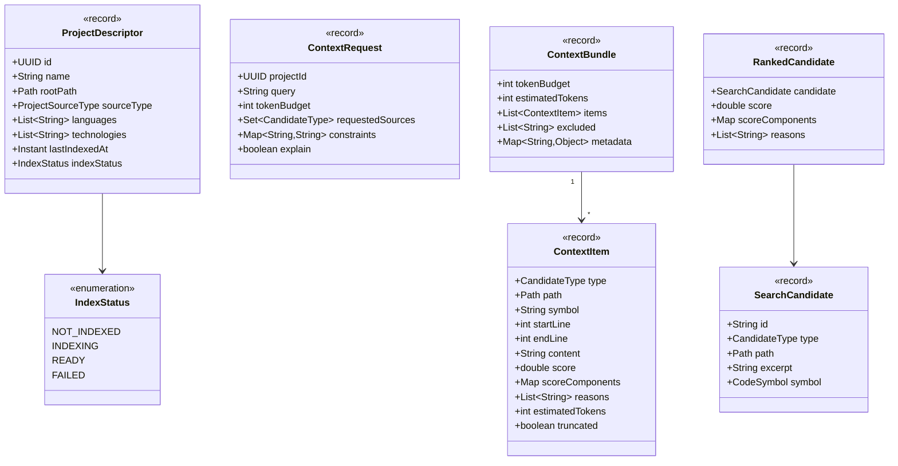
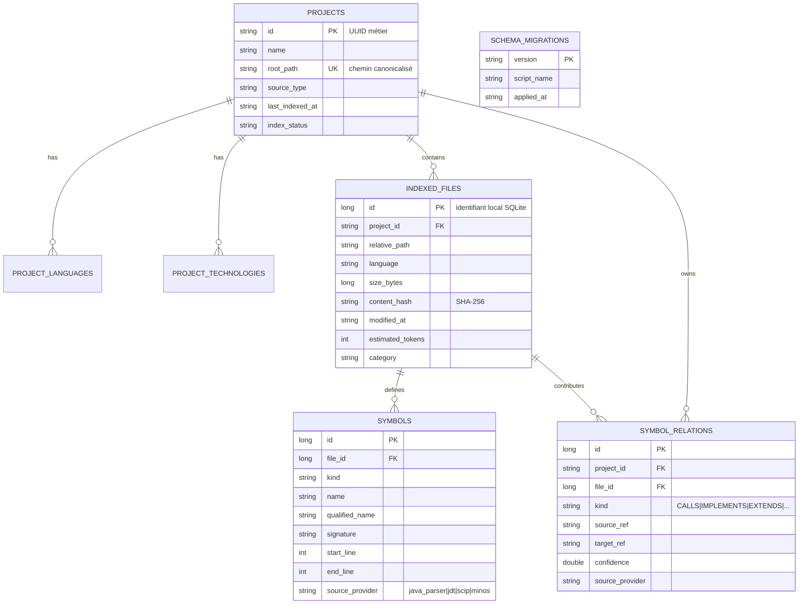

# Section 5 — Vue des blocs (C4 Container et Component)

## 5.1 Diagramme C4 Niveau 2 — Containers

## 5.2 Diagramme C4 Niveau 3 — Composants du NEXUS Core

```mermaid
C4Component
    title Diagramme de composants — NEXUS Core

    Container_Boundary(core, "NEXUS Core") {
        Component(app, "NexusApplication", "«Component»\nJava class", "Composition root et façade.\nInstancie et câble tous les services.\nPartagée par CLI, REST, MCP.")

        Component(registry, "ProjectRegistry", "«Component»\nJava class", "Enregistrement et résolution des projets.\nNormalisation de la racine.")

        Component(indexing, "ProjectIndexingService", "«Component»\nJava class", "Orchestre l'indexation d'un projet.\nSingle-flight par projectId.\nGère l'état NOT_INDEXED → INDEXING → READY|FAILED.")

        Component(scanner, "ProjectScanner", "«Component»\nJava class", "Parcourt le filesystem.\nApplique .gitignore / .nexusignore.\nHash SHA-256, classification FileCategory.")

        Component(analyzers, "LanguageAnalyzers", "«Component»\n«interface»", "JavaParserLanguageAnalyzer, MarkdownLanguageAnalyzer.\nExtension possible via CodeIntelligenceProvider.")

        Component(search, "SearchService", "«Component»\nJava class", "Pipeline de recherche mono-projet.\nFusionne LuceneFileSearchStrategy\net SymbolSearchStrategy.\nEnrichit via graphe et Git.")

        Component(fedSearch, "FederatedSearchService", "«Component»\nJava class", "Recherche multi-projets.\nSur-récupération locale bornée\navant tri global et diversification.")

        Component(contextBuilder, "DefaultContextBuilder", "«Component»\nJava class", "Orchestre : recherche, instructions,\nskills, Git. Applique le budget via\nBudgetedContextSelector.")

        Component(fedContext, "FederatedContextService", "«Component»\nJava class", "Contexte multi-projets.\nBudget global, round-robin,\ndéduplication, provenance.")

        Component(ranker, "ContextRanker", "«Component»\n«interface»", "DeterministicContextRanker (par défaut).\nSemanticHybridContextRanker (opt-in).")

        Component(skills, "SkillDiscoveryService", "«Component»\nJava class", "Agrège LocalAgentSkillsProvider\net AiSkillsRegistryProvider.\nDivulgation progressive.")

        Component(instrProviders, "InstructionProviders", "«Component»\n«interface»", "AgentsMd, Claude, Copilot, Gemini.\nRésolution de scope et applyTo.")

        Component(gitProvider, "LocalGitContextSourceProvider", "«Component»\nJava class", "Contexte Git borné : commits récents,\nfichiers modifiés, message HEAD.")

        Component(lockMgr, "ProjectIndexLockManager", "«Component»\nJava class", "Verrou JVM (ReentrantLock) + FileLock OS.\nSingle-flight inter-processus.")

        Component(pathGuard, "ProjectPathGuard", "«Component»\nJava class", "Confinement filesystem.\nRefuse les liens symboliques hors racine.")
    }

    ContainerDb(sqlite, "SQLite", "«database»")
    ContainerDb(lucene, "Lucene", "«database»")
    System_Ext(repo, "Repository Git", "«Software System»")
    System_Ext(ollama, "Ollama", "«Software System»")

    Rel(app, registry, "Crée / résout")
    Rel(app, indexing, "Lance l'indexation")
    Rel(app, search, "Délègue la recherche")
    Rel(app, fedSearch, "Délègue la recherche fédérée")
    Rel(app, contextBuilder, "Construit le contexte")
    Rel(app, fedContext, "Construit le contexte fédéré")
    Rel(indexing, scanner, "Scanne le filesystem")
    Rel(indexing, analyzers, "Analyse les fichiers")
    Rel(indexing, lockMgr, "Acquiert le verrou")
    Rel(indexing, sqlite, "Persiste l'état", "JDBC")
    Rel(indexing, lucene, "Indexe les documents", "Lucene API")
    Rel(scanner, pathGuard, "Vérifie les chemins")
    Rel(scanner, repo, "Lit les fichiers", "Filesystem / JGit")
    Rel(search, sqlite, "Recherche symboles", "SQL borné")
    Rel(search, lucene, "Recherche lexicale", "Lucene API")
    Rel(contextBuilder, search, "Récupère les candidats")
    Rel(contextBuilder, instrProviders, "Découvre les instructions")
    Rel(contextBuilder, skills, "Découvre et sélectionne les skills")
    Rel(contextBuilder, gitProvider, "Récupère le contexte Git")
    Rel(ranker, ollama, "Embeddings vectoriels", "HTTP (opt-in)")
```

## 5.3 Modèle de domaine — Entités principales

## 5.4 Schéma de données SQLite

## 5.5 Responsabilités par conteneur

| Conteneur | Responsabilité | Interfaces exposées | Dépendances |
|-----------|----------------|---------------------|-------------|
| CLI | Parsing args, formatage humain/JSON, codes de sortie | - | NexusApplication |
| Adaptateur REST | Routing HTTP, DTO, mapping, auth Bearer, health, métriques | REST `/api/v1/` | NexusApplication, Quarkus |
| Adaptateur MCP | Framing JSON-RPC STDIO, tool specifications, sérialisation | MCP tools | NexusApplication, MCP Java SDK |
| NEXUS Core | Indexation, recherche, ranking, contexte, fédération | NexusApplication (façade) | SQLite, Lucene, Filesystem, Providers opt-in |
| SQLite | Persistance structurelle canonique | JDBC SQL | - |
| Lucene | Index lexical / sémantique dérivé | Lucene Query API | SQLite (reconstruction) |
