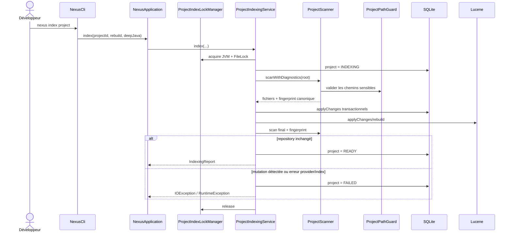
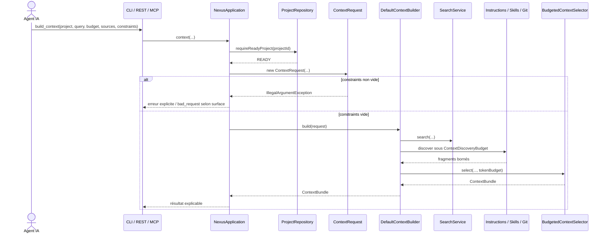
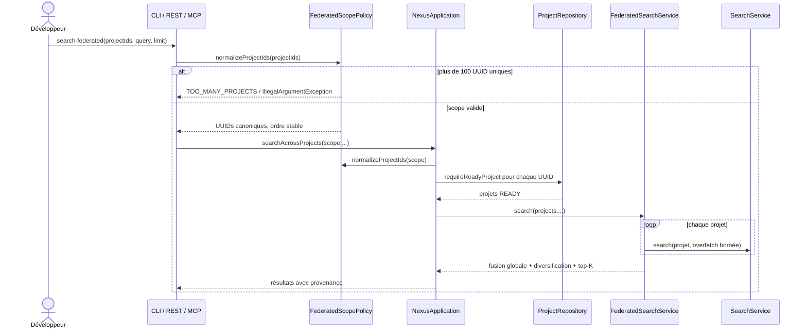
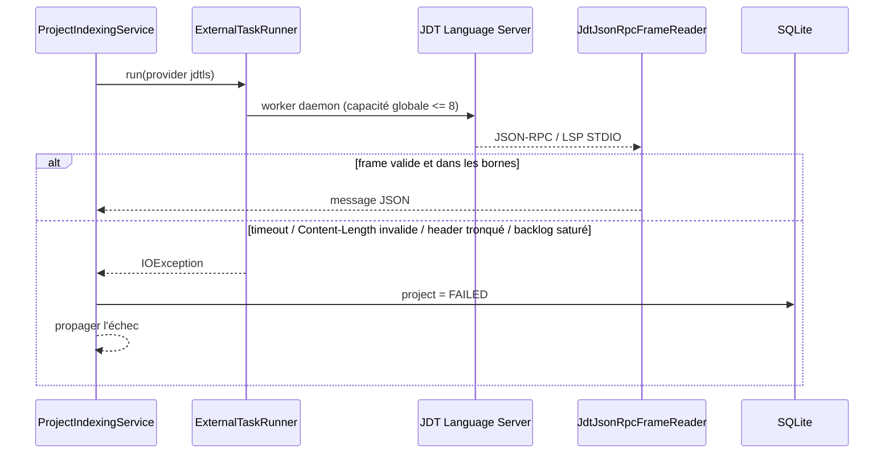
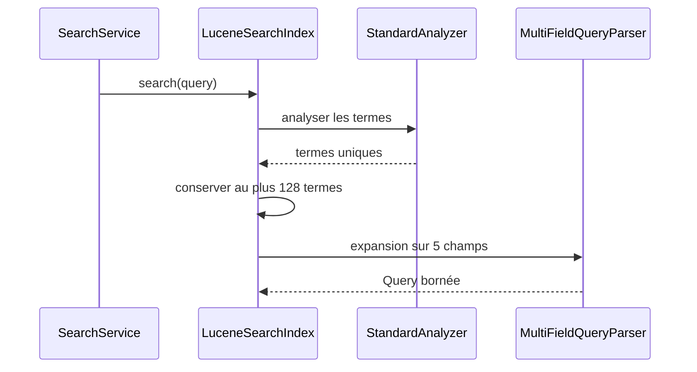
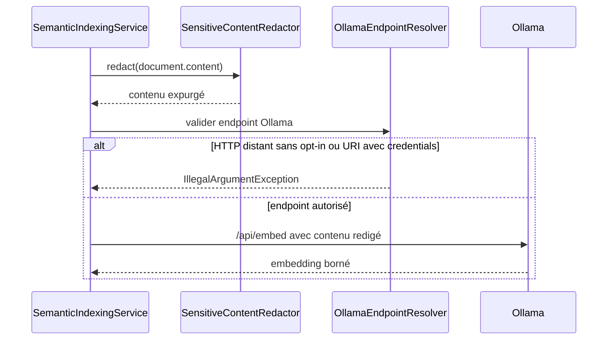
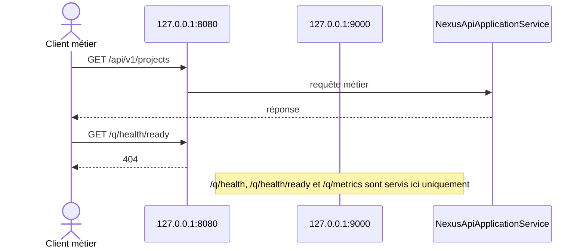
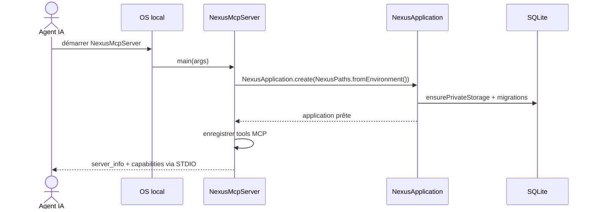

# Section 6 — Vue d'exécution

Les scénarios ci-dessous décrivent le comportement **courant** de NEXUS 0.2.0 et les ordres de validation qui ont une valeur de correctness/sécurité.

## 6.1 Indexation nominale d'un projet



Un projet n'est jamais publié `READY` si le fingerprint canonique final diffère de celui ayant servi à construire les index.

## 6.2 Contexte mono-projet et `constraints`



Le champ `constraints` reste présent pour compatibilité de contrat, mais une contrainte inconnue n'est jamais ignorée silencieusement.

Les contenus de contexte retournés passent par la redaction de secrets à forte confiance avant exposition au client.

## 6.3 Recherche fédérée — fail-fast de cardinalité



La limite de 100 projets uniques est appliquée avant les lookups/readiness coûteux ; un 101e UUID unique ne doit donc pas être masqué par un `PROJECT_NOT_FOUND` ultérieur.

## 6.4 JDT LS — timeout ou framing invalide



Contrairement à une ancienne version de cette documentation, un timeout du provider explicitement demandé n'est **pas** transformé en succès dégradé `READY`. `ProjectIndexingService` marque l'indexation `FAILED` et propage l'erreur. La prochaine indexation d'un état non-READY force le chemin de reconstruction approprié.

Le framing JDT applique avant allocation :

```text
message       <= 16 MiB
headers       <= 64 KiB
header line   <= 8 KiB
pending queue <= 256 messages
```

## 6.5 Recherche Lucene à forte cardinalité



Cette borne évite de dépasser le budget par défaut de clauses Lucene lors de l'expansion multi-champs.

## 6.6 Embedding sémantique et secrets



Un endpoint Ollama distant utilise HTTPS par défaut. HTTP distant exige `NEXUS_ALLOW_INSECURE_REMOTE_OLLAMA=true`.

## 6.7 REST : séparation application / management



Le management listener reste loopback-only et ne doit pas être publié par le reverse proxy métier.

## 6.8 Démarrage du serveur MCP



`stdout` reste réservé au framing MCP JSON-RPC ; les diagnostics utilisent `stderr`.
