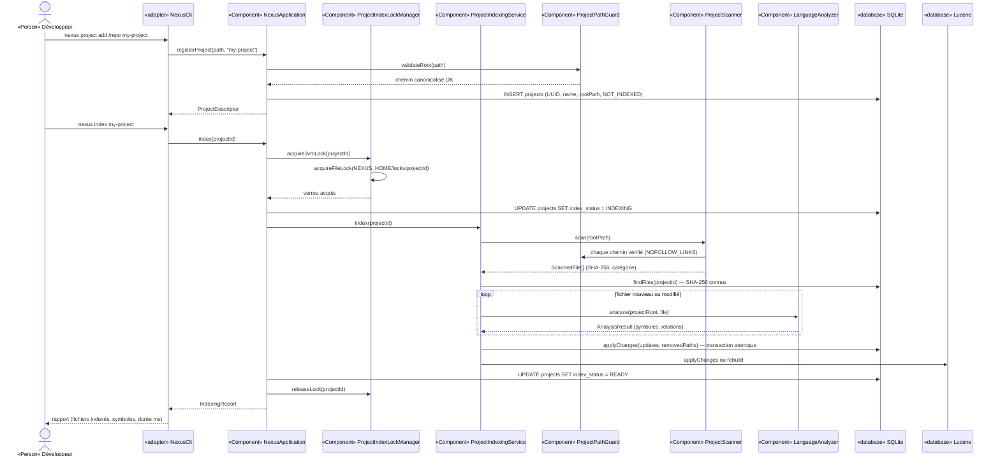
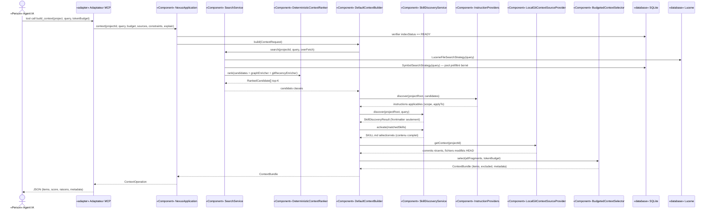
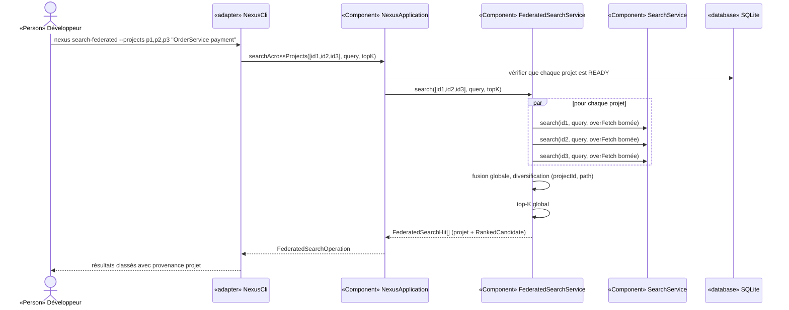
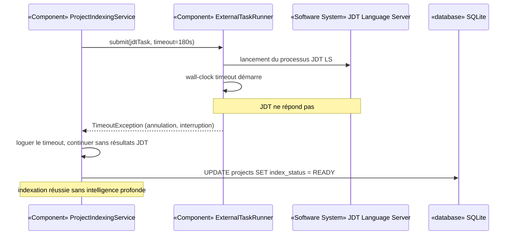
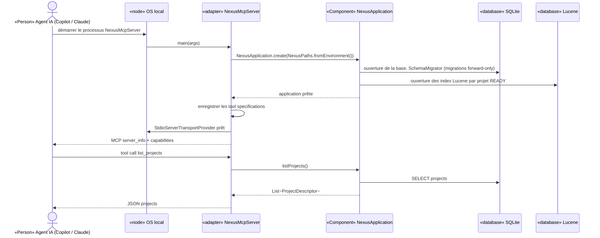

# Section 6 — Vue d'exécution

Les noms des participants correspondent strictement à la Section 5 (vue des blocs).

---

## 6.1 Scénario nominal — Indexation d'un projet

**Stimulus** : l'utilisateur enregistre et indexe un projet Java local via la CLI.

---

## 6.2 Scénario nominal — Construction d'un contexte mono-projet

**Stimulus** : un assistant IA appelle l'outil MCP `build_context` pour une tâche donnée.

---

## 6.3 Scénario nominal — Recherche fédérée multi-projets

**Stimulus** : un développeur recherche une fonctionnalité sur plusieurs projets simultanément.

---

## 6.4 Scénario d'erreur — Indexation en timeout d'un provider JDT

**Stimulus** : le provider JDT Language Server ne répond pas dans le délai configuré.

---

## 6.5 Scénario d'exploitation — Démarrage du serveur MCP

**Stimulus** : un assistant IA lance le serveur MCP NEXUS.

