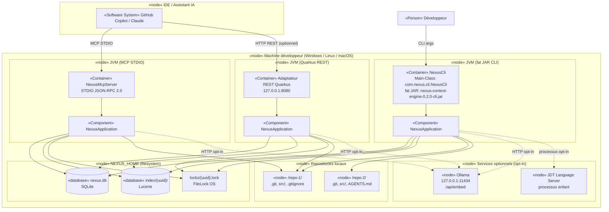
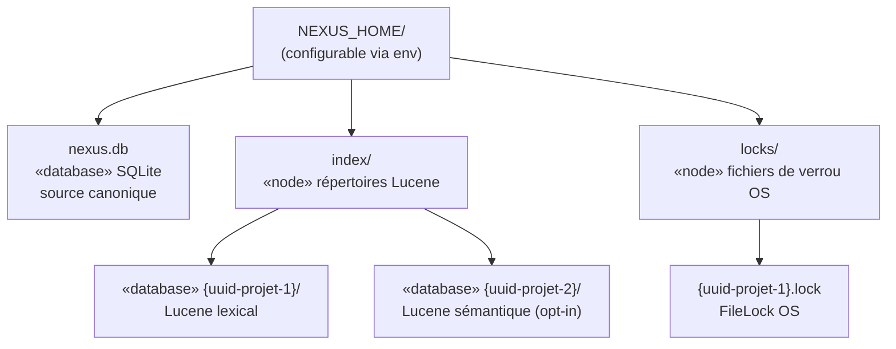

# Section 7 — Vue de déploiement

## 7.1 Environnements

NEXUS est un outil **local-first** : il n'existe pas d'environnement cloud NEXUS.
Les environnements correspondent aux modes d'utilisation sur la machine du développeur.

| Environnement | Description | Cible |
|---------------|-------------|-------|
| **Développement** | Build Maven local, exécution via `mvn exec:java` | Poste développeur |
| **Distribution autonome** | ZIP `nexus-context-engine-0.2.0.zip` avec launchers Windows/POSIX | Utilisateur final |
| **CI / self-smoke** | `mvn clean install` + `scripts/self-smoke.ps1`, `NEXUS_HOME=target/nexus-self-smoke-home` | Pipeline local |
| **Intégration REST** | Adaptateur Quarkus démarré comme service local | Poste avec assistants IDE |
| **Intégration MCP** | Serveur MCP STDIO lancé par l'assistant | Poste avec Copilot/Claude |

## 7.2 Diagramme de déploiement — Vue complète locale

## 7.3 Protocoles et ports

| Protocole | Port / Canal | Direction | Usage |
|-----------|-------------|-----------|-------|
| Filesystem (JGit) | N/A | NEXUS → repos | Lecture des sources et règles d'exclusion |
| JDBC SQLite | N/A (fichier local) | NEXUS ↔ NEXUS_HOME | Persistance canonique |
| Lucene API | N/A (fichier local) | NEXUS ↔ NEXUS_HOME | Index de recherche |
| HTTP JSON | 127.0.0.1:8080 | clients → REST | API NEXUS |
| MCP STDIO JSON-RPC 2.0 | stdin/stdout | IDE ↔ MCP | Outils NEXUS pour assistants |
| HTTP | 127.0.0.1:11434 | NEXUS → Ollama | Embeddings (opt-in) |
| Processus local | IPC/spawn | NEXUS → JDT LS | Intelligence Java profonde (opt-in) |

## 7.4 Distribution — Artefacts

| Artefact | Description | Localisation |
|----------|-------------|-------------|
| `nexus-context-engine-0.2.0-cli.jar` | Fat JAR CLI autonome | `target/` |
| `nexus-context-engine-0.2.0.jar` | JAR bibliothèque (sans dépendances shaded) | `target/` |
| `nexus-context-engine-0.2.0.zip` | ZIP autonome avec launchers Windows/POSIX | `target/distribution/` |
| `*.sha256` | Checksums SHA-256 des artefacts | `target/` |
| `bom.json` | SBOM CycloneDX | `target/sbom/` |

## 7.5 Structure de NEXUS_HOME

## 7.6 Contraintes de déploiement

- NEXUS supporte **Windows, Linux et macOS** (JVM portable).
- `NEXUS_HOME` doit être sur un **filesystem local** — la sémantique d'un FS réseau
  pour les verrous n'est pas qualifiée (H2, `docs/roadmap.md`).
- Le **REST adapter** écoute sur `127.0.0.1` par défaut (sécurité loopback). Un host
  non-loopback sans `NEXUS_REST_API_TOKEN` provoque un fail-fast au bootstrap (H6).
- Le **MCP server** ne doit écrire aucun message applicatif sur `stdout` — ce flux est
  réservé au framing JSON-RPC du SDK MCP.
- Plusieurs instances NEXUS sur le même `NEXUS_HOME` sont protégées par `FileLock` OS,
  mais un FS réseau partagé entre machines n'est **pas** un cas d'usage cible.
