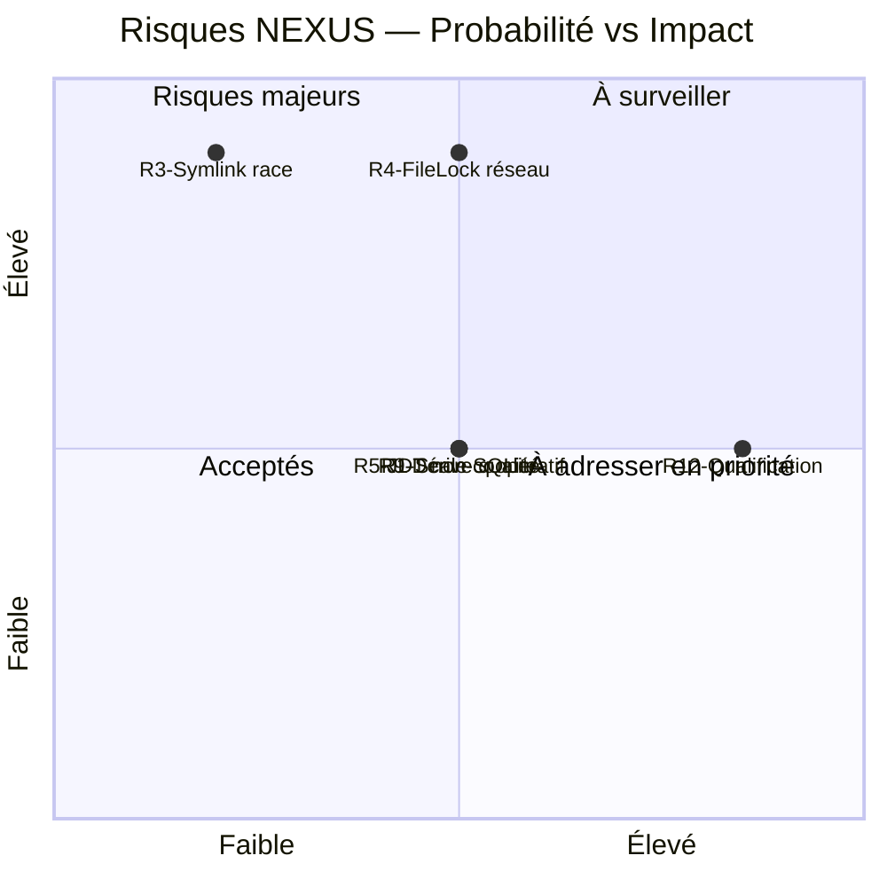

# Registre des risques — NEXUS Context Engine

Ce registre complète la Section 11 de l'arc42. Les risques sont numérotés R1–R12.
Voir [`arc42/11-risques-dette.md`](../arc42/11-risques-dette.md) pour le tableau complet.

## État courant des risques prioritaires

### R12 — Qualification post-Phase 6 non exécutée (**CLÔTURÉ 2026-08-05**)

- **Probabilité** : ~~Élevée~~ → **Mitigée** (gates A–D passées localement sous Windows)
- **Impact** : Moyen
- **Mitigation effective** :
  - Gate A (`.\mvnw.cmd -pl core test`) : 103 tests, 0 failures
  - Gate B (`.\mvnw.cmd -pl adapters/rest-quarkus -am test`) : 3 tests, 0 failures
  - Gate C (`.\mvnw.cmd clean test`) : 111 tests (5 modules), 0 failures
  - Gate D (`.\mvnw.cmd clean install`) : BUILD SUCCESS, 111 tests, 0 failures
  - Self-smoke (`scripts/self-smoke.ps1`) : 13/13 étapes, SELF-SMOKE SUCCESS
  - Fix committé : `e490f1d` — `fix(instructions): propagate project context to hardened file reads`
  - SHA HEAD après push : `f85bf25`
- **Propriétaire** : Propriétaire du projet
- **Date clôture** : 2026-08-05

### R1 — Scale SQLite lexical (WATCH ITEM)

- **Probabilité** : Moyenne
- **Impact** : Moyen
- **Action requise** : Benchmark sur corpus de 10k, 100k, 500k, 1M symboles
  avant toute décision de changer la stratégie (H8, `docs/roadmap.md`).
- **Propriétaire** : Équipe cœur
- **Déclencheur de réexamen** : Dégradation mesurée des temps de réponse > 2×

### R4 — FileLock FS réseau (NON-SUPPORT DOCUMENTÉ)

- **Probabilité** : Moyenne (si déploiement en environnement partagé)
- **Impact** : Élevé (corruption potentielle)
- **Action requise** : Documentation explicite que `NEXUS_HOME` doit être local.
  Ajout d'une vérification au démarrage si techniquement faisable.
- **Propriétaire** : Équipe hardening

## Matrice de priorisation

## Procédure de mise à jour

Ce registre doit être mis à jour :

- après chaque itération ou intégration majeure ;
- lors de la clôture d'un risque (preuve de mitigation effective) ;
- lors de l'identification d'un nouveau risque en revue de code ou d'architecture.
