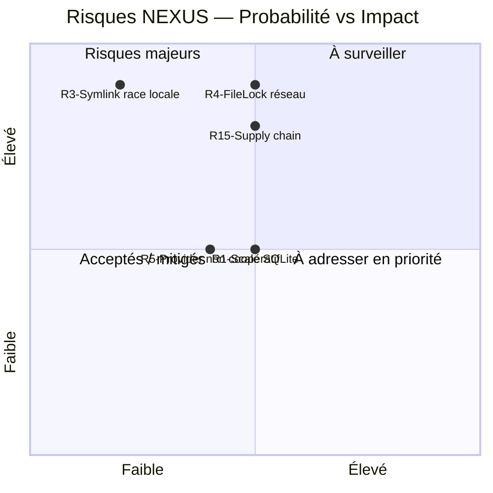

# Registre des risques — NEXUS Context Engine

Ce registre complète la Section 11 de l'arc42. Voir [`arc42/11-risques-dette.md`](../arc42/11-risques-dette.md) pour le contexte architectural détaillé.

## État courant des risques prioritaires

### R12 — Qualification post-Phase 6 non exécutée (**CLÔTURÉ**)

- **Statut** : fermé ; ce risque ne doit plus être présenté comme un gate en attente.
- **Preuves historiques** : gates A–D et self-smoke post-Phase 6 exécutés avec succès en 2026-08-05.
- **Preuve récente** : PR #24, head exact `25c12b100b774a4ec3d69d221675bf31d8ebaa0c`, NEXUS CI run #15 : Windows Java 24 PASS, Linux Java 21 reactor PASS, distribution smoke PASS.
- **Intégration courante** : `main` contient PR #24 via merge commit `c7a03479a78713b78ec2ddc477e1d07d400d8aba`.

Les anciens SHA associés à la branche historique de hardening restent des éléments d'archive et ne représentent plus le HEAD courant.

### R1 — Scale SQLite lexical (WATCH ITEM)

- **Probabilité** : Moyenne
- **Impact** : Moyen
- **Action requise** : benchmark sur corpus de 10k, 100k, 500k et 1M symboles avant toute décision de changer la stratégie ; suivi par l'issue #23.
- **Déclencheur de réexamen** : dégradation mesurée des temps de réponse > 2× ou dépassement d'un SLO défini.
- **Décision courante** : aucun FTS5/trigram/nouveau moteur sans mesure démontrant un bénéfice matériel.

### R4 — `FileLock` sur filesystem réseau (NON-SUPPORT DOCUMENTÉ)

- **Probabilité** : Moyenne si `NEXUS_HOME` est placé sur un stockage partagé/réseau.
- **Impact** : Élevé en cas de sémantique de verrouillage insuffisante.
- **Mitigation actuelle** : le support cible est un `NEXUS_HOME` local ; l'exclusion mutuelle inter-processus combine mutex JVM et `FileLock` OS par projet.
- **Action future possible** : détection/refus explicite au démarrage si une détection portable et fiable devient possible.

### R13 — Intelligence externe obsolète (**CLÔTURÉ par PR #24**)

- **Risque initial** : snapshots JDT/MINOS/autres providers persistés et encore consultables après changement canonique.
- **Mitigation** : changement SOURCE/TEST ⇒ invalidation des snapshots non embarqués persistés, même lorsque le provider n'est plus actif dans le runtime courant.
- **Preuve** : `ExternalCodeIntelligenceInvalidationTest` + qualification exacte-head de PR #24.

### R14 — Index sémantique incompatible (**CLÔTURÉ par PR #24**)

- **Risque initial** : réutilisation de vecteurs construits pour un autre état canonique, provider, modèle, dimension ou profil de contenu.
- **Mitigation** : manifeste de provenance Lucene ; mismatch/absence ⇒ rebuild ; recherche stale refusée avant calcul d'embedding de requête.
- **Preuve** : `SemanticIndexProvenanceIntegrationTest` + qualification exacte-head de PR #24.

### R15 — Supply-chain / obligations tierces (OUVERT — #22)

- **Probabilité** : Moyenne
- **Impact** : Élevé pour une distribution publique.
- **État** : licence propriétaire NEXUS intégrée ; obligations des dépendances à consolider.
- **Actions** : `THIRD_PARTY_NOTICES.md`, politique de vulnérabilités, code scanning, pinning des Actions tierces, conservation SBOM et gate de couverture.

## Matrice de priorisation

## Procédure de mise à jour

Ce registre doit être mis à jour :

- après chaque intégration majeure ;
- lors de la clôture d'un risque avec preuve de mitigation ;
- lors de l'identification d'un nouveau risque en revue de code, sécurité ou architecture ;
- lorsqu'un document de roadmap ou de recovery change une frontière de support.
