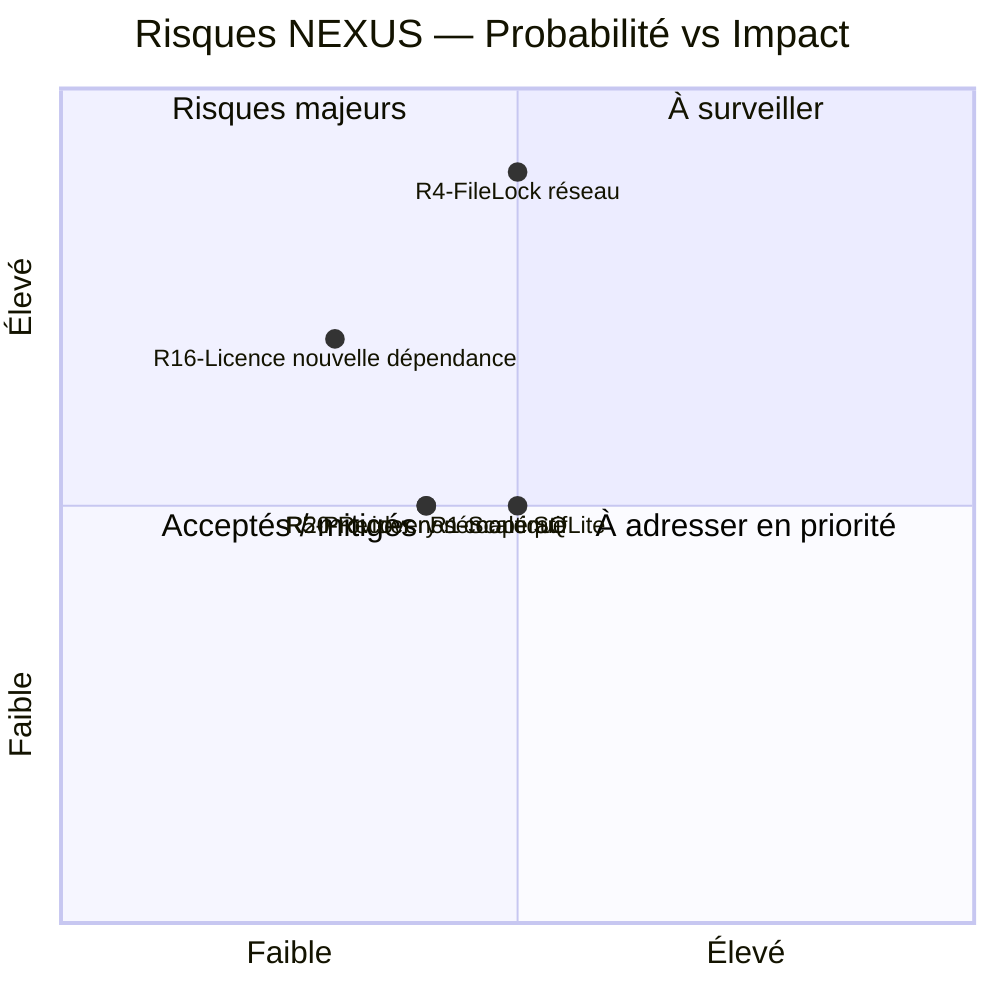

# Registre des risques — NEXUS Context Engine

Ce registre complète la Section 11 de l'arc42. Il décrit les risques **courants** ; les risques historiques clôturés restent référencés avec leur preuve.

## Risques prioritaires

### R1 — Scale SQLite lexical (WATCH ITEM)

- **Statut** : surveillance.
- **Risque** : les recherches `%substring%` peuvent se dégrader sur de très grands corpus.
- **Mitigation** : workflow Scale Benchmark et optimisations locales bornées avant toute introduction de FTS5/trigram/autre moteur.
- **Déclencheur** : dégradation matérielle et reproductible sur corpus représentatif.

### R4 — `FileLock` sur filesystem réseau (NON SUPPORTÉ SANS QUALIFICATION)

- **Statut** : suivi par issue #52.
- **Mitigation actuelle** : `NEXUS_HOME` local pour la garantie inter-processus ; mutex JVM + `FileLock` OS par projet.
- **Extension de support** : nécessite une matrice SMB/NFS et des tests de race/lock dédiés.

### R5 — Provider externe non coopératif (WATCH ITEM)

- **Statut** : issue #51.
- **Risque** : un worker Java tiers qui ignore définitivement l'interruption peut survivre comme daemon après timeout.
- **Mitigation actuelle** : wall-clock borné via `ExternalTaskRunner`.
- **Isolation processus** : uniquement si un cas réel reproductible le justifie.

### R13 — Intelligence externe obsolète (CLÔTURÉ)

- **Mitigation** : changement SOURCE/TEST ⇒ invalidation des snapshots externes persistés concernés.
- **Preuve** : PR #24 puis non-régressions qualifiées par PR #49.

### R14 — Index sémantique incompatible (CLÔTURÉ)

- **Mitigation** : manifeste de provenance Lucene ; mismatch/absence ⇒ rebuild ; recherche stale refusée avant embedding de requête.
- **Preuve** : PR #24, toujours couverte dans la baseline post-audit.

### R15 — Supply-chain / obligations tierces (CLÔTURÉ ET RENFORCÉ)

- **Mitigations** :
  - JaCoCo core 70 % lignes / 50 % branches ;
  - CodeQL Java/Kotlin `security-extended` ;
  - OSV delta PR + scan bloquant du SBOM CycloneDX agrégé du reactor ;
  - Dependabot Maven, GitHub Actions et Docker ;
  - Actions contrôlées épinglées à des SHA immuables ;
  - notices tierces avec `failOnMissing=true` ;
  - SBOM distribué ;
  - Docker Distribution avec Trivy, SBOM image et blocage des HIGH/CRITICAL corrigibles ;
  - attestations de provenance et de SBOM sur les images publiées depuis `main`.
- **Preuve technique actuelle** : PR #49 exact-head qualifiée.

### R16 — Nouvelle dépendance à licence inhabituelle (WATCH ITEM)

- **Statut** : issue #55.
- **Mitigation** : inventaire automatisé + revue juridique explicite des nouvelles licences ou modalités de redistribution inhabituelles.

### R17 — Snapshot d'indexation publié après mutation concurrente (CLÔTURÉ)

- **Mitigation** : revalidation du snapshot canonique avant publication ; mutation détectée ⇒ échec fail-closed.
- **Preuve** : issue #48 / PR #49.

### R18 — Exposition REST distante insuffisamment contrainte (CLÔTURÉ)

- **Mitigation** : token robuste, allowlist de racines, mode d'exposition explicite, modes HTTPS requis ; `loopback-forward` limité au runtime Docker publié sur loopback.
- **Preuve** : issue #48 / PR #49.

### R19 — Coût de graphe/contexte fédéré non borné (CLÔTURÉ)

- **Mitigation** : projections SQL bornées pour le graphe et budget de travail distinct pour le contexte fédéré.
- **Preuve** : issue #48 / PR #49 + Scale Benchmark.

### R20 — Recovery sémantique opérationnel incomplet (WATCH ITEM)

- **Statut** : issue #54.
- **Risque** : indisponibilité Ollama ou corruption physique Lucene nécessitant diagnostics/recovery explicites.

## Matrice de priorisation



## Preuves récentes

PR #49 :

```text
QUALIFIED_HEAD=4f04c1ad3ff5b41aa9d1892ade57ad62b90a43f9
MERGE_SHA=c1ff9ef03ef33097c0d51154e02c30109b0a46f1
```

NEXUS CI, Scale Benchmark, Windows Installer, Docker Distribution, CodeQL et OSV-Scanner : PASS.

PR #61 :

```text
QUALIFIED_HEAD=ba91be044a600d2396e0939fc154848dc47f6310
MERGE_SHA=660ca9f07a23950d2a5284605531524372331bc5
```

NEXUS CI, CodeQL et OSV-Scanner : PASS.

## Procédure de mise à jour

Mettre à jour ce registre après chaque intégration majeure, clôture de risque, changement de frontière de support ou nouvelle dette opérationnelle significative.
