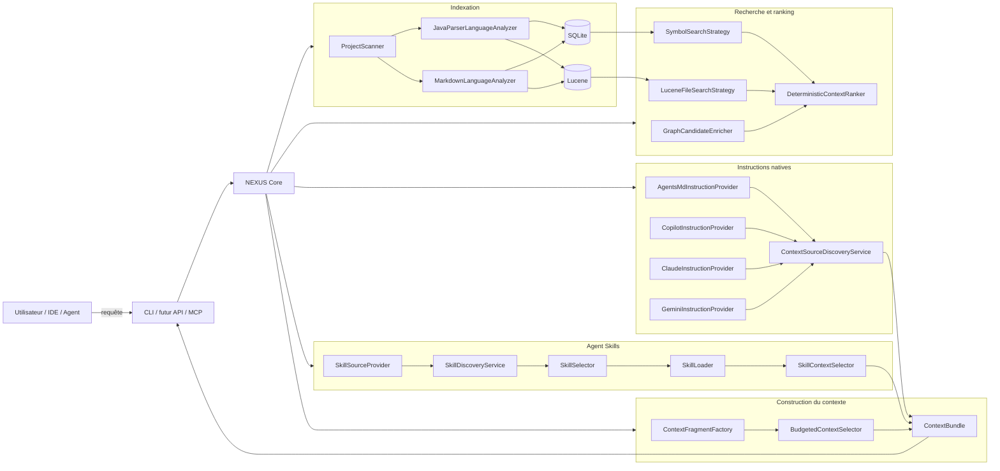
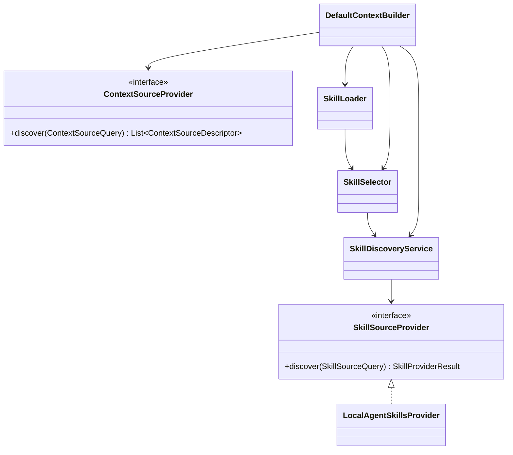

# Guide développeur NEXUS

Ce répertoire explique **comment NEXUS est réellement implémenté**, pourquoi les composants existent, comment ils collaborent et comment reproduire le comportement localement.

L'objectif est qu'un développeur découvrant le repository puisse :

1. comprendre la mission et les frontières de NEXUS ;
2. suivre un fichier depuis le scan jusqu'à SQLite et Lucene ;
3. comprendre comment une requête devient un classement explicable ;
4. comprendre comment ce classement devient un `ContextBundle` sous budget ;
5. comprendre comment NEXUS réutilise les instructions déjà présentes dans un projet ;
6. comprendre comment les Agent Skills sont découverts puis chargés progressivement ;
7. reproduire les scénarios depuis la CLI et les tests ;
8. modifier une brique sans casser les principes architecturaux.

> **Important** : `docs/architecture.md` décrit l'architecture courante à haut niveau. Les ADR sous `docs/adr/` conservent les décisions et leurs alternatives. Le présent guide décrit **l'implémentation concrète** et ses flux d'exécution.

## Parcours de lecture recommandé

| Chapitre | Ce que vous apprendrez |
|---|---|
| [1. Architecture d'implémentation](architecture-implementation.md) | packages, couches, dépendances, principaux contrats et classes |
| [2. Indexation locale](indexing-pipeline.md) | scan, ignore rules, SHA-256, JavaParser, SQLite, Lucene, incrémental |
| [3. Recherche et ranking](search-ranking.md) | BM25, recherche de symboles, graphe, fusion, score explicable |
| [4. Construction du contexte](context-building.md) | fragments, fusion, tokens, sélection sous budget, `ContextBundle` |
| [5. Reproduire et déboguer](reproduce-and-debug.md) | build, CLI, self-smoke, données locales, scénarios de diagnostic |
| [6. CLI du MVP](cli-mvp.md) | contrat humain/JSON, codes de sortie, JAR autonome, launchers Windows, métriques |
| [7. Contexte natif des projets](native-context-sources.md) | `AGENTS.md`, Copilot, Claude, Gemini, documentation et configurations existantes |
| [8. Agent Skills](agent-skills.md) | `SKILL.md`, catalogue léger, sélection, activation, ressources, sécurité et budget |

## Vue d'ensemble actuelle



## Position de NEXUS

NEXUS n'est ni un chatbot, ni un LLM, ni un orchestrateur généraliste.

```text
Repository + demande + budget
          │
          ▼
        NEXUS
          │
          ├── code / symboles / tests
          ├── documentation pertinente
          ├── instructions natives applicables
          ├── skills pertinents activés progressivement
          └── métadonnées de configuration détectées
          │
          ▼
     ContextBundle
          │
          ▼
 LLM / Agent consommateur
```

Le choix du modèle et l'exécution des agents, hooks, MCP ou scripts de skills restent hors du cœur.

## État d'implémentation

### Itération 0 — Socle

Validée : Java 21, Maven, contrats principaux, JavaParser et architecture sans framework applicatif obligatoire dans le cœur.

### Itération 1 — Indexation locale

Validée : registre de projets, `NEXUS_HOME`, scanner, `.gitignore` / `.nexusignore`, SHA-256, SQLite, migrations, Lucene et indexation incrémentale.

### Itération 2 — Recherche et ranking

Validée : BM25 multi-champs, recherche exacte/fuzzy de symboles, fusion, graphe d'imports, ranking déterministe, explications, `precision@K` et `recall@K`.

### Itération 3 — Construction du contexte

Validée localement le 19 juillet 2026 :

- fragments symboliques ;
- fusion ;
- sélection sous budget ;
- troncatures explicables ;
- 13 tests verts ;
- self-smoke : 3 items, 178/180 tokens, réduction d'environ 96,49 %.

### Itération 4 — CLI utilisable pour le MVP

Validée localement le 19 juillet 2026 :

- sortie humaine et JSON ;
- codes de sortie `0`, `1`, `2` ;
- JAR autonome ;
- launchers Windows ;
- 16 tests verts ;
- `mean precision@3 = 0,4444`, `mean recall@3 = 1,0000` ;
- résultat `SELF-SMOKE SUCCESS`.

Cette validation clôt la Phase 1 et valide le MVP du moteur.

### Itération 5 — Instructions et documentation

Validée localement le 20 juillet 2026 :

- Markdown indexé comme documentation ;
- providers AGENTS, Copilot, Claude et Gemini ;
- scopes repository/répertoire/glob ;
- références `@fichier` sécurisées ;
- déduplication inter-provider et inter-source ;
- budget d'instructions ;
- 19 tests verts ;
- 145 fichiers, 406 symboles, 781 relations ;
- contexte strict : 172/180 tokens ;
- contexte multi-source : 1 185/1 200 tokens ;
- résultat `SELF-SMOKE SUCCESS`.

### Itération 6 — Skills et divulgation progressive

Validée localement le 20 juillet 2026 :

- ADR-0034 ;
- port `SkillSourceProvider` ;
- `LocalAgentSkillsProvider` ;
- racines `.agents/skills`, `.github/skills`, `.claude/skills` ;
- parsing YAML 1.2 du frontmatter avec SnakeYAML Engine ;
- `SkillDescriptor` sans corps Markdown complet ;
- validation `name` / `description` ;
- inventaire léger des ressources ;
- `SkillDiscoveryService` et déduplication par nom ;
- `SkillSelector` déterministe sur `name` + `description` ;
- `SkillLoader` appelé uniquement après sélection ;
- `SkillContextSelector` sans troncature ;
- type `CandidateType.SKILL` ;
- isolation de tout le sous-arbre des skills hors de la recherche Lucene générique ;
- budget skill dédié ;
- métadonnées de découverte, matching, activation et ressources ;
- `skillsExecuted=false` par conception ;
- dogfooding avec `.agents/skills/nexus-context-validation` ;
- 100 fichiers source compilés ;
- 17 fichiers de test compilés ;
- 26 tests verts ;
- baseline conservée : `mean precision@3 = 0,4444`, `mean recall@3 = 1,0000` ;
- index : 170 fichiers, 480 symboles, 926 relations ;
- indexation complète : 1 218 ms ;
- indexation incrémentale : 282 ms avec 0 changement ;
- recherche : 282 ms ;
- contexte strict : 5 items, 180/180 tokens, 454 ms ;
- contexte multi-source : 9 items, 1 185/1 200 tokens, 449 ms ;
- contexte avec skill : 1 194/1 200 tokens, 550 ms ;
- skill `nexus-context-validation` sélectionné intégralement : 233 tokens, non tronqué ;
- 1 ressource inventoriée mais non chargée automatiquement ;
- `skillsExecuted = false` ;
- résultat `SELF-SMOKE SUCCESS`.

Le critère de sortie est validé : NEXUS sait recommander et inclure un skill pertinent sans charger tous les skills ni exécuter de script. Le chapitre [Agent Skills](agent-skills.md) décrit l'implémentation complète.

La prochaine cible est l'**Itération 7 — Contexte Git**.

## Principes à respecter en contribuant

### 1. Le cœur ne dépend pas des clients

Copilot, Claude, MCP, Quarkus, JARVIS ou un registre externe ne doivent pas contaminer les contrats métier.

### 2. Les conventions natives restent dans les providers

Les chemins et formats spécifiques restent dans leurs adaptateurs.

### 3. Découverte d'un skill ne signifie pas chargement complet

`SkillDescriptor` ne doit pas contenir le corps du `SKILL.md`.

### 4. Sélection avant activation

Le `SkillLoader` ne doit recevoir que des `SkillMatch` déjà sélectionnés.

### 5. NEXUS ne doit jamais exécuter un skill

Les scripts et outils déclarés restent sous le contrôle du consommateur.

### 6. SQLite est canonique, Lucene est dérivé

Une perte de l'index Lucene doit rester reconstructible.

### 7. Toute sélection doit être explicable

Scores, instructions, skills et exclusions doivent provenir de règles inspectables.

### 8. Le budget appartient au moteur

Le bundle final ne doit jamais dépasser le budget demandé.

### 9. Une décision structurante implique un ADR

Avant de modifier stockage, scoring, protocole ou stratégie de contexte, vérifier si un nouvel ADR est nécessaire.

## Repères dans le code

```text
src/main/java/com/nexus/
├── cli/
├── config/
├── context/
│   └── source/
│       ├── instruction/     Providers AGENTS / Copilot / Claude / Gemini
│       └── skill/           Catalogue, sélection et activation Agent Skills
├── index/
│   ├── java/
│   ├── markdown/
│   └── scan/
├── persistence/sqlite/
├── project/
├── ranking/
├── search/
│   ├── evaluation/
│   └── lucene/
└── token/
```

## UML simplifié des ports de sources



## Validation locale de référence

```powershell
git pull --ff-only
mvn clean install
.\scripts\self-smoke.ps1 -KeepData
```

Le self-smoke comporte 12 étapes et valide notamment :

```text
Java + Markdown indexés
    ↓
instructions natives sélectionnées
    ↓
contexte multi-source
    ↓
Agent Skill découvert par métadonnées
    ↓
Skill pertinent sélectionné
    ↓
SKILL.md complet chargé après sélection
    ↓
référence du skill non chargée automatiquement
    ↓
skillsExecuted = false
    ↓
SELF-SMOKE SUCCESS
```

Commande de reproduction ciblée :

```powershell
.\scripts\nexus.ps1 context nexus-local "validate NEXUS context quality progressive disclosure" --budget 1200 --explain --json
```
