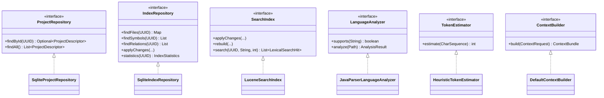

# Guide développeur NEXUS

Ce répertoire explique **comment NEXUS est réellement implémenté**, pourquoi les composants existent, comment ils collaborent et comment reproduire le comportement localement.

L'objectif est qu'un développeur découvrant le repository puisse :

1. comprendre la mission et les frontières de NEXUS ;
2. suivre un fichier depuis le scan jusqu'à SQLite et Lucene ;
3. comprendre comment une requête devient un classement explicable ;
4. comprendre comment ce classement devient un `ContextBundle` sous budget ;
5. reproduire les scénarios depuis la CLI et les tests ;
6. modifier une brique sans casser les principes architecturaux.

> **Important** : `docs/architecture.md` décrit l'architecture cible et courante à haut niveau. Les ADR sous `docs/adr/` conservent les décisions et leurs alternatives. Le présent guide décrit **l'implémentation concrète** et ses flux d'exécution.

## Parcours de lecture recommandé

| Chapitre | Ce que vous apprendrez |
|---|---|
| [1. Architecture d'implémentation](architecture-implementation.md) | packages, couches, dépendances, principaux contrats et classes |
| [2. Indexation locale](indexing-pipeline.md) | scan, ignore rules, SHA-256, JavaParser, SQLite, Lucene, incrémental |
| [3. Recherche et ranking](search-ranking.md) | BM25, recherche de symboles, graphe, fusion, score explicable |
| [4. Construction du contexte](context-building.md) | fragments, fusion, tokens, sélection sous budget, `ContextBundle` |
| [5. Reproduire et déboguer](reproduce-and-debug.md) | build, CLI, self-smoke, données locales, scénarios de diagnostic |

## Vue d'ensemble

```mermaid
flowchart LR
    U[Utilisateur / IDE / Agent] -->|requête| CLI[CLI / futur API / MCP]
    CLI --> CORE[NEXUS Core]

    subgraph INDEXATION[Indexation]
        SCAN[ProjectScanner]
        AST[JavaParserLanguageAnalyzer]
        SQL[(SQLite)]
        LUCENE[(Lucene)]
        SCAN --> AST
        AST --> SQL
        AST --> LUCENE
    end

    subgraph SEARCH[Recherche et ranking]
        LEX[LuceneFileSearchStrategy]
        SYM[SymbolSearchStrategy]
        MERGE[CandidateMerger]
        GRAPH[GraphCandidateEnricher]
        RANK[DeterministicContextRanker]
        LEX --> MERGE
        SYM --> MERGE
        MERGE --> GRAPH
        GRAPH --> RANK
    end

    subgraph CONTEXT[Construction du contexte]
        FACTORY[ContextFragmentFactory]
        FMERGE[FragmentMerger]
        BUDGET[BudgetedContextSelector]
        BUNDLE[ContextBundle]
        FACTORY --> FMERGE
        FMERGE --> BUDGET
        BUDGET --> BUNDLE
    end

    CORE --> INDEXATION
    SQL --> SYM
    SQL --> GRAPH
    LUCENE --> LEX
    CORE --> SEARCH
    RANK --> FACTORY
    CORE --> CONTEXT
    BUNDLE --> CLI
```



## Position de NEXUS

NEXUS n'est ni un chatbot, ni un LLM, ni un orchestrateur généraliste.

Son contrat conceptuel est :

```text
Repository + demande utilisateur + contraintes de budget
                         │
                         ▼
                       NEXUS
                         │
                         ▼
                   ContextBundle
                         │
                         ▼
              LLM / Agent consommateur
```

NEXUS répond à la question :

> **Quelles informations dois-je fournir au consommateur IA pour cette demande précise, dans quel ordre, et pourquoi ?**

Le choix du modèle, l'exécution d'un agent et la génération de la réponse finale restent hors du cœur.

## État d'implémentation couvert par ce guide

### Itération 0 — Socle

Validée :

- Java 21 ;
- Maven ;
- contrats principaux ;
- JavaParser ;
- architecture sans framework applicatif dans le cœur.

### Itération 1 — Indexation locale

Validée :

- registre de projets ;
- `NEXUS_HOME` ;
- scanner ;
- `.gitignore` / `.nexusignore` ;
- SHA-256 ;
- SQLite ;
- migrations ;
- Lucene ;
- indexation incrémentale.

### Itération 2 — Recherche et ranking

Validée :

- BM25 multi-champs ;
- recherche de symboles exacte et fuzzy ;
- fusion des candidats ;
- graphe minimal d'imports ;
- ranking pondéré déterministe ;
- explication du score ;
- `precision@K` et `recall@K`.

### Itération 3 — Construction du contexte

Implémentation initiale présente, validation locale à effectuer après récupération des derniers commits :

- `HeuristicTokenEstimator` ;
- `ContextFragmentFactory` ;
- `FragmentMerger` ;
- `BudgetedContextSelector` ;
- `DefaultContextBuilder` ;
- commande CLI `context` ;
- self-smoke étendu au `ContextBundle`.

## Principes à respecter en contribuant

### 1. Le cœur ne dépend pas des clients

Les classes métier ne doivent pas dépendre de Copilot, Claude, MCP, Quarkus ou d'un SDK LLM.

### 2. SQLite est canonique, Lucene est dérivé

Une perte de l'index Lucene doit être récupérable par reconstruction.

### 3. Toute sélection doit être explicable

Un score ou une exclusion doit provenir d'une règle mesurable, pas d'un texte justificatif généré après coup.

### 4. Le budget appartient au moteur

Le consommateur fournit un budget ; NEXUS construit un bundle qui ne dépasse pas ce budget selon le `TokenEstimator` actif.

### 5. Les dépendances lourdes restent derrière des ports

Exemples :

- `SearchIndex` masque Lucene ;
- `IndexRepository` masque SQLite ;
- `LanguageAnalyzer` masque JavaParser ;
- `TokenEstimator` masque la stratégie de comptage.

### 6. Une décision structurante implique un ADR

Avant de modifier une décision durable — stockage, scoring, protocole, modèle de données, stratégie de contexte — vérifier si un nouvel ADR est nécessaire.

## Repères dans le code

```text
src/main/java/io/github/fturleque/nexus/
├── cli/             Adaptateur CLI
├── config/          Résolution NEXUS_HOME et chemins locaux
├── context/         Construction du ContextBundle
├── index/           Modèles et pipeline d'indexation
│   ├── java/        Analyse Java via JavaParser
│   └── scan/        Parcours filesystem et ignore rules
├── persistence/
│   └── sqlite/      Adaptateurs SQLite et migrations
├── project/         Registre et modèle des projets
├── ranking/         Score déterministe et graphe
├── search/          Stratégies de recherche et fusion
│   ├── evaluation/  Métriques de qualité
│   └── lucene/      Adaptateur Lucene
└── token/           Estimation de tokens
```

## Diagramme UML simplifié des contrats principaux



## Commandes minimales

```powershell
git pull --ff-only
mvn clean install
.\scripts\self-smoke.ps1 -KeepData
```

Pour utiliser la CLI via Maven :

```powershell
mvn -q exec:java "-Dexec.args=project add . nexus-local"
mvn -q exec:java "-Dexec.args=index nexus-local"
mvn -q exec:java "-Dexec.args=search nexus-local ProjectIndexingService --limit 5 --explain"
mvn -q exec:java "-Dexec.args=context nexus-local ProjectIndexingService --budget 500 --explain"
```

Les chapitres suivants détaillent exactement ce qui se passe derrière chacune de ces commandes.
