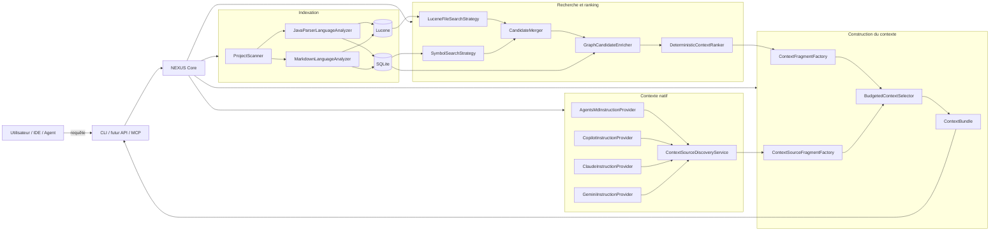
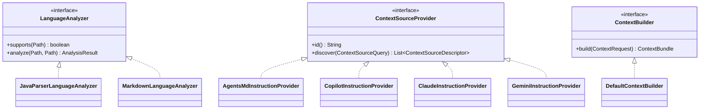

# Guide développeur NEXUS

Ce répertoire explique **comment NEXUS est réellement implémenté**, pourquoi les composants existent, comment ils collaborent et comment reproduire le comportement localement.

L'objectif est qu'un développeur découvrant le repository puisse :

1. comprendre la mission et les frontières de NEXUS ;
2. suivre un fichier depuis le scan jusqu'à SQLite et Lucene ;
3. comprendre comment une requête devient un classement explicable ;
4. comprendre comment ce classement devient un `ContextBundle` sous budget ;
5. comprendre comment NEXUS réutilise les instructions et configurations déjà présentes dans un projet ;
6. reproduire les scénarios depuis la CLI et les tests ;
7. modifier une brique sans casser les principes architecturaux.

> **Important** : `docs/architecture.md` décrit l'architecture courante à haut niveau. Les ADR sous `docs/adr/` conservent les décisions et leurs alternatives. Le présent guide décrit **l'implémentation concrète** et ses flux d'exécution.

## Parcours de lecture recommandé

| Chapitre | Ce que vous apprendrez |
|---|---|
| [1. Architecture d'implémentation](architecture-implementation.md) | packages, couches, dépendances, principaux contrats et classes |
| [2. Indexation locale](indexing-pipeline.md) | scan, ignore rules, SHA-256, JavaParser, SQLite, Lucene, incrémental |
| [3. Recherche et ranking](search-ranking.md) | BM25, recherche de symboles, graphe, fusion, score explicable |
| [4. Construction du contexte](context-building.md) | fragments, fusion, tokens, sélection sous budget, `ContextBundle` |
| [5. Reproduire et déboguer](reproduce-and-debug.md) | build, CLI, self-smoke, données locales, scénarios de diagnostic |
| [6. CLI du MVP](cli-mvp.md) | contrat humain/JSON, codes de sortie, JAR autonome, launchers Windows, métriques |
| [7. Contexte natif des projets](native-context-sources.md) | `AGENTS.md`, Copilot, Claude, Gemini, documentation, profils d'agents, skills et configurations existantes |

## Vue d'ensemble actuelle



## Position de NEXUS

NEXUS n'est ni un chatbot, ni un LLM, ni un orchestrateur généraliste.

```text
Repository + demande utilisateur + contraintes de budget
                         │
                         ▼
                       NEXUS
                         │
                         ├── code / symboles / tests
                         ├── documentation pertinente
                         ├── instructions natives applicables
                         └── métadonnées de configurations détectées
                         │
                         ▼
                   ContextBundle
                         │
                         ▼
              LLM / Agent consommateur
```

NEXUS répond à la question :

> **Quelles informations dois-je fournir au consommateur IA pour cette demande précise, dans quel ordre, sous quel budget, et pourquoi ?**

Le choix du modèle, l'exécution d'un agent, d'un hook, d'un serveur MCP ou d'un skill restent hors du cœur.

## État d'implémentation

### Itération 0 — Socle

Validée : Java 21, Maven, contrats principaux, JavaParser et architecture sans framework applicatif obligatoire dans le cœur.

### Itération 1 — Indexation locale

Validée : registre de projets, `NEXUS_HOME`, scanner, `.gitignore` / `.nexusignore`, SHA-256, SQLite, migrations, Lucene et indexation incrémentale.

### Itération 2 — Recherche et ranking

Validée : BM25 multi-champs, recherche exacte/fuzzy de symboles, fusion, graphe d'imports, ranking déterministe, explications, `precision@K` et `recall@K`.

### Itération 3 — Construction du contexte

Validée localement le 19 juillet 2026 :

- `ContextFragmentFactory` ;
- `FragmentMerger` ;
- `BudgetedContextSelector` ;
- `DefaultContextBuilder` ;
- budget strict et troncatures explicables ;
- 13 tests verts lors de la validation ;
- self-smoke : 3 items, 178/180 tokens estimés, réduction d'environ 96,49 %.

### Itération 4 — CLI utilisable pour le MVP

Validée localement le 19 juillet 2026 :

- sortie humaine et JSON ;
- codes de sortie `0`, `1`, `2` ;
- JAR autonome `*-cli.jar` ;
- launchers Windows ;
- 16 tests verts lors de la validation ;
- baseline qualité : `mean precision@3 = 0,4444`, `mean recall@3 = 1,0000` ;
- self-smoke : 77 fichiers, 322 symboles, 599 relations ;
- indexation complète 896 ms, incrémentale 232 ms ;
- recherche 254 ms ;
- contexte 285 ms ;
- résultat `SELF-SMOKE SUCCESS`.

Cette validation clôt la **Phase 1 — validation du moteur NEXUS** et valide le MVP du moteur.

### Itération 5 — Instructions et documentation

**En cours — validation locale à effectuer.**

Implémentation actuelle :

- scan et indexation des fichiers Markdown ;
- `MarkdownLanguageAnalyzer` ;
- catégorie `DOCUMENTATION` pour le Markdown ordinaire ;
- catégories séparées `INSTRUCTION`, `AGENT_PROFILE` et `SKILL` ;
- `ContextSourceProvider` et `ContextSourceDescriptor` ;
- `AgentsMdInstructionProvider` ;
- `CopilotInstructionProvider` avec résolution `applyTo` ;
- `ClaudeInstructionProvider` ;
- `GeminiInstructionProvider` ;
- scopes repository, répertoire et glob ;
- priorité croissante avec la spécificité ;
- résolution sécurisée des références `@fichier` à l'intérieur du repository ;
- profondeur maximale de référence : 5 ;
- détection de cycles ;
- déduplication SHA-256 des instructions identiques ;
- déduplication entre document référencé et document retrouvé par Lucene ;
- budget d'instructions plafonné à 25 % du budget total et à 600 tokens ;
- détection sans injection brute de `.claude/settings*.json`, fichiers MCP, profils d'agents, hooks et skills ;
- `AGENTS.md` racine ajouté à NEXUS pour dogfooder le mécanisme ;
- self-smoke étendu à un bundle `INSTRUCTION + DOCUMENTATION + code`.

Décisions associées :

- ADR-0011 — normaliser les sources derrière des providers ;
- ADR-0012 — réutiliser les standards existants ;
- ADR-0032 — préserver et normaliser le contexte natif ;
- ADR-0033 — séparer instructions contextuelles et configuration opérationnelle.

Le chapitre [Contexte natif des projets](native-context-sources.md) détaille exactement comment un projet déjà configuré avec `.github`, `.claude`, `AGENTS.md` ou `CLAUDE.md` est utilisé par NEXUS.

## Principes à respecter en contribuant

### 1. Le cœur ne dépend pas des clients

Les classes métier ne doivent pas dépendre de Copilot, Claude, MCP, Quarkus ou d'un SDK LLM.

### 2. Les conventions natives restent dans les providers

`DefaultContextBuilder` ne doit pas contenir de logique spécifique à `.github/copilot-instructions.md` ou `CLAUDE.md`.

### 3. SQLite est canonique, Lucene est dérivé

Une perte de l'index Lucene doit être récupérable par reconstruction.

### 4. Toute sélection doit être explicable

Un score, une instruction applicable ou une exclusion doit provenir d'une règle mesurable.

### 5. Le budget appartient au moteur

Le consommateur fournit un budget ; NEXUS construit un bundle qui ne dépasse pas ce budget selon le `TokenEstimator` actif.

### 6. Configuration d'outil ne signifie pas contexte

Les permissions, hooks, MCP et settings détectés ne doivent pas être injectés comme texte brut dans le bundle.

### 7. Une décision structurante implique un ADR

Avant de modifier stockage, scoring, protocole, modèle de données ou stratégie de contexte, vérifier si un nouvel ADR est nécessaire.

## Repères dans le code

```text
src/main/java/io/github/fturleque/nexus/
├── cli/                     Adaptateur CLI et rendu humain/JSON
├── config/                  Résolution NEXUS_HOME et chemins locaux
├── context/                 Construction du ContextBundle
│   └── source/              Sources natives normalisées
│       └── instruction/     Providers AGENTS / Copilot / Claude / Gemini
├── index/                   Modèles et pipeline d'indexation
│   ├── java/                Analyse Java via JavaParser
│   ├── markdown/            Analyse Markdown minimale
│   └── scan/                Parcours filesystem et classification
├── persistence/sqlite/      Adaptateurs SQLite et migrations
├── project/                 Registre et modèle des projets
├── ranking/                 Score déterministe et graphe
├── search/                  Stratégies de recherche et fusion
│   ├── evaluation/          Métriques de qualité
│   └── lucene/              Adaptateur Lucene
└── token/                   Estimation de tokens
```

## UML simplifié des nouveaux ports



## Validation locale

L'Itération 5 doit maintenant être validée par :

```powershell
git pull --ff-only
mvn clean install
.\scripts\self-smoke.ps1 -KeepData
```

Le self-smoke comporte désormais 11 étapes et doit vérifier notamment :

```text
Java + Markdown indexés
    ↓
AGENTS.md natif découvert
    ↓
ContextBundle strict <= 180 tokens
    ↓
ContextBundle multi-source
    ├── INSTRUCTION
    ├── DOCUMENTATION
    └── code
    ↓
SELF-SMOKE SUCCESS
```

Après le build, la CLI reste accessible via :

```powershell
.\scripts\nexus.ps1 --help
.\scripts\nexus.ps1 context nexus-local "modifier OrderService" --budget 2000 --explain --json
```
