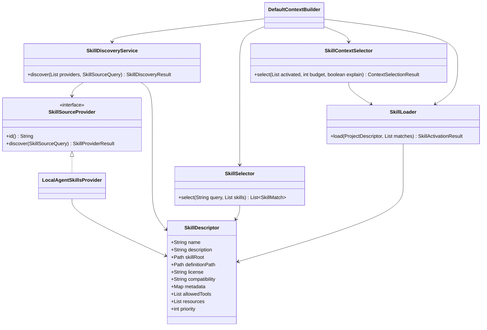
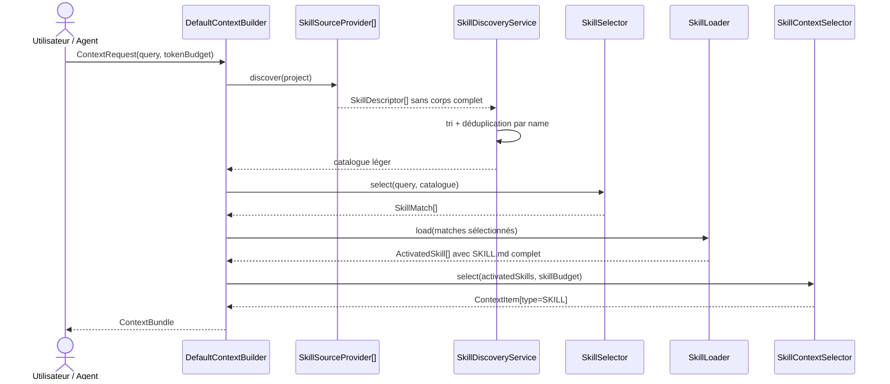
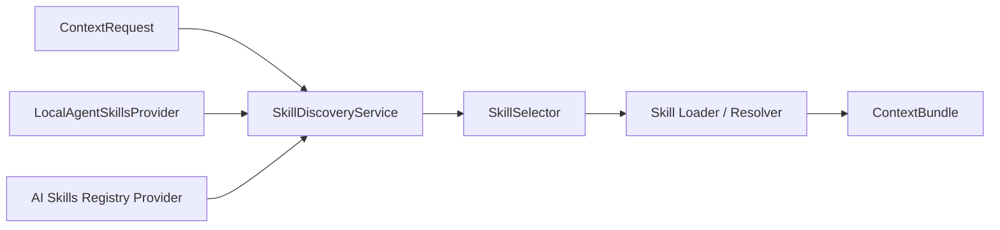

# Agent Skills : découverte, sélection et divulgation progressive

Ce chapitre décrit l'implémentation de l'Itération 6 de NEXUS.

> État : implémentation initiale à valider localement. L'itération ne sera déclarée terminée qu'après `mvn clean install` et le self-smoke étendu.

## 1. Objectif

NEXUS doit exploiter les skills déjà présents dans un repository sans inventer un format propriétaire et sans charger toutes leurs instructions à chaque requête.

Le principe retenu suit le standard Agent Skills :

```text
Découverte
    ↓
name + description + métadonnées
    ↓
Sélection
    ↓
skill pertinent pour la tâche ?
    ↓ oui
Activation
    ↓
chargement complet de SKILL.md
    ↓
ContextBundle
```

Les ressources complémentaires du skill sont seulement inventoriées :

```text
scripts/
references/
assets/
autres fichiers
```

NEXUS ne les exécute jamais et ne les injecte pas automatiquement.

## 2. Pourquoi la divulgation progressive

Un projet peut posséder des dizaines ou des centaines de skills.

Charger tous les `SKILL.md` produirait :

```text
beaucoup de skills
    ↓
beaucoup d'instructions procédurales
    ↓
bruit contextuel
    ↓
budget consommé
    ↓
moins de place pour le code réellement utile
```

NEXUS sépare donc trois niveaux :

| Niveau | Données chargées | Coût |
|---|---|---|
| Découverte | `name`, `description`, métadonnées, chemins, inventaire des ressources | faible |
| Activation | corps complet du `SKILL.md` sélectionné | payé uniquement si pertinent |
| Ressources | références, scripts, assets | non chargés automatiquement |

## 3. Emplacements reconnus

Le provider local initial reconnaît :

```text
.agents/skills/**/SKILL.md
.github/skills/**/SKILL.md
.claude/skills/**/SKILL.md
```

Exemple :

```text
repo/
├── .agents/
│   └── skills/
│       └── pdf-processing/
│           ├── SKILL.md
│           ├── scripts/
│           │   └── extract.py
│           ├── references/
│           │   └── forms.md
│           └── assets/
│               └── template.pdf
├── .github/
│   └── skills/
│       └── code-review/
│           └── SKILL.md
└── .claude/
    └── skills/
        └── database-migration/
            └── SKILL.md
```

Ces racines sont des choix du provider local, pas une limitation du modèle NEXUS. Un futur provider pourra découvrir des skills ailleurs ou depuis un registre distant.

## 4. Structure minimale d'un skill

Exemple :

```markdown
---
name: pdf-processing
description: Extract PDF text and tables. Use when handling PDF documents or forms.
license: Apache-2.0
compatibility: Requires a PDF-capable consumer.
metadata:
  owner: document-team
  version: "1.0"
allowed-tools: Read Bash(pdfinfo:*)
---

# PDF processing

1. Inspect the document.
2. Extract the requested data.
3. Validate the result.
```

NEXUS valide notamment :

```text
name
├── obligatoire
├── 1 à 64 caractères
├── minuscules alphanumériques et tirets
└── identique au nom du dossier parent

description
├── obligatoire
├── non vide
└── maximum 1024 caractères
```

Les champs optionnels actuellement normalisés sont :

```text
license
compatibility
metadata
allowed-tools
```

## 5. Architecture



La frontière importante est :

```text
SkillDescriptor
    ≠
contenu complet de SKILL.md
```

Le descripteur contient seulement ce qui est nécessaire à la découverte et au ranking léger.

## 6. Séquence complète



Le point critique est la position du `SkillLoader` : il intervient **après** `SkillSelector`.

## 7. Découverte locale

`LocalAgentSkillsProvider` :

1. parcourt uniquement les racines connues ;
2. respecte `.gitignore` et `.nexusignore`, y compris imbriqués ;
3. recherche les fichiers nommés `SKILL.md` ;
4. lit uniquement leur frontmatter YAML ;
5. valide les métadonnées ;
6. inventorie les ressources par chemin, type et taille ;
7. retourne un `SkillDescriptor`.

Le corps Markdown situé après le frontmatter n'est pas conservé dans le descripteur.

Cette propriété est testée explicitement avec un marqueur placé dans le corps du fichier : le marqueur ne doit pas apparaître dans `SkillDescriptor`.

## 8. Parseur YAML

NEXUS utilise SnakeYAML Engine pour le frontmatter YAML 1.2.

Le parseur lit le fichier de manière incrémentale :

```text
---             ← début
name: ...
description: ...
metadata: ...
---             ← fin
STOP
```

La découverte s'arrête au second séparateur `---`.

Elle ne fait donc pas :

```text
Files.readString(SKILL.md complet)
```

pendant la phase de catalogue.

Un skill invalide n'arrête pas tout le projet. Il est ignoré et un diagnostic est enregistré.

Exemples :

```text
name différent du dossier
→ diagnostic
→ skill ignoré

frontmatter absent
→ diagnostic
→ skill ignoré

description vide
→ diagnostic
→ skill ignoré
```

## 9. Déduplication entre racines

Une équipe peut temporairement posséder le même skill dans :

```text
.agents/skills/pdf-processing/SKILL.md
.claude/skills/pdf-processing/SKILL.md
.github/skills/pdf-processing/SKILL.md
```

`SkillDiscoveryService` déduplique par nom normalisé.

Le tri est déterministe :

```text
priority DESC
name ASC
path ASC
provider ASC
```

Le premier skill est conservé.

Les doublons apparaissent dans :

```text
metadata.skillsDeduplicated
```

Si deux skills de même nom possèdent des descriptions différentes, NEXUS ajoute également un diagnostic :

```text
metadata.skillDiagnostics
```

## 10. Sélection par métadonnées

`SkillSelector` ne lit jamais le corps du skill.

Il travaille uniquement avec :

```text
requête utilisateur
+
skill.name
+
skill.description
```

Signaux initiaux :

```text
nom explicitement mentionné
couverture des termes du nom
couverture de la requête dans nom + description
phrase complète éventuellement présente dans la description
```

Le score est borné entre `0` et `1`.

Une sélection produit des raisons comme :

```text
nom du skill mentionné explicitement dans la requête
correspondance avec le nom du skill : 2 terme(s)
correspondance avec la description : 3 terme(s)
score de sélection du skill : 0.725
```

La politique initiale conserve au maximum trois skills.

Cette limite protège le budget et pourra devenir configurable après mesure réelle.

## 11. Activation

Une fois un `SkillMatch` retenu :

```text
SkillMatch
    ↓
SkillLoader
    ↓
lecture complète de SKILL.md
    ↓
ActivatedSkill
```

Le loader vérifie à nouveau que le chemin reste dans la racine du repository.

Il n'ouvre aucune ressource associée.

## 12. Ressources

Les ressources sont représentées par :

```text
SkillResourceDescriptor
├── path
├── type
└── sizeBytes
```

Les types initiaux sont :

```text
SCRIPT
REFERENCE
ASSET
OTHER
```

Classification :

```text
scripts/**     → SCRIPT
references/**  → REFERENCE
assets/**      → ASSET
autres         → OTHER
```

Le contenu n'est pas chargé automatiquement.

Cela permet à un futur consommateur de demander explicitement une ressource :

```text
ContextBundle
    ↓
SKILL sélectionné
    ↓
references/forms.md disponible
    ↓
consommateur décide qu'il en a besoin
    ↓
chargement ciblé futur
```

L'Itération 6 ne fournit pas encore de commande dédiée pour charger une ressource individuelle.

## 13. Sécurité : NEXUS n'exécute rien

Un skill peut contenir :

```text
scripts/build.ps1
scripts/extract.py
scripts/migrate.sh
```

NEXUS :

```text
découvre le chemin       ✅
inventorie la taille     ✅
expose la métadonnée     ✅
exécute le script        ❌
```

Le `ContextBundle` expose :

```text
metadata.skillsExecuted = false
```

Cette valeur est actuellement constante par conception.

L'exécution d'un skill appartient à l'agent ou à l'orchestrateur consommateur, jamais au moteur de contexte.

## 14. Budget dédié

Ordre de consommation actuel :

```text
Budget total
    │
    ├── instructions natives applicables
    │
    ├── skills activés
    │
    └── contexte de tâche
        ├── code
        ├── tests
        └── documentation
```

Le budget skill initial est :

```text
skillBudget = min(
    budget restant après instructions,
    2000,
    max(64, budgetTotal / 5)
)
```

Exemples théoriques avant prise en compte des instructions :

| Budget total | Budget skill maximal |
|---:|---:|
| 180 | 64 |
| 500 | 100 |
| 2 000 | 400 |
| 10 000 | 2 000 |

## 15. Pourquoi les skills ne sont jamais tronqués

Une instruction de skill peut représenter une procédure séquentielle :

```text
1. préparer
2. vérifier
3. modifier
4. valider
5. nettoyer
```

Tronquer le texte après l'étape 2 pourrait produire un comportement incorrect.

La politique est donc :

```text
skill complet tient dans le budget
→ sélection intégrale

skill complet trop grand
→ exclusion explicite
→ aucune troncature
```

Une exclusion explique :

```text
SKILL.md exclu : skill complet de N tokens estimés,
M disponibles ; les skills ne sont pas tronqués
```

## 16. Interaction avec Lucene

Les skills ne sont pas des documents ordinaires.

`ProjectScanner` catégorise comme `SKILL` tous les fichiers texte supportés situés sous :

```text
.github/skills/
.claude/skills/
.agents/skills/
```

Cela inclut :

```text
SKILL.md
references/*.md
```

`LuceneFileSearchStrategy` exclut `FileCategory.SKILL` de la recherche générique.

Conséquence :

```text
references/quality-checks.md
```

ne peut pas apparaître comme simple `DOCUMENTATION` dans le bundle avant activation du skill.

Cette isolation est essentielle pour respecter la divulgation progressive.

## 17. Métadonnées du ContextBundle

Les nouvelles métadonnées sont :

```text
skillProviders
skillsDiscovered
skillsDeduplicated
skillDiagnostics
skillsMatched
skillsActivated
skillResourcesDiscovered
skillBudget
skillSelectedItems
skillSelectedTokens
skillsSelected
skillsExecuted
```

Exemple PowerShell :

```powershell
$result = .\scripts\nexus.ps1 context mon-app "extract PDF form" --budget 2000 --explain --json |
    ConvertFrom-Json

$result.items | Where-Object type -eq "SKILL"
$result.metadata.skillsDiscovered
$result.metadata.skillsMatched
$result.metadata.skillsSelected
$result.metadata.skillResourcesDiscovered
$result.metadata.skillsExecuted
```

## 18. Exemple complet

Repository :

```text
repo/
├── .agents/skills/
│   └── pdf-processing/
│       ├── SKILL.md
│       ├── references/forms.md
│       └── scripts/extract.py
├── .github/skills/
│   └── database-migration/
│       └── SKILL.md
└── src/main/java/app/PdfService.java
```

Requête :

```text
extract PDF forms with PdfService
```

Découverte :

```text
pdf-processing      metadata seulement
database-migration  metadata seulement
```

Sélection :

```text
pdf-processing      ✅
database-migration  ❌
```

Activation :

```text
pdf-processing/SKILL.md      chargé complètement
references/forms.md          non chargé
scripts/extract.py           non exécuté
```

Bundle conceptuel :

```text
ContextBundle
├── SKILL       .agents/skills/pdf-processing/SKILL.md
├── SYMBOL      src/main/java/app/PdfService.java#extractForm
└── ...
```

## 19. Dogfooding dans NEXUS

Le repository NEXUS contient :

```text
.agents/skills/nexus-context-validation/
├── SKILL.md
└── references/quality-checks.md
```

Le self-smoke utilise la requête :

```text
validate NEXUS context quality progressive disclosure
```

Il doit vérifier :

1. le skill est découvert ;
2. le skill est sélectionné via ses métadonnées ;
3. le `SKILL.md` complet entre dans le bundle ;
4. `quality-checks.md` n'entre pas automatiquement dans le bundle ;
5. au moins une ressource est inventoriée ;
6. `skillsExecuted = false` ;
7. le budget global reste respecté.

## 20. Tests

Les tests principaux sont :

```text
LocalAgentSkillsProviderTest
→ frontmatter
→ métadonnées
→ ressources
→ ignore rules
→ skill invalide
→ corps non chargé à la découverte

SkillSelectorTest
→ matching name + description
→ rejet des skills non pertinents
→ sélection explicable

SkillContextSelectorTest
→ exclusion d'un skill trop grand
→ aucune troncature

AgentSkillsIntegrationTest
→ indexation réelle
→ découverte de plusieurs racines
→ déduplication
→ activation du bon skill
→ non-chargement des références
→ non-exécution des scripts
```

## 21. Futur AI Skills Registry

Le cœur dépend de :

```text
SkillSourceProvider
```

et non de :

```text
LocalAgentSkillsProvider
```

Un futur connecteur pourra donc faire :



La stratégie de déduplication devra alors gérer les mêmes noms provenant de plusieurs origines avec des priorités explicites.

## 22. Limites actuelles

- Sélection lexicale locale uniquement ; pas d'embeddings.
- Maximum trois skills sélectionnés.
- Les ressources ne peuvent pas encore être demandées individuellement via la CLI.
- Les scripts ne sont jamais exécutés.
- Les skills utilisateur situés hors repository ne sont pas découverts.
- Les skills d'un registre externe ne sont pas encore disponibles.
- Les champs YAML inconnus ne sont pas encore conservés comme structure typée complète.
- La validation n'essaie pas d'imiter tous les comportements spécifiques de Copilot ou Claude ; elle suit le modèle Agent Skills commun.

Ces limites sont intentionnelles pour garder l'Itération 6 locale, déterministe et mesurable.

## 23. Décisions d'architecture

- ADR-0011 — normaliser les sources de contexte derrière des providers ;
- ADR-0012 — réutiliser les standards existants ;
- ADR-0013 — construire le `ContextBundle` sous budget ;
- ADR-0017 — découpler NEXUS des outils externes ;
- ADR-0034 — adopter la divulgation progressive pour les Agent Skills.

## 24. Références

- Agent Skills specification : https://agentskills.io/specification
- GitHub Copilot Agent Skills : https://docs.github.com/en/copilot/how-tos/copilot-cli/customize-copilot/add-skills
