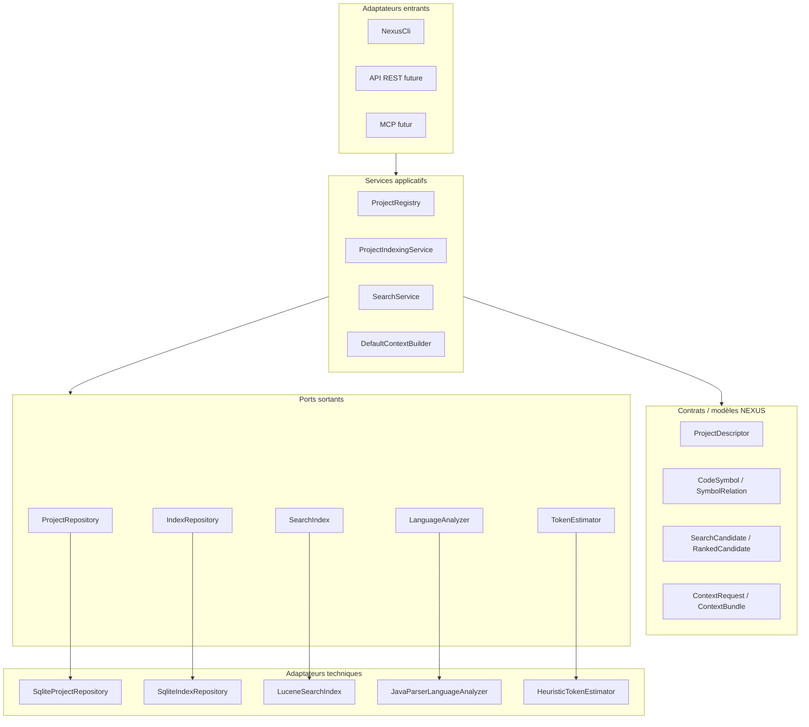
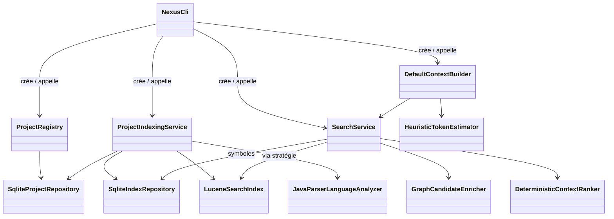
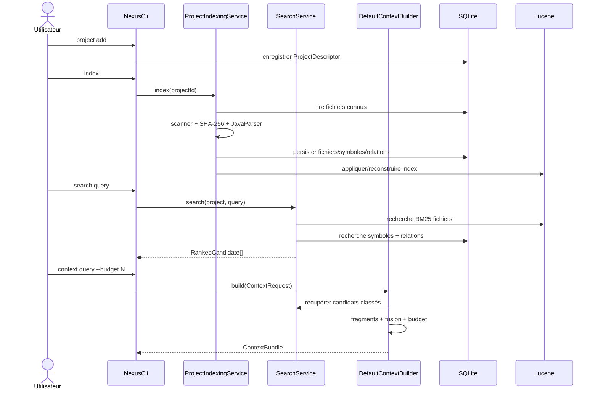

# Architecture d'implémentation

Ce chapitre décrit l'organisation concrète du code NEXUS au niveau développeur.

## 1. Style architectural actuel

Le repository utilise actuellement **un seul module Maven**, mais les responsabilités sont séparées par packages et interfaces.

L'objectif est de conserver la vitesse de développement d'un mono-module tout en préparant une extraction future lorsque les runtimes divergeront réellement.



La dépendance conceptuelle doit toujours aller vers les contrats NEXUS.

Un adaptateur technique peut connaître le domaine ; le domaine ne doit pas connaître Lucene, SQLite ou JavaParser.

## 2. Composition de l'application CLI

Pour l'instant, `NexusCli` joue aussi le rôle de **composition root** : c'est l'endroit où les implémentations concrètes sont instanciées et injectées dans les services.

Le câblage actuel est conceptuellement :

```java
NexusPaths paths = NexusPaths.fromEnvironment();
SqliteDatabase database = new SqliteDatabase(paths);

ProjectRepository projectRepository = new SqliteProjectRepository(database);
IndexRepository indexRepository = new SqliteIndexRepository(database);
SearchIndex searchIndex = new LuceneSearchIndex(paths);

ProjectIndexingService indexingService = ...;
SearchService searchService = ...;
TokenEstimator tokenEstimator = new HeuristicTokenEstimator();
ContextBuilder contextBuilder = new DefaultContextBuilder(...);
```

Aucun conteneur d'injection n'est nécessaire pour le MVP.

### Diagramme UML de composition



Lorsque l'API REST ou MCP sera ajoutée, ces adaptateurs devront construire ou recevoir les **mêmes services**, pas réimplémenter leur logique.

## 3. Responsabilités par package

### `project`

Responsable de l'identité et de l'enregistrement d'un projet.

Principales classes :

- `ProjectDescriptor` : modèle du projet ;
- `ProjectRepository` : port de persistance ;
- `ProjectRegistry` : logique d'enregistrement et consultation ;
- `IndexStatus` : état `NOT_INDEXED`, `INDEXING`, `READY`, `FAILED`.

### `config`

Responsable des emplacements locaux NEXUS.

`NexusPaths` résout le répertoire `NEXUS_HOME` puis les chemins de :

- base SQLite ;
- index Lucene par projet ;
- autres données locales futures.

### `index`

Responsable du pipeline de transformation :

```text
filesystem
→ ScannedFile
→ AnalysisResult
→ IndexedFileUpdate
→ SQLite + Lucene
```

Les types `CodeSymbol` et `SymbolRelation` sont des modèles internes NEXUS et non des types JavaParser.

### `persistence.sqlite`

Implémente les ports de persistance avec JDBC/SQLite.

Les classes métier ne reçoivent jamais de `Connection`, `ResultSet` ou `PreparedStatement`.

### `search`

Responsable de la récupération des candidats :

- `SearchStrategy` ;
- `LuceneFileSearchStrategy` ;
- `SymbolSearchStrategy` ;
- `CandidateMerger` ;
- `SearchService`.

### `ranking`

Responsable de l'enrichissement structurel et du score final :

- `GraphCandidateEnricher` ;
- `ProjectGraphBuilder` ;
- `DeterministicContextRanker` ;
- `RankedCandidate`.

### `context`

Responsable du passage du ranking au contenu réellement injectable :

- `ContextFragmentFactory` ;
- `FragmentMerger` ;
- `BudgetedContextSelector` ;
- `DefaultContextBuilder` ;
- `ContextBundle`.

### `token`

Contient le port `TokenEstimator` et l'implémentation locale `HeuristicTokenEstimator`.

## 4. Flux de bout en bout



## 5. Invariants architecturaux

### Invariant A — Lucene n'est jamais canonique

Si l'index Lucene est supprimé, il doit pouvoir être reconstruit.

### Invariant B — les chemins persistés sont relatifs au projet

L'identité d'un fichier dans l'index est le couple :

```text
(projectId, relativePath)
```

Les chemins absolus sont utilisés pour accéder au filesystem, mais les sorties de contexte utilisent des chemins relatifs pour rester portables.

### Invariant C — le ranking est déterministe

À index, requête et configuration identiques, l'ordre doit être identique.

### Invariant D — le contexte ne dépasse pas le budget estimé

Pour chaque bundle :

```text
ContextBundle.estimatedTokens <= ContextBundle.tokenBudget
```

### Invariant E — les détails fournisseurs restent aux frontières

Un futur tokenizer Claude/OpenAI, un serveur MCP ou un endpoint REST doit être un adaptateur.

## 6. Où ajouter une nouvelle fonctionnalité ?

### Ajouter un autre moteur de recherche

Implémenter `SearchIndex` ou une nouvelle `SearchStrategy`.

Ne pas modifier `ContextBuilder` pour parler directement au moteur.

### Ajouter un langage

Implémenter `LanguageAnalyzer` ou un futur `CodeIntelligenceProvider`.

Convertir toujours les données vers `CodeSymbol` / `SymbolRelation`.

### Ajouter un tokenizer exact

Implémenter `TokenEstimator`, puis l'injecter dans :

- `ContextFragmentFactory` ;
- `BudgetedContextSelector` ;
- `DefaultContextBuilder`.

### Ajouter une nouvelle source de contexte

La direction cible est `ContextSourceProvider` ; ne pas coder directement les conventions Copilot/Claude dans `DefaultContextBuilder`.

## 7. Règles de dépendance à vérifier en revue de code

Un changement mérite une alerte si :

- une classe `context` importe directement une classe Lucene ;
- une classe `ranking` ouvre une connexion JDBC ;
- une classe de domaine dépend de Quarkus ou MCP ;
- une ressource REST future contient le calcul du score ;
- un nouveau provider externe devient obligatoire pour lancer le moteur local.

Ces règles matérialisent les ADR 0001, 0003, 0005, 0006, 0007 et 0017.
