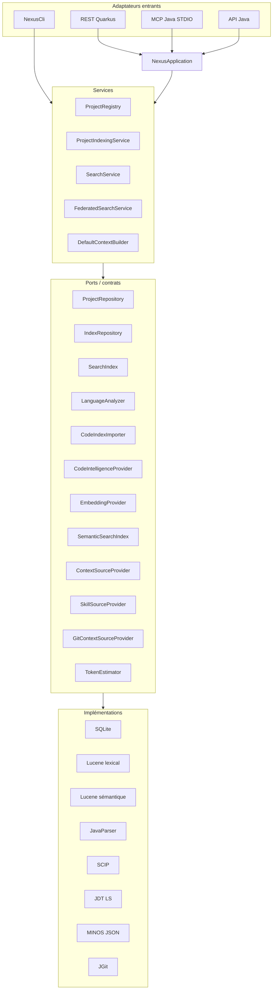
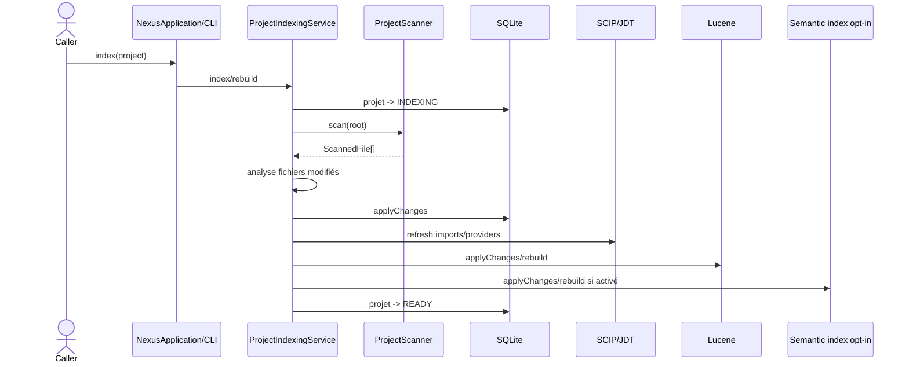
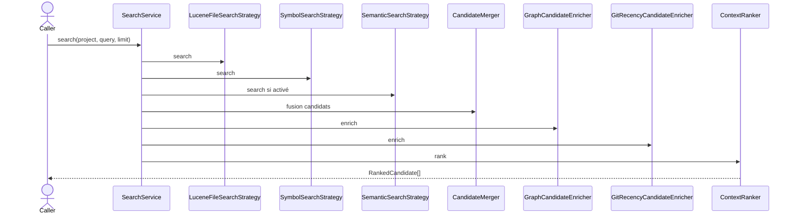

# Architecture d'implémentation

Ce chapitre décrit l'organisation concrète du code NEXUS sur l'état courant du repository.

État de référence : 29 juillet 2026, `main` `13fd6970f7350602c7a86aae729ddd4adad771bd`.

## 1. Forme du repository

NEXUS n'est plus seulement « un module Maven avec une CLI futurement extensible ».

La forme actuelle est :

```text
nexus-context-engine/
├── pom.xml                         cœur + CLI
├── src/main/java/com/nexus/
├── src/test/java/com/nexus/
├── adapters/
│   ├── rest-quarkus/               POM autonome
│   ├── mcp-java/                   POM autonome
│   └── assistant-clients/          POM autonome
├── docs/
└── scripts/
```

Le cœur reste Java 21 sans framework applicatif obligatoire. Les adaptateurs qui ont un runtime ou un graphe de dépendances distinct restent isolés.

Cette séparation répond à une contrainte réelle ; en revanche, la duplication actuelle des versions/plugins Maven doit être réduite par la Phase 6.

## 2. Couches concrètes



La flèche `CLI --> SERVICES` représente une dette réelle : REST et MCP passent par `NexusApplication`, tandis que la CLI recompose encore les services. L'Itération 20 doit supprimer cette divergence.

## 3. `NexusApplication`

La façade applicative centralise aujourd'hui :

- résolution/enregistrement de projets ;
- indexation ;
- inspection ;
- recherche mono-projet ;
- recherche fédérée ;
- construction de contexte mono-projet ;
- recherche de symboles ;
- recherche d'usages ;
- import MINOS explicite.

Composition par défaut :

```text
SqliteDatabase
├── SqliteProjectRepository
└── SqliteIndexRepository

LuceneSearchIndex

ProjectIndexingService
├── ProjectScanner
├── JavaParserLanguageAnalyzer
├── MarkdownLanguageAnalyzer
├── ScipCodeIndexImporter
├── JdtLanguageServerCodeIntelligenceProvider si environnement configuré
└── SemanticIndexingService si mode sémantique activé

SearchService
├── LuceneFileSearchStrategy
├── SymbolSearchStrategy
├── SemanticSearchStrategy si activée
├── GraphCandidateEnricher
├── GitRecencyCandidateEnricher
└── ContextRanker

FederatedSearchService

DefaultContextBuilder
├── providers d'instructions
├── provider de skills
└── LocalGitContextSourceProvider
```

## 4. Composition CLI actuelle

`NexusCli` instancie encore directement une composition très proche de celle ci-dessus puis route ses commandes vers les services.

Ce comportement fonctionne et a été validé, mais il crée deux sources de vérité de composition.

La direction retenue pour la Phase 6 est :

```text
arguments CLI
    │
    ▼
NexusCli
    │ parsing / validation uniquement
    ▼
NexusApplication
    │
    ▼
objets métier / opérations
    │
    ▼
CliRenderer
```

Le même principe s'applique aux autres adaptateurs : aucun calcul de ranking ou de budget ne doit migrer dans REST/MCP.

## 5. Packages principaux

### `application`

`NexusApplication` et les records d'opération exposés aux adaptateurs.

### `project`

- `ProjectDescriptor` ;
- `ProjectRepository` ;
- `ProjectRegistry` ;
- `IndexStatus`.

### `config`

`NexusPaths` résout `NEXUS_HOME`, SQLite et les répertoires d'index.

### `index`

Contrats et pipeline d'indexation :

- `ProjectIndexingService` ;
- `IndexRepository` ;
- `LanguageAnalyzer` ;
- `CodeIndexImporter` ;
- `CodeIntelligenceProvider` ;
- `CodeIntelligenceSnapshot` ;
- `CodeSymbol` / `SymbolRelation`.

Sous-packages :

```text
java/       JavaParser
markdown/   Markdown
scan/       scanner + ignore rules
scip/       import SCIP
jdt/        provider JDT LS
minos/      import contrat JSON MINOS
```

### `persistence.sqlite`

JDBC/SQLite et migrations. Les classes métier ne reçoivent pas de `Connection` ou `ResultSet`.

### `search`

- `SearchService` ;
- `SearchStrategy` ;
- `LuceneFileSearchStrategy` ;
- `SymbolSearchStrategy` ;
- `CandidateMerger` ;
- `FederatedSearchService` ;
- types de hits/candidats.

Sous-package `semantic` :

- `EmbeddingProvider` ;
- `SemanticSearchConfiguration` ;
- `SemanticIndexingService` ;
- `SemanticSearchStrategy` ;
- `SemanticSearchIndex` ;
- implémentations Lucene/Ollama.

### `ranking`

- `DeterministicContextRanker` ;
- `SemanticHybridContextRanker` ;
- `RankedCandidate` ;
- `GraphCandidateEnricher` ;
- `ProjectGraphBuilder`.

### `context`

- `ContextRequest` / `ContextBundle` ;
- `ContextFragmentFactory` ;
- `FragmentMerger` ;
- `BudgetedContextSelector` ;
- `DefaultContextBuilder`.

`context.source` contient les providers instructions, skills et Git.

### `token`

`TokenEstimator` et `HeuristicTokenEstimator`.

### `cli`

Parsing/dispatch/rendu CLI. Le package contient encore une partie de composition qui doit migrer vers `NexusApplication`.

## 6. Pipeline d'indexation réel



Sur exception, le projet passe à `FAILED` et une prochaine indexation force un rebuild.

Limite actuelle : SQLite peut déjà avoir committé lorsque Lucene/provider échoue. Le gate de lecture doit donc devenir uniforme et une politique de génération/récupération doit être formalisée.

## 7. Recherche réelle



`SearchService` augmente déjà son retrieval interne (`max(20, limit*3)`, borné à 500) pour agréger les stratégies. La fédération applique toutefois actuellement son `limit` projet par projet avant diversification finale ; ce point est traité en I18.

## 8. Recherche symbolique et graphe : implémentation courante

### Symboles

`SymbolSearchStrategy` appelle `IndexRepository.findSymbols(projectId)` puis calcule le fuzzy en Java.

`NexusApplication.findSymbols` fait également un filtrage en mémoire sur la liste complète.

### Usages

`NexusApplication.findUsages` charge les relations du projet puis filtre source/cible en mémoire.

### Graphe

`ProjectGraphBuilder` recharge les symboles et relations puis construit un graphe d'imports à chaque enrichissement.

Ces comportements sont corrects sur les corpus validés, mais ils sont explicitement le prochain plafond de scale. La direction Phase 6 est d'ajouter des opérations repository ciblées avant toute technologie externe.

## 9. Recherche fédérée

`FederatedSearchService` :

1. déduplique la portée de projets par UUID ;
2. appelle `SearchService` sur chaque projet ;
3. fusionne par score ;
4. stabilise les égalités par ordre de projet et rang local ;
5. diversifie par `projectId + path` ;
6. conserve la provenance du projet.

Le service reste séquentiel : aucun parallélisme n'a été justifié par la baseline Itération 16.

## 10. Construction du contexte

`DefaultContextBuilder` vérifie déjà `IndexStatus.READY`.

Ordre courant :

```text
SearchService
→ filtre requestedSources
→ targetPaths
→ instructions natives
→ skills
→ Git
→ fragments de tâche
→ déduplication cross-source
→ fusion
→ budget instructions
→ budget skills
→ budget Git
→ budget tâche restant
→ ContextBundle + metadata
```

Les budgets sont bornés et le budget inutilisé est rendu aux étapes suivantes.

## 11. Skills et registry

L'architecture de contrat est bonne :

```text
SkillSourceProvider[]
        │
        ▼
SkillDiscoveryService
        │ priorité/déduplication
        ▼
SkillSelector
        ▼
SkillLoader
        ▼
SkillContextSelector
```

Divergence actuelle : `LocalAgentSkillsProvider.discover()` instancie `AiSkillsRegistryProvider` et agrège son résultat, tandis que `NexusApplication` ne fournit qu'un provider à `DefaultContextBuilder`.

Cette divergence est planifiée en I20 ; la documentation ne doit plus présenter l'agrégation multi-provider comme déjà réalisée au niveau de la composition.

## 12. MINOS

`MinosCodeIndexImporter` est volontairement distinct de l'import automatique `CodeIndexImporter` : son payload est fourni explicitement par l'appelant.

Le contrat impose :

- `contractVersion=1` ;
- `producer=MINOS` ;
- racine canonique identique ;
- payload ≤ 128 MiB ;
- chemins relatifs sûrs ;
- mapping conservateur des kinds ;
- provenance `minos`.

La construction actuelle de l'allow-list parcourt le filesystem complet. L'optimisation prévue doit réutiliser la vue canonique NEXUS sans réduire la sécurité.

## 13. Adaptateur REST

`adapters/rest-quarkus` dépend du JAR NEXUS mais le cœur ne dépend pas de Quarkus.

Responsabilités acceptables :

```text
HTTP
→ validation DTO
→ NexusApplication
→ mapping DTO
→ HTTP
```

Le bind par défaut est `127.0.0.1:8080`.

## 14. Adaptateur MCP

`adapters/mcp-java` utilise le SDK Java MCP et transporte les réponses NEXUS sous forme JSON dans un contenu texte MCP.

Les tools appellent `NexusApplication`. Les versions Jackson sont aujourd'hui alignées explicitement dans le POM de l'adaptateur à cause d'un conflit observé pendant I12 ; ce cas motive la convergence Maven prévue en I20.

## 15. Sémantique

`NexusApplication.create(paths)` compose le moteur sans sémantique.

`NexusApplication.create(paths, SemanticSearchConfiguration)` peut ajouter :

```text
EmbeddingProvider
LuceneSemanticSearchIndex
SemanticIndexingService
SemanticSearchStrategy
SemanticHybridContextRanker
```

L'activation opérationnelle homogène dans les adaptateurs n'est pas encore livrée.

## 16. Règles de dépendance

Une revue doit alerter si :

- le domaine importe Quarkus/MCP ;
- `context` ouvre JDBC/Lucene directement ;
- un provider externe devient obligatoire au démarrage ;
- REST/MCP recalcule un score ou un budget ;
- un nouveau langage impose des branches dans `DefaultContextBuilder` ;
- une optimisation introduit un backend réseau sans mesure ;
- la CLI et `NexusApplication` divergent encore davantage dans leur composition.

## 17. Prochain état cible

La cible Phase 6 n'est pas une réécriture :

```text
même modèle métier
mêmes ports
mêmes invariants
        +
readiness uniforme
queries repository ciblées
composition unique
builds gouvernés
indexation bornée/concurrente sûre
runtime mesuré
fédération corrigée
contexte fédéré ensuite
```

Voir [Limites actuelles](current-limitations.md) et la [roadmap](../roadmap.md).
