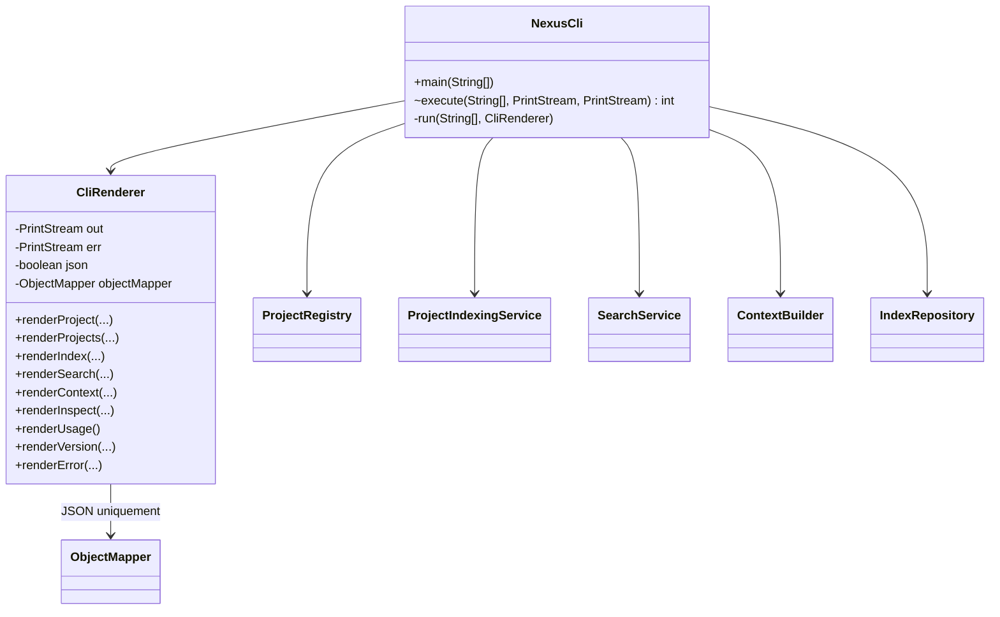
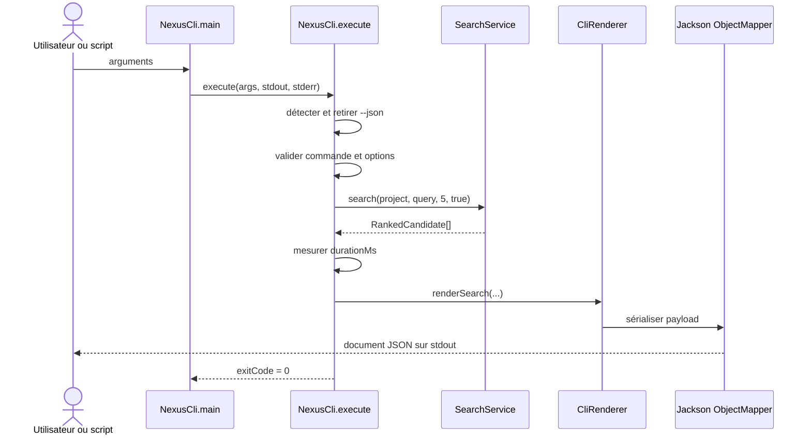
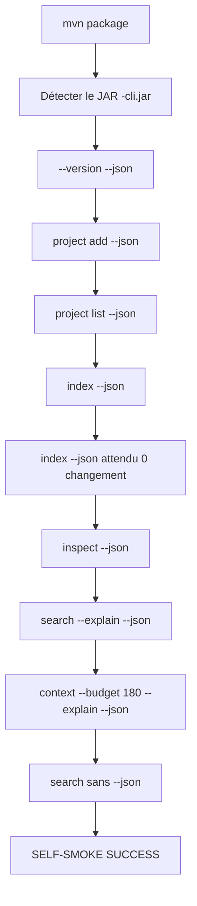
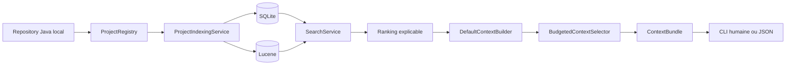

# CLI du MVP : contrat, JSON, packaging et exécution

Ce chapitre décrit l'implémentation de l'Itération 4 au niveau développeur.

> **Statut : Itération 4 terminée et validée localement le 19 juillet 2026. Le MVP du moteur NEXUS est validé de bout en bout.**

Validation de référence :

```text
mvn clean install
→ 66 fichiers source compilés
→ 11 fichiers de test compilés
→ 16 tests exécutés
→ 0 échec / 0 erreur / 0 ignoré

self-smoke via JAR autonome
→ 77 fichiers indexés
→ 322 symboles
→ 599 relations
→ indexation complète : 896 ms
→ indexation incrémentale : 232 ms
→ recherche : 254 ms
→ contexte : 285 ms
→ 3 items, 178/180 tokens
→ réduction : 96,45 %
→ SELF-SMOKE SUCCESS
```

Baseline qualité publiée par le corpus golden :

```text
mean precision@3 = 0,4444
mean recall@3    = 1,0000
```

## 1. Objectif

La CLI est le premier adaptateur complet de NEXUS.

Elle permet deux usages avec le **même cœur métier** :

```text
Développeur humain
    ↓
sortie lisible

Script / agent / outil
    ↓
sortie JSON stable
```

La CLI ne réimplémente aucune logique d'indexation, de recherche, de ranking ou de construction de contexte.

Son rôle est strictement :

```text
arguments
   ↓
validation / parsing
   ↓
appel des services NEXUS
   ↓
rendu humain ou JSON
   ↓
code de sortie
```

## 2. Commandes du MVP

```text
nexus project add <chemin> [nom] [--json]
nexus project list [--json]
nexus index <id-ou-nom> [--rebuild] [--json]
nexus search <id-ou-nom> <requête> [--limit N] [--explain] [--json]
nexus context <id-ou-nom> <requête> [--budget N] [--explain] [--json]
nexus inspect <id-ou-nom> [--json]
nexus --help [--json]
nexus --version [--json]
```

`--json` est une option globale : `NexusCli` la détecte avant le dispatch puis la retire des arguments fonctionnels.

Cela permet par exemple :

```text
nexus search demo OrderService --limit 5 --json
```

sans faire connaître le format de sortie à `SearchService`.

## 3. Architecture de la CLI



La dépendance Jackson reste dans le package CLI.

Les packages métier :

```text
project
index
search
ranking
context
token
```

ne connaissent pas Jackson.

## 4. Flux d'une commande

Exemple :

```text
nexus search demo ProjectIndexingService --limit 5 --explain --json
```



## 5. Pourquoi `execute` retourne un entier

Le `main` historique appelait directement :

```java
System.exit(1);
```

Cela rend une CLI difficile à tester dans la même JVM.

Le flux actuel est :

```java
int exitCode = execute(args, System.out, System.err);
if (exitCode != 0) {
    System.exit(exitCode);
}
```

Les tests invoquent directement :

```java
NexusCli.execute(args, testOut, testErr)
```

sans arrêter Surefire.

## 6. Codes de sortie

Le contrat initial est :

| Code | Signification |
|---:|---|
| `0` | succès |
| `1` | erreur d'exécution NEXUS ou erreur inattendue |
| `2` | commande, option ou argument invalide |

Exemple :

```text
nexus unknown-command --json
```

produit sur `stderr` :

```json
{
  "error" : true,
  "exitCode" : 2,
  "message" : "Commande inconnue : unknown-command"
}
```

et le processus termine avec le code `2`.

## 7. Séparation stdout / stderr

### Succès

Les données de commande sont écrites sur :

```text
stdout
```

### Erreur

Les diagnostics NEXUS sont écrits sur :

```text
stderr
```

Cette règle est essentielle en mode JSON.

Un script peut donc faire :

```text
stdout → parser JSON
stderr → journaliser diagnostic
exit code → décider succès/échec
```

Les avertissements éventuels de la JVM ou de bibliothèques natives ne font pas partie du document JSON NEXUS.

Sous Windows PowerShell 5.1, les lignes écrites sur `stderr` par un processus natif peuvent être présentées comme un `NativeCommandError` visuel. Le self-smoke contourne ce comportement pendant l'appel Java et se fie au véritable `$LASTEXITCODE`. La validation complète a confirmé que ce bruit n'empêche ni le parsing JSON ni le succès fonctionnel.

## 8. Sortie humaine et sortie JSON

### Sortie humaine

Comportement par défaut :

```text
nexus search demo ProjectIndexingService --limit 3
```

Exemple conceptuel :

```text
Recherche 'ProjectIndexingService' : 3 résultat(s), 25 ms
 1. 0,5585 FILE   src/main/.../ProjectIndexingService.java
 ...
```

### Sortie JSON

```text
nexus search demo ProjectIndexingService --limit 3 --json
```

Structure :

```json
{
  "command" : "search",
  "project" : { },
  "query" : "ProjectIndexingService",
  "limit" : 3,
  "explain" : false,
  "durationMs" : 25,
  "results" : [ ]
}
```

Les deux rendus sont construits à partir des mêmes objets retournés par le cœur.

## 9. Contrats JSON par commande

### `project add`

```text
command
project
  id
  name
  rootPath
  sourceType
  languages
  technologies
  lastIndexedAt
  indexStatus
```

### `project list`

```text
command
projects[]
```

Les projets sont triés par nom puis UUID pour stabiliser l'ordre.

### `index`

```text
command
project
report
  scannedFiles
  changedFiles
  removedFiles
  fullSearchRebuild
  durationMs
  statistics
    files
    symbols
    relations
```

### `search`

```text
command
project
query
limit
explain
durationMs
results[]
  rank
  score
  type
  path
  symbol
  scoreComponents
  reasons
```

Les chemins des résultats sont relatifs au projet et normalisés avec `/`.

### `context`

```text
command
project
query
durationMs
tokenBudget
estimatedTokens
items[]
  type
  path
  symbol
  startLine
  endLine
  content
  score
  scoreComponents
  reasons
  estimatedTokens
  truncated
excluded[]
metadata
```

### `inspect`

```text
command
project
index
  files
  symbols
  relations
```

## 10. Mesures de latence

Trois latences sont directement disponibles :

```text
index.report.durationMs
search.durationMs
context.durationMs
```

L'indexation mesure son propre pipeline via `IndexingReport`.

La CLI mesure `search` et `context` autour des appels :

```text
System.nanoTime()
→ appel service
→ elapsedMillis
```

Ces valeurs servent de **baseline locale**, pas de SLA universel.

Validation de référence sur la machine utilisée le 19 juillet 2026 :

```text
indexation complète    896 ms
indexation incrémentale 232 ms
recherche               254 ms
construction contexte   285 ms
```

Elles dépendent notamment :

- de la taille du repository ;
- du disque ;
- de la JVM ;
- de l'état des caches OS/Lucene ;
- de la machine utilisée.

## 11. Métriques de qualité

Le corpus golden mesure :

```text
mean precision@3
mean recall@3
```

Le test `GoldenSearchCorpusTest` publie les valeurs observées dans le log Maven avant de vérifier les seuils.

Baseline validée :

```text
corpus = 3 requêtes
mean precision@3 = 0,4444
mean recall@3 = 1,0000
```

Lors d'une modification du ranking, ces métriques permettent de détecter une régression fonctionnelle avant de se fier à une impression subjective.

## 12. Packaging Maven

Le build produit deux artefacts.

### JAR bibliothèque

```text
target/nexus-context-engine-0.1.0-SNAPSHOT.jar
```

Il reste l'artefact Maven standard.

### JAR CLI autonome

```text
target/nexus-context-engine-0.1.0-SNAPSHOT-cli.jar
```

Il contient les dépendances runtime et possède notamment :

```text
Main-Class: com.nexus.cli.NexusCli
Implementation-Version: 0.1.0-SNAPSHOT
```

Il peut être exécuté avec :

```powershell
java -jar target\nexus-context-engine-0.1.0-SNAPSHOT-cli.jar --help
```

La validation réelle a confirmé que le JAR autonome démarre et exécute SQLite, Lucene, Jackson, l'indexation, la recherche et la construction du contexte.

## 13. Pourquoi fusionner `META-INF/services`

Certaines bibliothèques utilisent le mécanisme Java `ServiceLoader` ou des fichiers de découverte dans :

```text
META-INF/services/
```

Lors de la création d'un uber-JAR, plusieurs dépendances peuvent fournir des fichiers portant le même chemin.

Le Maven Shade Plugin utilise donc :

```text
ServicesResourceTransformer
```

pour fusionner leurs déclarations au lieu d'en perdre une arbitrairement.

Les signatures :

```text
META-INF/*.SF
META-INF/*.DSA
META-INF/*.RSA
```

sont exclues car elles ne restent plus valides après fusion des JAR.

Les warnings Shade relatifs à `module-info.class`, `LICENSE`, `NOTICE` et `MANIFEST.MF` ont été observés pendant le build de validation. Ils sont non bloquants pour le MVP puisque le JAR autonome a été exécuté avec succès sur tout le flux fonctionnel.

## 14. Scripts Windows

### PowerShell

```powershell
.\scripts\nexus.ps1 --help
.\scripts\nexus.ps1 project list --json
```

Le script :

1. cherche le dernier `*-cli.jar` dans `target/` ;
2. échoue clairement si le JAR n'existe pas ;
3. exécute `java -jar` ;
4. propage le code de sortie NEXUS.

### CMD

```cmd
scripts\nexus.cmd --help
scripts\nexus.cmd project list --json
```

Le script CMD suit le même principe.

## 15. Self-smoke de l'Itération 4

Le script `scripts/self-smoke.ps1` valide le **JAR autonome**, et non `mvn exec:java`.

Flux :



Chaque document JSON est parsé avec PowerShell `ConvertFrom-Json`.

La validation réelle a produit :

```text
77 fichiers
322 symboles
599 relations

indexation complète : 896 ms
indexation incrémentale : 232 ms
recherche : 254 ms
contexte : 285 ms

3 items
178/180 tokens
96,45 % de réduction
```

Cela vérifie simultanément :

- le packaging ;
- la classe `Main-Class` ;
- SQLite dans l'uber-JAR ;
- Lucene dans l'uber-JAR ;
- Jackson ;
- les sorties JSON ;
- le parsing JSON réel ;
- la sortie humaine ;
- l'idempotence de l'indexation ;
- la recherche explicable ;
- le budget de contexte ;
- le flux MVP complet.

## 16. Tests automatisés

`NexusCliTest` couvre notamment :

- `--help --json` sans initialiser de projet ;
- erreur de commande structurée et code `2` ;
- `project add --json` ;
- `index --json` ;
- `search --explain --json` ;
- `context --budget ... --json` ;
- `inspect --json` ;
- chemins de contexte relatifs ;
- respect du budget ;
- présence de métriques de latence.

Le test utilise :

```text
-Dnexus.home=<répertoire temporaire>
```

via la propriété système `nexus.home`, ce qui évite de toucher au vrai `~/.nexus` du développeur.

La suite complète validée compte 16 tests.

## 17. Reproduire localement

### Construire

```powershell
mvn clean install
```

### Vérifier les artefacts

```powershell
Get-ChildItem .\target\*cli.jar
```

### Lancer directement

```powershell
java -jar .\target\nexus-context-engine-0.1.0-SNAPSHOT-cli.jar --version
```

### Utiliser le launcher

```powershell
.\scripts\nexus.ps1 project add . nexus-local
.\scripts\nexus.ps1 index nexus-local
.\scripts\nexus.ps1 search nexus-local ProjectIndexingService --limit 5 --explain
.\scripts\nexus.ps1 context nexus-local ProjectIndexingService --budget 500 --explain
```

### Obtenir du JSON

```powershell
.\scripts\nexus.ps1 search nexus-local ProjectIndexingService --limit 5 --explain --json
```

### Lancer le self-smoke

```powershell
.\scripts\self-smoke.ps1 -KeepData
```

Résultat attendu :

```text
SELF-SMOKE SUCCESS
```

## 18. Frontière architecturale à préserver

Une future modification de la CLI ne doit pas conduire à :

```text
SearchService dépend de Jackson        ❌
ContextBuilder écrit directement JSON  ❌
ProjectIndexingService connaît stdout  ❌
Ranking connaît un code de sortie      ❌
```

La direction correcte reste :

```text
Core NEXUS
   ↓ objets métier
CLI adapter
   ↓
CliRenderer
   ├── humain
   └── JSON
```

Cette frontière permet au futur REST et MCP d'exposer les mêmes capacités avec leurs propres contrats sans réutiliser artificiellement le format JSON de la CLI.

## 19. Ce que valide exactement le MVP

Le MVP validé garantit aujourd'hui qu'un repository Java local peut être traité ainsi :



Les intégrations externes, sources documentaires, instructions, skills, contexte Git, MCP et API restent volontairement hors de ce MVP. Elles s'appuieront sur ce cœur validé plutôt que de modifier son principe de fonctionnement.
