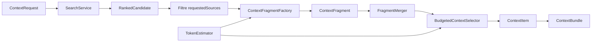
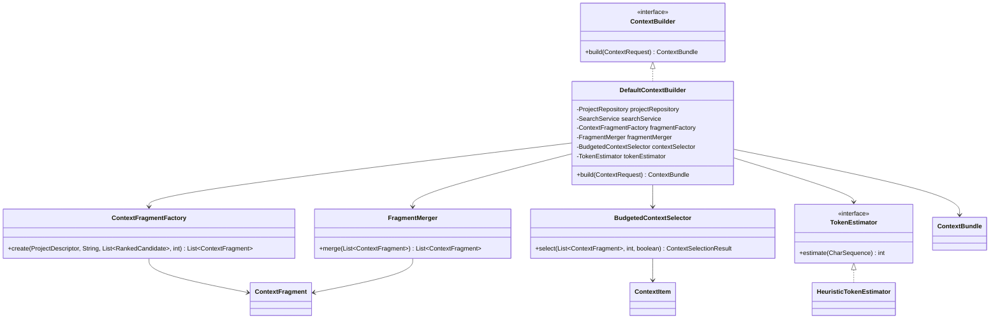
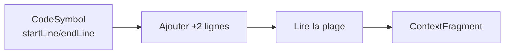
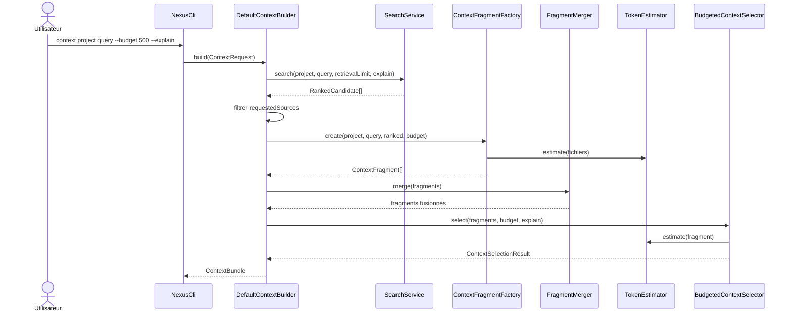

# Construction du contexte et gestion du budget

Ce chapitre décrit l'implémentation initiale de l'Itération 3.

> Cette itération est implémentée dans le repository mais doit encore être validée par le prochain build local et le self-smoke étendu.

## 1. Objectif

Transformer :

```text
ContextRequest
+ résultats de recherche classés
+ sources locales
```

en :

```text
ContextBundle
```

avec la garantie :

```text
estimatedTokens <= tokenBudget
```

selon le `TokenEstimator` actif.

## 2. Contrats d'entrée et sortie

### `ContextRequest`

Contient :

```text
projectId
query
tokenBudget
requestedSources
constraints
explain
```

Pour l'implémentation actuelle :

- `requestedSources` vide signifie : accepter tous les types produits par la recherche ;
- `constraints` est réservé aux politiques futures ;
- `explain` active les raisons et exclusions détaillées.

### `ContextBundle`

Contient :

```text
items
budget
estimatedTokens
excluded
metadata
```

### `ContextItem`

Un item retenu contient désormais :

```text
type
path relatif au projet
symbol éventuel
startLine
endLine
content
score
scoreComponents
reasons
estimatedTokens
truncated
```

## 3. Vue générale du pipeline



## 4. Diagramme UML



## 5. Étape 1 — Résoudre le projet

`DefaultContextBuilder` charge le projet par `projectId`.

Le projet doit être en état :

```text
READY
```

Sinon la construction échoue avec `ContextBuildingException`.

Cela évite de construire un contexte sur un index non initialisé ou en échec.

## 6. Étape 2 — Récupérer davantage de candidats que nécessaire

Le builder calcule une limite de récupération :

```text
retrievalLimit = clamp(tokenBudget / 40, 20, 100)
```

Exemples :

| Budget | Candidats demandés au SearchService |
|---:|---:|
| 200 | 20 |
| 800 | 20 |
| 2 000 | 50 |
| 10 000 | 100 |

L'objectif est d'avoir suffisamment de choix avant le budget sans récupérer arbitrairement des milliers de candidats.

## 7. Étape 3 — Filtrer les sources demandées

Si :

```java
requestedSources = Set.of()
```

aucun filtre n'est appliqué.

Sinon seuls les types demandés sont conservés.

Exemple :

```java
Set.of(CandidateType.SYMBOL, CandidateType.TEST)
```

permettrait de construire un bundle uniquement à partir de symboles et tests.

## 8. Étape 4 — Matérialiser les fragments

`ContextFragmentFactory` lit le contenu réel depuis le filesystem.

Les chemins du `ContextItem` sont ensuite rendus **relatifs à la racine projet**.

### Cas A — un symbole est disponible

Pour un `CodeSymbol` :

```text
start = symbol.startLine - 2
end   = symbol.endLine + 2
```

avec bornage dans le fichier.

Le fragment contient donc le symbole et deux lignes de contexte de chaque côté.



### Pourquoi privilégier le symbole ?

Supposons un fichier de 800 lignes contenant une méthode pertinente de 20 lignes.

Inclure le fichier entier peut coûter plusieurs milliers de tokens.

Inclure :

```text
méthode + 2 lignes avant + 2 lignes après
```

conserve davantage de budget pour d'autres dépendances pertinentes.

### Cas B — candidat fichier sans symbole précis

Le builder estime d'abord le fichier complet.

Le seuil d'inclusion complète est :

```text
fullFileThreshold = max(120, min(800, tokenBudget / 4))
```

Si le fichier est inférieur à ce seuil, il est inclus intégralement.

Sinon NEXUS construit des fenêtres lexicales.

## 9. Fenêtres lexicales de fichier

Pour un fichier long :

1. extraire les termes de la requête ;
2. trouver les lignes qui contiennent au moins un terme ;
3. prendre `±5` lignes autour ;
4. limiter à 4 fenêtres ;
5. fusionner les fenêtres qui se chevauchent ou sont adjacentes.

Exemple :

```text
ligne 100 contient "ContextBuilder"
→ plage 95..105

ligne 108 contient "ContextBuilder"
→ plage 103..113

fusion
→ plage 95..113
```

Si aucun terme n'est trouvé, le fallback initial prend les 40 premières lignes.

Ce fallback est volontairement simple et devra être mesuré avant sophistication.

## 10. Étape 5 — Fusionner les fragments

`FragmentMerger` groupe les fragments par chemin.

Deux plages sont fusionnées si :

```text
next.startLine <= current.endLine + 1
```

Cela couvre :

- chevauchement ;
- inclusion d'une plage dans une autre ;
- adjacency directe.

### Exemple

```text
Fragment A : lignes 10..20
Fragment B : lignes 18..30

Résultat : lignes 10..30
```

Le contenu chevauchant n'est pas dupliqué.

Les métadonnées sont fusionnées :

- score final = maximum des scores ;
- composante de score = maximum par signal ;
- raisons = union ordonnée ;
- symboles = concaténés lorsqu'ils diffèrent.

## 11. Estimation des tokens

L'implémentation par défaut est `HeuristicTokenEstimator`.

Formule :

```text
estimatedTokens = ceil(nombreDePointsDeCodeUnicode / 3.5)
```

Exemple approximatif :

```text
350 caractères Unicode
→ environ 100 tokens estimés
```

Cette valeur est volontairement une **estimation générique**, pas le résultat exact du tokenizer OpenAI, Anthropic ou autre.

Le port :

```java
public interface TokenEstimator {
    int estimate(CharSequence text);
}
```

permettra d'injecter un tokenizer exact dans un adaptateur futur.

## 12. Étape 6 — Sélection sous budget

`BudgetedContextSelector` reçoit les fragments déjà fusionnés.

### Tri

Ordre :

1. score décroissant ;
2. chemin ;
3. ligne de début ;
4. ligne de fin.

### Plafond par item

Pour éviter qu'un seul fragment monopolise tout le contexte :

```text
maxPerItemTokens = max(24, tokenBudget / 2)
```

Ainsi, avec un budget de 1 000 :

```text
un fragment individuel est plafonné à environ 500 tokens
```

Cela laisse de la place à au moins une autre information pertinente.

## 13. Algorithme de sélection

Pseudo-code correspondant à l'implémentation :

```text
remaining = tokenBudget
selected = []

for fragment in fragments sorted by score:
    fullTokens = estimate(fragment.content)
    allowed = min(remaining, maxPerItemTokens)

    if fullTokens <= allowed:
        select(fragment)
        remaining -= fullTokens

    else if allowed >= 24:
        truncated = truncate(fragment, allowed)

        if truncated fits:
            select(truncated)
            remaining -= truncated.tokens

    else:
        exclude(fragment)
```

Le résultat satisfait toujours :

```text
sum(item.estimatedTokens) <= tokenBudget
```

## 14. Troncature

La troncature essaie d'abord de conserver des lignes complètes.

Marqueur :

```text
... [fragment tronqué par NEXUS]
```

Si aucune ligne complète ne tient avec le marqueur, une recherche binaire détermine le plus grand préfixe de caractères compatible avec le budget.

L'item reçoit :

```text
truncated = true
```

Avec `explain=true`, une raison supplémentaire indique que la troncature sert à respecter le budget et préserver la diversité.

## 15. Exclusions

Un fragment qui ne peut pas être inclus produit une explication de la forme :

```text
src/.../Demo.java:10-50 exclu : 180 tokens estimés requis, 12 disponibles
```

Ces messages sont exposés dans :

```text
ContextBundle.excluded
```

uniquement lorsque `explain=true` dans l'implémentation actuelle.

## 16. Métadonnées du bundle

`DefaultContextBuilder` ajoute actuellement :

```text
query
tokenEstimator
rankedCandidates
sourceEligibleCandidates
materializedFragments
mergedFragments
selectedItems
excludedItems
truncatedItems
availableEstimatedTokens
selectedEstimatedTokens
reductionRatio
```

### Ratio de réduction

```text
reductionRatio = 1 - selectedEstimatedTokens / availableEstimatedTokens
```

Exemple :

```text
fragments disponibles : 4 000 tokens
bundle sélectionné     : 1 000 tokens

reductionRatio = 0.75
```

NEXUS a donc réduit de 75 % le volume candidat estimé.

## 17. Séquence complète



## 18. Exemple CLI

```powershell
mvn -q exec:java "-Dexec.args=context nexus-local ProjectIndexingService --budget 500 --explain"
```

La sortie contient :

```text
Contexte 'ProjectIndexingService' : N item(s), X/500 tokens estimés

[1] score TYPE chemin:ligneDébut-ligneFin (tokens)
-----
<contenu réellement inclus>
-----
```

Puis, si `--explain` :

- raisons ;
- métadonnées ;
- exclusions.

## 19. Pourquoi le chemin du bundle est relatif ?

La recherche interne utilise un chemin absolu pour lire le fichier.

Mais un `ContextBundle` doit rester portable :

```text
N:\workspace-dev\nexus-context-engine\src\...
```

ne doit pas devenir une identité persistante du contexte.

La sortie utilise donc :

```text
src/main/java/io/github/fturleque/nexus/...
```

## 20. Limites actuelles

L'implémentation initiale ne gère pas encore :

- sous-budgets par type de source ;
- diversité optimisée globalement ;
- tokenizer exact par modèle ;
- documentation/instructions/skills ;
- fragments structurels non Java ;
- résolution automatique des dépendances nécessaires à la compilation d'un extrait ;
- optimisation globale de type knapsack.

Ces limites sont volontaires. Le glouton déterministe constitue la baseline mesurable.

## 21. Tests

Les nouveaux tests couvrent :

- déterminisme de l'estimateur ;
- Unicode ;
- fusion de plages chevauchantes ;
- chemins relatifs ;
- construction de contexte de bout en bout ;
- respect strict du budget ;
- troncature d'un gros fragment ;
- déterminisme du bundle.

Le self-smoke est également étendu pour construire un contexte réel sur le repository NEXUS.

## 22. Modifier la politique de contexte

Avant toute modification :

1. identifier si la décision relève des ADR 0013, 0027, 0028 ou 0029 ;
2. ajouter un test qui montre le problème actuel ;
3. modifier une responsabilité isolée ;
4. vérifier `mvn clean install` ;
5. vérifier le self-smoke ;
6. mesurer le ratio de réduction et la qualité du corpus lorsque pertinent.

Ne pas déplacer la logique de budget dans la CLI ou un futur adaptateur LLM.
