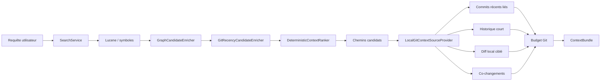
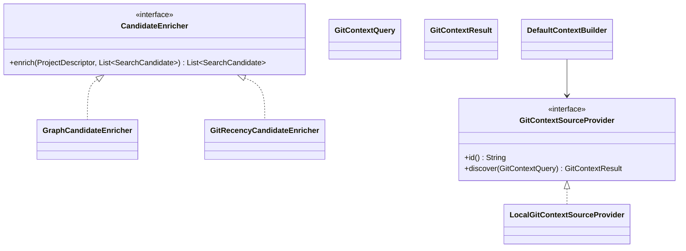

# Contexte Git local

Ce chapitre décrit l'implémentation de l'Itération 7 : utiliser l'historique Git local comme **signal de pertinence** et comme **source de contexte bornée**, sans transformer NEXUS en client Git généraliste.

> L'Itération 7 est implémentée mais reste à valider localement par `mvn clean install` puis par le self-smoke à 13 étapes avant d'être déclarée terminée.

## 1. Objectif

Le contexte Git répond à deux besoins différents :

```text
Recherche
→ quels fichiers récemment actifs méritent un léger bonus ?

ContextBundle
→ quels éléments historiques expliquent les fichiers déjà sélectionnés ?
```

Ces deux responsabilités ne doivent pas être confondues.

## 2. Principes de sécurité

Le contexte Git est :

- local uniquement ;
- en lecture seule ;
- sans appel réseau ;
- sans `fetch` ;
- sans `pull` ;
- sans `push` ;
- sans `checkout` ;
- sans création de commit ;
- limité au périmètre du projet enregistré dans NEXUS.

JGit est utilisé comme bibliothèque d'accès au repository local déjà présent sur le disque.

## 3. Architecture



## 4. Contrats principaux



## 5. Chaîne d'enrichissement du ranking

`SearchService` ne dépend plus d'un seul enrichisseur structurel.

```text
SearchStrategy[]
    ↓
CandidateMerger
    ↓
CandidateEnricher[]
    ├── GraphCandidateEnricher
    └── GitRecencyCandidateEnricher
    ↓
ContextRanker
```

Cette généralisation évite de coder une dépendance JGit directement dans `SearchService`.

Les anciens constructeurs restent disponibles : un consommateur qui ne branche pas `GitRecencyCandidateEnricher` conserve le comportement historique.

## 6. Signal `gitRecencyScore`

`GitRecencyCandidateEnricher` inspecte au maximum les 50 commits locaux les plus récents.

Pour chaque candidat déjà connu :

1. NEXUS calcule son chemin relatif au projet ;
2. ce chemin est converti en chemin relatif au repository Git ;
3. les commits récents sont parcourus ;
4. si un commit touche le fichier, un score de récence est associé ;
5. le meilleur score observé est conservé.

Le signal normalisé est :

```text
gitRecencyScore ∈ [0, 1]
```

Le bonus par défaut est :

```text
gitRecencyContribution = gitRecencyScore × 0,05
```

Configuration :

```java
new DeterministicContextRanker(0.05d);
```

Désactivation :

```java
new DeterministicContextRanker(0.0d);
```

La valeur acceptée est bornée entre `0.0` et `0.20`.

Un candidat sans signal Git conserve exactement son score historique.

## 7. Explication du ranking

Avec `--explain` :

```text
récence Git locale: 1.000 -> +0.050
```

La composante JSON est :

```json
{
  "gitRecencyScore": 0.05
}
```

La valeur exposée dans `scoreComponents` est la contribution pondérée, comme pour les autres signaux.

## 8. Contexte Git construit

`LocalGitContextSourceProvider` reçoit uniquement les chemins déjà remontés par la recherche.

Il peut produire quatre fragments virtuels de type `GIT`.

### 8.1 Commits récents liés

```text
.nexus/git/recent-commits.md
```

Contenu :

- SHA court ;
- date du commit ;
- message ;
- principaux fichiers du projet touchés.

Seuls les commits touchant au moins un chemin cible sont conservés.

### 8.2 Historique court

```text
.nexus/git/file-history.md
```

Bornes :

- maximum 5 chemins cibles ;
- maximum 5 commits par chemin.

### 8.3 Diff local pertinent

```text
.nexus/git/working-tree-diff.md
```

Le fragment peut contenir :

```text
Patch non indexé
→ working tree vs index

Patch indexé
→ index vs HEAD

Résumé de statut
→ ajouté / modifié / changé dans l'index / supprimé / manquant / non suivi
```

Les patches sont produits par JGit uniquement pour les chemins candidats.

Chaque zone de patch est bornée à :

```text
6 000 caractères
```

Au-delà :

```text
... [diff Git tronqué par NEXUS]
```

Le `BudgetedContextSelector` applique ensuite le budget de tokens normal du `ContextBundle`.

Un fichier local modifié mais sans rapport avec les candidats ne peut pas apparaître dans le patch ou le résumé.

### 8.4 Co-changements

```text
.nexus/git/co-changes.md
```

NEXUS observe les commits récents touchant les chemins cibles et compte les autres fichiers du **même projet NEXUS** modifiés dans les mêmes commits.

Maximum :

```text
8 relations de co-changement
```

Un fichier n'est compté qu'une fois par commit, même lorsqu'un même commit touche plusieurs chemins cibles.

Une relation de co-changement est un signal historique, pas une preuve de dépendance métier.

## 9. Support des monorepos

NEXUS distingue :

```text
racine du repository Git
racine du projet enregistré dans NEXUS
```

Exemple :

```text
monorepo/
├── .git/
├── backend/
│   └── nexus-project-root/
└── frontend/
```

Si le projet NEXUS est :

```text
monorepo/backend/nexus-project-root
```

les chemins JGit sont préfixés par :

```text
backend/nexus-project-root/
```

NEXUS convertit automatiquement :

```text
backend/nexus-project-root/src/OrderService.java
→ src/OrderService.java
```

Cette conversion est appliquée :

- au bonus de récence ;
- aux commits liés ;
- à l'historique ;
- aux patches locaux ;
- aux co-changements.

Les fichiers et co-changements situés hors du sous-projet, par exemple `frontend/App.ts`, sont exclus du contexte du projet backend.

## 10. Budget Git

Ordre de sélection :

```text
1. instructions natives
2. skills
3. contexte Git
4. contexte de tâche
```

Pour les budgets inférieurs à 500 tokens :

```text
gitEnabled = false
gitBudget = 0
```

Cela protège les scénarios très contraints comme le self-smoke à 180 tokens.

À partir de 500 tokens :

```text
gitBudget = min(
    budget restant,
    500,
    max(64, budget total × 15 %)
)
```

Exemples :

```text
budget total 500   → Git max 75
budget total 1200  → Git max 180
budget total 2000  → Git max 300
budget total 5000  → Git max 500
```

Les fragments Git peuvent être tronqués par le sélecteur générique si nécessaire.

## 11. Métadonnées du ContextBundle

En mode JSON explicable :

```text
gitProvider
gitEnabled
gitRepositoryAvailable
gitDiagnostics
gitCommitsInspected
gitRelatedCommits
gitCoChangeLinks
gitBudget
gitSelectedItems
gitSelectedTokens
```

Exemple :

```json
{
  "gitProvider": "local-git",
  "gitEnabled": true,
  "gitRepositoryAvailable": true,
  "gitCommitsInspected": 50,
  "gitRelatedCommits": 4,
  "gitCoChangeLinks": 6,
  "gitBudget": 240,
  "gitSelectedItems": 2,
  "gitSelectedTokens": 218
}
```

## 12. Repository non Git

Si le projet n'est pas dans un repository Git :

```text
recherche
→ candidats inchangés

ContextBundle
→ aucun item GIT
→ diagnostic explicable
→ aucune erreur fonctionnelle
```

NEXUS reste pleinement utilisable sans Git.

## 13. Limites initiales

- 50 commits récents maximum ;
- premier parent uniquement pour les commits de merge ;
- commit racine non utilisé pour le calcul différentiel initial ;
- pas de suivi exhaustif des renommages sur toute l'histoire ;
- patches locaux bornés à 6 000 caractères par zone ;
- co-changements bornés et non persistés ;
- aucun cache Git dédié dans cette itération ;
- la recherche et le `ContextBuilder` lisent chacun Git à la demande dans le chemin CLI initial.

Ces limites sont intentionnelles. Une optimisation ou une persistance supplémentaire devra être justifiée par des mesures.

## 14. Tests

### `GitRecencyCandidateEnricherTest`

Vérifie :

- bonus sur un fichier récemment modifié ;
- absence de bonus hors repository Git ;
- résolution correcte des chemins d'un sous-projet dans un monorepo.

### `LocalGitContextSourceProviderTest`

Vérifie :

- commits liés uniquement ;
- historique ciblé ;
- patch local réel limité au chemin cible ;
- exclusion des patches non ciblés ;
- co-changements ;
- confinement à un sous-projet de monorepo ;
- dégradation propre hors Git.

### `DeterministicContextRankerGitTest`

Vérifie :

- contribution `gitRecencyScore` ;
- explication ;
- poids configurable ;
- retour exact au score historique avec poids `0`.

### `DefaultContextBuilderIntegrationTest`

Vérifie :

- provider Git non appelé sous 500 tokens ;
- `gitEnabled = false` pour le petit budget ;
- activation du provider lorsque le budget le permet ;
- présence d'un item `GIT` ;
- respect du budget global.

## 15. Self-smoke de l'Itération 7

Le self-smoke passe à 13 étapes.

La requête dédiée est :

```text
DefaultContextBuilder git context budget recent changes
```

Le scénario vérifie :

```text
gitEnabled = true
gitRepositoryAvailable = true
gitRelatedCommits > 0
gitSelectedItems > 0
au moins un ContextItem.type == GIT
estimatedTokens <= tokenBudget
```

Le scénario strict à 180 tokens vérifie en parallèle :

```text
gitEnabled = false
```

## 16. Décision d'architecture

Voir :

- ADR-0035 — intégrer le contexte Git local comme source bornée et explicable.
