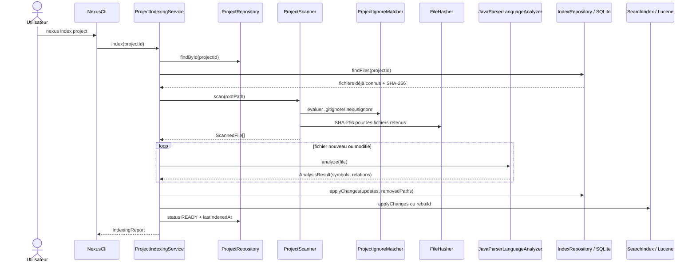
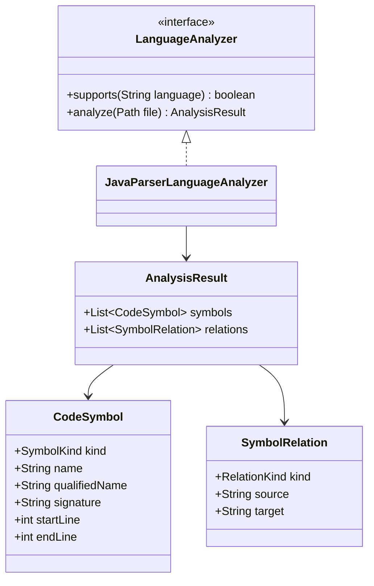
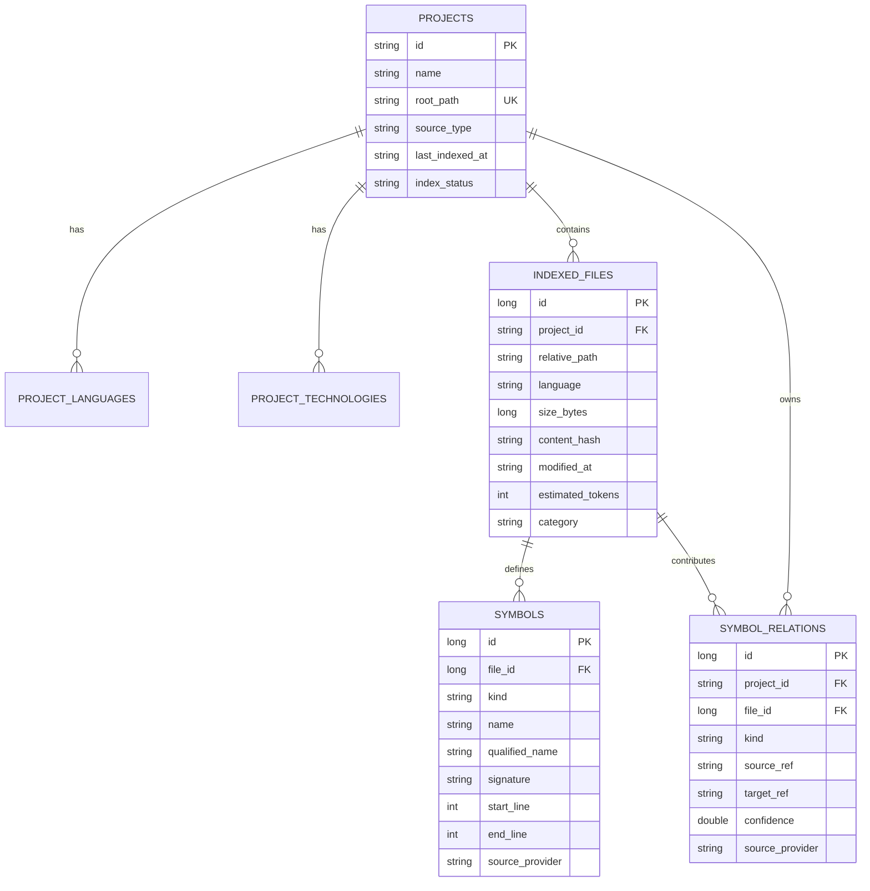
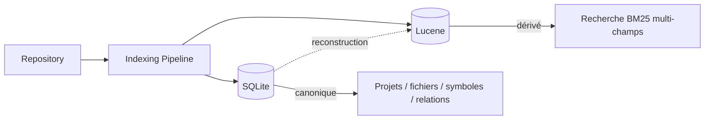

# Pipeline d'indexation locale

Ce chapitre décrit l'Itération 1 telle qu'elle est implémentée.

## 1. Objectif

Transformer un repository local en deux représentations complémentaires :

```text
SQLite
→ source de vérité structurelle

Lucene
→ index de recherche dérivé et reconstructible
```

L'indexation doit être :

- locale ;
- incrémentale ;
- idempotente ;
- sensible aux suppressions ;
- capable de reconstruire Lucene ;
- indépendante d'un LLM.

## 2. Séquence complète



## 3. Enregistrement d'un projet

La commande :

```powershell
mvn -q exec:java "-Dexec.args=project add N:\workspace-dev\my-project my-project"
```

passe par `ProjectRegistry`.

L'identité métier du projet est un UUID. SQLite conserve le chemin racine réel du projet et impose son unicité.

Conceptuellement :

```text
ProjectDescriptor
├── id : UUID
├── name
├── rootPath
├── sourceType
├── languages
├── technologies
├── lastIndexedAt
└── indexStatus
```

L'utilisation d'un UUID permet de déplacer les implémentations de persistance sans exposer l'identifiant numérique local SQLite.

## 4. `NEXUS_HOME`

`NexusPaths` centralise les données locales.

Le répertoire peut être défini par la variable :

```powershell
$env:NEXUS_HOME = "N:\nexus-data"
```

Le self-smoke utilise volontairement :

```text
target/nexus-self-smoke-home
```

pour ne pas polluer le stockage utilisateur réel.

Le stockage contient actuellement :

```text
NEXUS_HOME/
├── nexus.db
└── lucene/
    └── <project-uuid>/
```

Le nom exact des sous-répertoires doit être obtenu via `NexusPaths`; les autres composants ne doivent pas reconstruire les chemins manuellement.

## 5. Scan du filesystem

`ProjectScanner` parcourt le projet et construit des `ScannedFile`.

Chaque fichier retenu contient notamment :

- chemin relatif ;
- langage ;
- taille ;
- SHA-256 ;
- date de modification ;
- catégorie.

### Catégories

`FileCategory` contient actuellement :

```text
SOURCE
TEST
RESOURCE
DOCUMENTATION
OTHER
```

Pour le MVP Java, les sources `.java` sont les principales cibles d'analyse structurelle.

## 6. Règles d'exclusion

`ProjectIgnoreMatcher` réutilise JGit pour reproduire la sémantique des patterns Git plutôt que de développer un parseur maison.

Les sources de règles comprennent :

- `.gitignore` ;
- `.nexusignore` ;
- fichiers imbriqués lorsque leur scope s'applique ;
- exclusions intégrées de sécurité et contenus générés.

Exemples typiques exclus :

```text
.git/
target/
build/
node_modules/
.env
clés privées
contenus générés
```

La négation Git reste supportée :

```gitignore
*.generated.java
!important.generated.java
```

L'objectif est que NEXUS ne réinterprète pas approximativement les règles déjà comprises par les développeurs.

## 7. Détection incrémentale

Chaque contenu est identifié par SHA-256.

Pour chaque chemin :

```text
nouveau hash == ancien hash
→ fichier inchangé
→ pas de nouveau parsing AST

nouveau hash != ancien hash
→ fichier modifié
→ nouvelle analyse + remplacement symboles/relations

ancien chemin absent du scan
→ fichier supprimé
→ suppression SQLite + propagation Lucene
```

Le second self-smoke valide explicitement :

```text
0 fichier modifié
0 fichier supprimé
```

sur une deuxième indexation sans changement.

## 8. Analyse Java

`JavaParserLanguageAnalyzer` implémente `LanguageAnalyzer`.

Le parser est explicitement configuré au niveau **Java 21**.

Cette configuration a été ajoutée après qu'un self-smoke réel a révélé qu'un text block Java moderne échouait avec le niveau de langage par défaut de JavaParser.

### Modèle de sortie



Les positions `startLine` et `endLine` seront réutilisées plus tard par `ContextFragmentFactory` pour extraire du code ciblé.

## 9. Persistance SQLite

### Diagramme entité-relation



Le couple suivant est unique :

```text
(project_id, relative_path)
```

Les suppressions utilisent les clés étrangères avec `ON DELETE CASCADE` pour nettoyer les symboles associés.

## 10. Migrations

`SchemaMigrator` crée d'abord :

```text
schema_migrations
├── version
├── script_name
└── applied_at
```

Puis applique les scripts embarqués non encore exécutés.

Migration actuelle :

```text
src/main/resources/db/migration/V001__initial_schema.sql
```

L'application d'une migration se fait dans une transaction. Une erreur provoque un rollback.

Pour ajouter une migration :

1. créer `V002__description.sql` ;
2. ajouter la migration à la liste ordonnée de `SchemaMigrator` ;
3. écrire un test de migration ;
4. ne jamais modifier rétroactivement `V001` pour une base déjà distribuée.

## 11. Index Lucene

`LuceneSearchIndex` implémente `SearchIndex`.

Un document Lucene représente actuellement un **fichier**.

Champs principaux :

```text
document_key
project_id
path
path_text
language
category
content
symbol_exact
symbol_name
qualified_name_exact
qualified_name
symbol_kind
```

Clé stable :

```text
projectId + ":" + relativePath
```

Une mise à jour utilise `updateDocument`, ce qui rend l'opération idempotente pour cette clé.

## 12. Pourquoi SQLite ET Lucene ?



SQLite répond aux besoins relationnels et transactionnels.

Lucene répond aux besoins de recherche textuelle et de ranking lexical.

Fusionner les deux responsabilités dans un seul moteur réduirait soit la qualité de recherche, soit la qualité du modèle structurel.

## 13. Gestion d'échec

Le statut projet suit le cycle :

```text
NOT_INDEXED
    │
    ▼
INDEXING
   ├── succès ──> READY
   └── erreur ──> FAILED
```

Après un état incohérent ou un besoin explicite, l'index Lucene peut être reconstruit.

La commande :

```powershell
mvn -q exec:java "-Dexec.args=index my-project --rebuild"
```

force cette reconstruction.

## 14. Reproduire l'indexation

```powershell
$env:NEXUS_HOME = "$PWD\target\manual-nexus-home"

mvn -q exec:java "-Dexec.args=project add . local-demo"
mvn -q exec:java "-Dexec.args=index local-demo"
mvn -q exec:java "-Dexec.args=inspect local-demo"
mvn -q exec:java "-Dexec.args=index local-demo"
```

La seconde commande `index` doit signaler zéro modification si le repository n'a pas changé.

Pour la validation complète automatisée :

```powershell
.\scripts\self-smoke.ps1 -KeepData
```

## 15. Tests qui protègent ce pipeline

Les tests couvrent notamment :

- JavaParser et syntaxe Java 21 ;
- scanner et ignore rules ;
- négation de patterns ;
- registre de projets ;
- indexation initiale ;
- indexation sans changement ;
- modification ;
- suppression ;
- cohérence SQLite/Lucene.

Un changement d'indexation doit conserver ces propriétés avant d'ajouter de nouvelles capacités.
