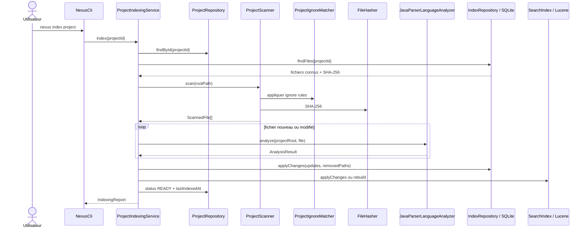
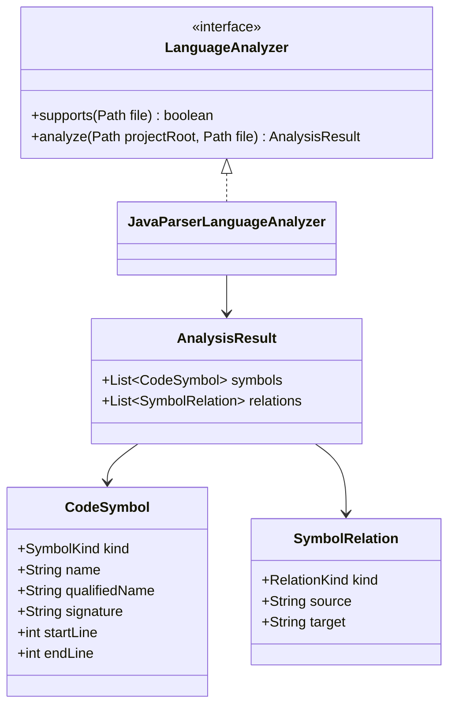
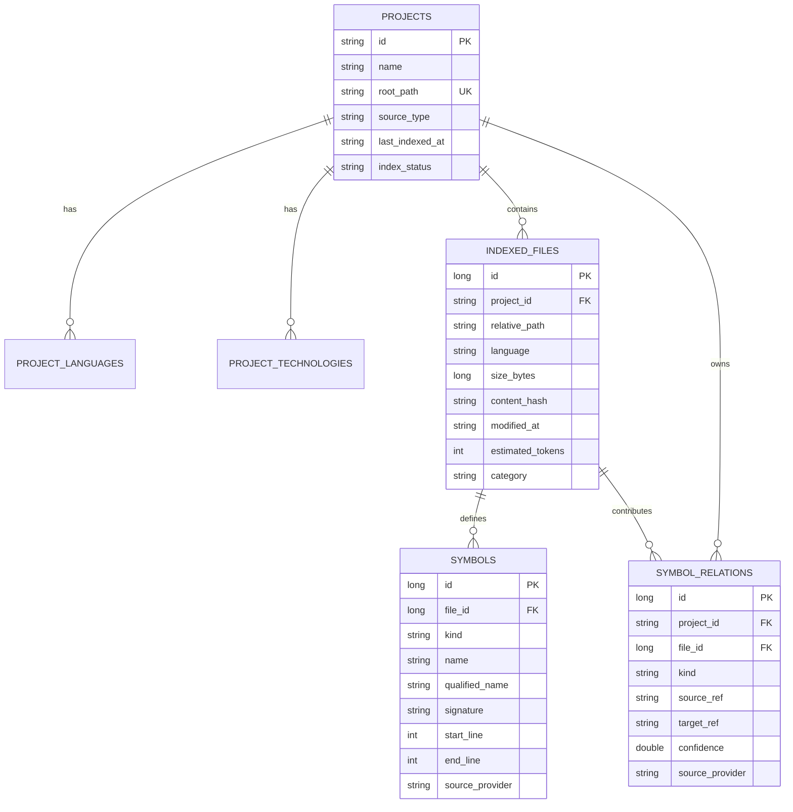
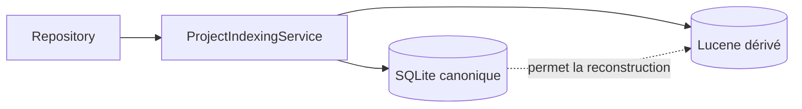
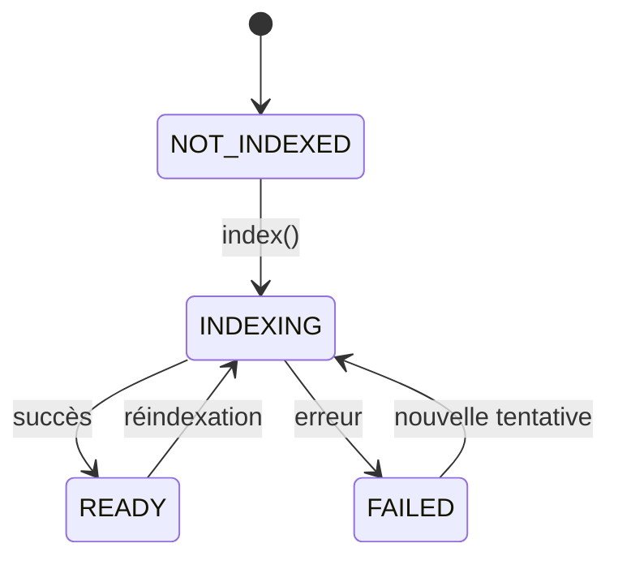

# Pipeline d'indexation locale

Ce chapitre décrit l'Itération 1 telle qu'elle est implémentée et validée.

## 1. Objectif

Transformer un repository Java local en deux représentations complémentaires :

```text
SQLite
→ source de vérité structurelle

Lucene
→ index de recherche dérivé et reconstructible
```

L'indexation doit rester locale, incrémentale, idempotente et capable de propager les suppressions.

## 2. Séquence complète



## 3. Enregistrement d'un projet

La commande :

```powershell
mvn -q exec:java "-Dexec.args=project add N:\workspace-dev\my-project my-project"
```

passe par `ProjectRegistry`.

Le projet possède un UUID métier durable :

```text
ProjectDescriptor
├── id : UUID
├── name
├── rootPath
├── sourceType
├── languages
├── technologies
├── lastIndexedAt
└── indexStatus
```

La racine réelle du projet est normalisée afin d'éviter d'enregistrer deux fois le même repository via des chemins équivalents.

## 4. `NEXUS_HOME`

`NexusPaths` centralise les données locales.

La variable :

```powershell
$env:NEXUS_HOME = "N:\nexus-data"
```

permet de déplacer le stockage.

Le self-smoke utilise :

```text
target/nexus-self-smoke-home
```

pour isoler les données de validation.

Conceptuellement :

```text
NEXUS_HOME/
├── base SQLite
└── index Lucene par UUID projet
```

Toujours utiliser `NexusPaths` pour résoudre ces emplacements.

## 5. Scan du filesystem

`ProjectScanner.scan(Path projectRoot)` :

1. normalise la racine en chemin absolu ;
2. initialise `ProjectIgnoreMatcher` ;
3. parcourt l'arbre avec `Files.walkFileTree` ;
4. ignore les sous-arbres exclus ;
5. ne conserve actuellement que les fichiers `.java` ;
6. calcule SHA-256 ;
7. classe le fichier `SOURCE` ou `TEST` ;
8. trie le résultat par chemin relatif.

Chaque `ScannedFile` contient notamment :

```text
absolutePath
relativePath
language
sizeBytes
contentHash
modifiedAt
estimatedTokens
category
```

### Catégories

`FileCategory` définit :

```text
SOURCE
TEST
RESOURCE
DOCUMENTATION
OTHER
```

Le scanner MVP ne conserve actuellement que les sources Java ; les autres catégories préparent l'extension future.

## 6. Règles d'exclusion

`ProjectIgnoreMatcher` réutilise JGit pour la sémantique des patterns.

Sources :

- `.gitignore` ;
- `.nexusignore` ;
- règles imbriquées avec leur scope ;
- exclusions intégrées de sécurité et contenus générés.

Exemples typiques :

```text
.git/
target/
build/
node_modules/
.env
clés privées
```

La négation est supportée :

```gitignore
*.generated.java
!important.generated.java
```

NEXUS évite ainsi de maintenir un parseur d'ignore partiellement compatible avec Git.

## 7. Détection incrémentale par SHA-256

Pour chaque chemin fonctionnel `(projectId, relativePath)` :

```text
nouveau hash == ancien hash
→ inchangé
→ pas de parsing AST

nouveau hash != ancien hash
→ modifié
→ nouvelle analyse

chemin ancien absent du scan
→ supprimé
→ suppression SQLite + Lucene
```

Le self-smoke valide qu'une seconde indexation sans modification retourne :

```text
0 modifié
0 supprimé
```

## 8. Analyse Java

`JavaParserLanguageAnalyzer` implémente exactement le contrat :

```java
public interface LanguageAnalyzer {
    boolean supports(Path file);
    AnalysisResult analyze(Path projectRoot, Path file) throws IOException;
}
```

Le parser est configuré explicitement au niveau Java 21.

Cette configuration a été ajoutée après qu'un self-smoke réel a révélé que le niveau par défaut refusait les text blocks présents dans NEXUS.

### UML du modèle d'analyse



Les bornes `startLine` / `endLine` sont ensuite utilisées par l'Itération 3 pour extraire des fragments ciblés.

## 9. Persistance SQLite

### Diagramme entité-relation



La contrainte importante est :

```text
UNIQUE(project_id, relative_path)
```

Les IDs numériques de fichiers/symboles restent techniques et locaux à SQLite.

## 10. Transactions de mise à jour

`SqliteIndexRepository.applyChanges` effectue dans une transaction :

1. suppression des fichiers disparus ;
2. upsert des fichiers modifiés ;
3. suppression des anciennes analyses du fichier ;
4. insertion des nouveaux symboles ;
5. insertion des nouvelles relations ;
6. commit.

Une erreur SQL entraîne un rollback.

Les clés étrangères avec `ON DELETE CASCADE` nettoient les symboles liés aux fichiers supprimés.

## 11. Migrations

`SchemaMigrator` maintient la table :

```text
schema_migrations
├── version
├── script_name
└── applied_at
```

Migration actuelle :

```text
src/main/resources/db/migration/V001__initial_schema.sql
```

Au démarrage de la base :

1. créer `schema_migrations` si nécessaire ;
2. lire les versions appliquées ;
3. exécuter les scripts manquants dans l'ordre ;
4. enregistrer la version ;
5. commit ou rollback global en cas d'erreur.

Pour ajouter `V002` :

- créer un nouveau script ;
- l'enregistrer dans la liste ordonnée du migrateur ;
- ne pas modifier rétroactivement `V001` pour une base existante.

## 12. Index Lucene

`LuceneSearchIndex` implémente `SearchIndex`.

Un document Lucene représente actuellement un fichier Java indexé.

Champs principaux :

```text
document_key
project_id
path
path_text
language
category
content
symbol_exact
symbol_name
qualified_name_exact
qualified_name
symbol_kind
```

Clé stable :

```text
projectId + ":" + relativePath
```

Les mises à jour utilisent `updateDocument`.

## 13. Synchronisation SQLite → Lucene



SQLite contient l'état structurel durable.

Lucene est optimisé pour la recherche et peut être supprimé/reconstruit.

La commande :

```powershell
mvn -q exec:java "-Dexec.args=index my-project --rebuild"
```

force une reconstruction complète de l'index de recherche.

## 14. Cycle d'état



`DefaultContextBuilder` exige ensuite l'état `READY` avant de construire un contexte.

## 15. Reproduire l'indexation

```powershell
$env:NEXUS_HOME = "$PWD\target\manual-nexus-home"

mvn -q exec:java "-Dexec.args=project add . local-demo"
mvn -q exec:java "-Dexec.args=index local-demo"
mvn -q exec:java "-Dexec.args=inspect local-demo"
mvn -q exec:java "-Dexec.args=index local-demo"
```

La dernière commande doit signaler zéro modification si le repository est inchangé.

Validation automatique :

```powershell
.\scripts\self-smoke.ps1 -KeepData
```

## 16. Tests qui protègent le pipeline

Les tests couvrent :

- syntaxe Java 21 et text blocks ;
- scanner ;
- `.gitignore` / `.nexusignore` ;
- négation de patterns ;
- registre idempotent ;
- indexation initiale ;
- deuxième indexation sans changement ;
- modification ;
- suppression ;
- cohérence du nombre de documents Lucene.

Toute évolution du scanner ou de la persistance doit conserver ces invariants.
