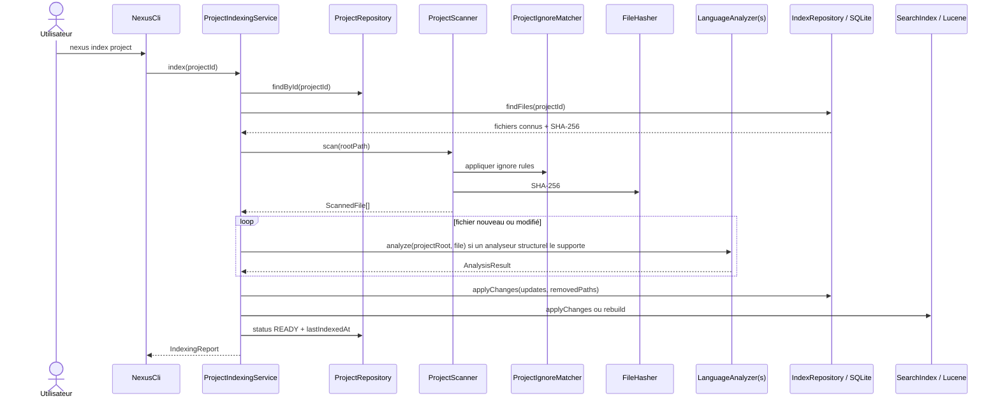
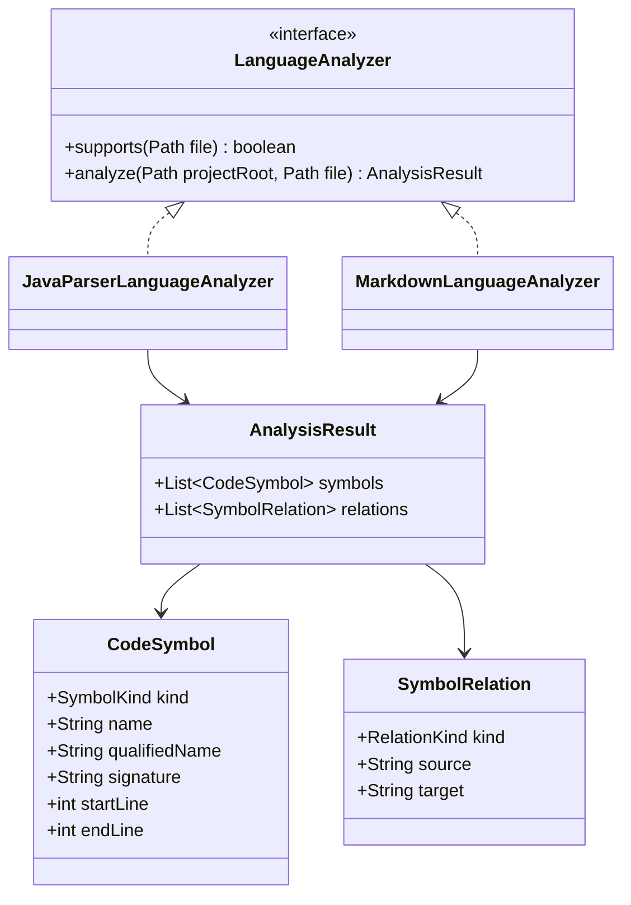

# Pipeline d'indexation locale

Ce chapitre décrit le pipeline d'indexation actuellement implémenté et validé.

## 1. Objectif

Transformer un repository local multi-langage en deux représentations complémentaires :

```text
SQLite
→ source de vérité structurelle

Lucene
→ index de recherche dérivé et reconstructible
```

L'indexation reste locale, incrémentale, idempotente et capable de propager les suppressions.

## 2. Séquence complète



## 3. Enregistrement d'un projet

La commande :

```powershell
mvn -q exec:java "-Dexec.args=project add N:\workspace-dev\my-project my-project"
```

passe par `ProjectRegistry`.

Le projet possède un UUID métier durable :

```text
ProjectDescriptor
├── id : UUID
├── name
├── rootPath
├── sourceType
├── languages
├── technologies
├── lastIndexedAt
└── indexStatus
```

La racine réelle du projet est canonisée avec `toRealPath()` afin d'éviter d'enregistrer deux fois le même repository via des chemins équivalents.

## 4. `NEXUS_HOME`

`NexusPaths` centralise les données locales.

La variable :

```powershell
$env:NEXUS_HOME = "N:\nexus-data"
```

permet de déplacer le stockage.

Le self-smoke utilise :

```text
target/nexus-self-smoke-home
```

pour isoler les données de validation.

Conceptuellement :

```text
NEXUS_HOME/
├── base SQLite
└── index Lucene par UUID projet
```

Toujours utiliser `NexusPaths` pour résoudre ces emplacements.

## 5. Scan du filesystem

`ProjectScanner.scan(Path projectRoot)` :

1. construit un `ProjectPathGuard` sur la racine réelle ;
2. initialise `ProjectIgnoreMatcher` ;
3. parcourt l'arbre avec `Files.walkFileTree` sans suivre les liens symboliques ;
4. applique les règles d'exclusion avant matérialisation ;
5. ne conserve que les langages texte déclarés par `SourceLanguage` ;
6. applique les limites globales de nombre d'entrées, volume total et taille par fichier ;
7. calcule SHA-256 sur les fichiers retenus ;
8. classe chaque fichier dans une `FileCategory` ;
9. trie le résultat par chemin repository canonique.

Les langages texte actuellement reconnus sont :

```text
JAVA        .java
MARKDOWN    .md
KOTLIN      .kt .kts
TYPESCRIPT  .ts .tsx
JAVASCRIPT  .js .jsx .mjs .cjs
PYTHON      .py
SQL         .sql
```

La présence d'un langage dans `SourceLanguage` garantit le scan, l'indexation lexicale et la construction de contexte à partir du contenu. Elle ne garantit pas une analyse structurelle embarquée pour ce langage.

Chaque `ScannedFile` contient notamment :

```text
absolutePath
relativePath
language
sizeBytes
contentHash
modifiedAt
estimatedTokens
category
```

### Catégories

`FileCategory` définit actuellement :

```text
SOURCE
TEST
RESOURCE
DOCUMENTATION
INSTRUCTION
AGENT_PROFILE
SKILL
OTHER
```

Le scanner reconnaît notamment les tests usuels Java/Kotlin/Python/JavaScript/TypeScript, les fichiers Markdown de documentation, les instructions IA (`AGENTS.md`, `CLAUDE.md`, `GEMINI.md`, instructions Copilot), les profils agents et les répertoires de skills.

## 6. Règles d'exclusion et sécurité filesystem

`ProjectIgnoreMatcher` réutilise JGit pour la sémantique des patterns.

Sources :

- `.gitignore` ;
- `.nexusignore` ;
- règles imbriquées avec leur scope ;
- exclusions intégrées de sécurité et contenus générés.

Exemples typiques :

```text
.git/
target/
build/
node_modules/
.env
clés privées
```

La négation est supportée :

```gitignore
*.generated.java
!important.generated.java
```

Les liens symboliques et entrées non régulières sont refusés pour les fichiers indexables. Les chemins retenus sont revalidés par `ProjectPathGuard` avant hash et lecture.

## 7. Détection incrémentale par SHA-256

Pour chaque chemin fonctionnel `(projectId, relativePath)` :

```text
nouveau hash == ancien hash
→ inchangé
→ pas de nouvelle analyse structurelle

nouveau hash != ancien hash
→ modifié
→ nouvelle analyse

chemin ancien absent du scan
→ supprimé
→ suppression SQLite + Lucene
```

Le self-smoke valide qu'une seconde indexation sans modification retourne :

```text
0 modifié
0 supprimé
```

Un projet en cours d'indexation passe par `INDEXING`. Une défaillance positionne le projet en `FAILED`; un état non `READY` impose ensuite une reconstruction cohérente avant que recherche et contexte ne soient servis.

## 8. Analyse structurelle embarquée

Le contrat commun reste :

```java
public interface LanguageAnalyzer {
    boolean supports(Path file);
    AnalysisResult analyze(Path projectRoot, Path file) throws IOException;
}
```

Les analyseurs embarqués actuellement composés par `NexusApplication` sont :

- `JavaParserLanguageAnalyzer` pour Java ;
- `MarkdownLanguageAnalyzer` pour Markdown.

JavaParser est configuré explicitement au niveau Java 21. Les autres langages reconnus par `SourceLanguage` restent indexés lexicalement et peuvent recevoir une intelligence structurelle externe, notamment via SCIP. L'analyse Java profonde par JDT Language Server est un provider optionnel distinct et n'est activée que par configuration explicite.

### UML du modèle d'analyse


