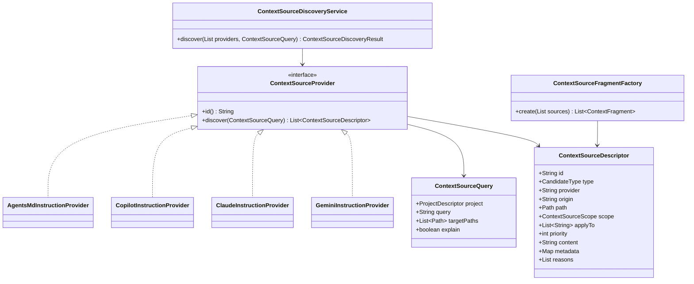
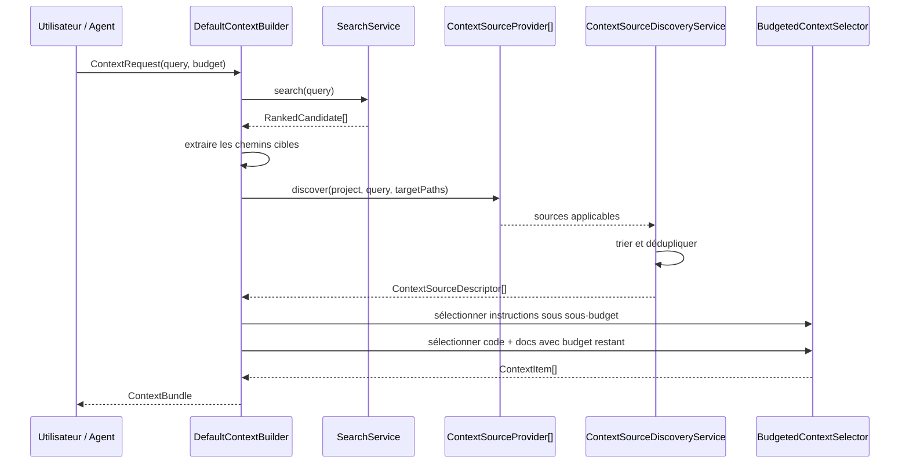

# Contexte natif des projets : instructions, documentation et configurations d'agents

Ce chapitre explique comment NEXUS réutilise le contexte déjà présent dans un repository sans imposer de migration vers un format propriétaire.

L'objectif de l'Itération 5 est :

```text
Projet existant
├── code
├── documentation
├── AGENTS.md
├── .github/copilot-instructions.md
├── .github/instructions/*.instructions.md
├── CLAUDE.md
├── .claude/CLAUDE.md
├── .github/agents/*.agent.md
├── .claude/settings.json
└── skills
        │
        ▼
      NEXUS
        │
        ├── utilise ce qui constitue réellement du contexte
        ├── respecte les scopes natifs
        ├── détecte les configurations sans les injecter
        └── explique chaque décision
```

## 1. Principe fondamental

NEXUS ne remplace pas la configuration existante d'une application.

Il applique la règle suivante :

> **Le contexte natif du repository reste la source de vérité pour ses propres conventions ; NEXUS le normalise afin de pouvoir le sélectionner et le budgéter avec le reste du contexte.**

Il n'est donc pas nécessaire de copier un `CLAUDE.md` vers `AGENTS.md`, ni de recopier `.github/copilot-instructions.md` dans un fichier NEXUS.

## 2. Ce qui est utilisé automatiquement

| Convention | Traitement NEXUS | Scope |
|---|---|---|
| `AGENTS.md` | instruction | arborescence sous le répertoire parent |
| `AGENT.md` | instruction, alias de compatibilité | arborescence sous le répertoire parent |
| `.github/copilot-instructions.md` | instruction | repository entier |
| `.github/instructions/**/*.instructions.md` | instruction | motifs `applyTo` |
| `CLAUDE.md` | instruction | repository ou arborescence selon sa position |
| `.claude/CLAUDE.md` | instruction | repository entier |
| `GEMINI.md` | instruction | repository ou arborescence selon sa position |
| Markdown ordinaire | documentation | ranking lexical BM25 |

## 3. Ce qui est détecté mais pas injecté automatiquement

| Convention | Pourquoi |
|---|---|
| `.claude/settings.json` | configuration opérationnelle, permissions et réglages |
| `.claude/settings.local.json` | configuration locale spécifique au poste |
| `.mcp.json` / `mcp.json` | configuration de serveurs MCP, pas du texte de contexte |
| `.github/agents/*.md` / `*.agent.md` | profil d'agent spécialisé, pas instruction globale |
| `.claude/agents/*.md` | profil ou sous-agent spécifique |
| `.github/hooks/*.json` / `.claude/hooks/*.json` | commandes ou hooks exécutables |
| `.github/skills/**/SKILL.md` | skill détecté mais sélection progressive prévue en Itération 6 |
| `.claude/skills/**/SKILL.md` | idem |
| `.agents/skills/**/SKILL.md` | idem |

Ces éléments apparaissent dans :

```text
ContextBundle.metadata.nativeCustomizationsDetected
```

Leur contenu brut n'est pas envoyé au consommateur IA.

## 4. Architecture



Les particularités des fournisseurs restent dans les providers.

`DefaultContextBuilder` ne contient aucune condition du type :

```text
if path == ".github/copilot-instructions.md"   ❌
if path == "CLAUDE.md"                         ❌
```

Il manipule uniquement les `ContextSourceDescriptor` normalisés.

## 5. Flux complet de construction



## 6. Comment NEXUS décide qu'une instruction est applicable

### Repository-wide

Exemple :

```text
.github/copilot-instructions.md
.claude/CLAUDE.md
AGENTS.md à la racine
```

Ces instructions sont applicables à toute demande concernant le repository.

### Scope répertoire

Structure :

```text
repo/
├── AGENTS.md
├── src/
│   ├── api/
│   │   ├── AGENTS.md
│   │   └── OrderController.java
│   └── batch/
│       └── BatchJob.java
```

Pour une requête qui classe `src/api/OrderController.java` :

```text
/AGENTS.md
    applicable

/src/api/AGENTS.md
    applicable
    priorité supérieure car plus proche
```

Pour `src/batch/BatchJob.java` :

```text
/AGENTS.md
    applicable

/src/api/AGENTS.md
    non applicable
```

NEXUS conserve les instructions parentes au lieu de supprimer automatiquement leur contenu. La priorité permet aux règles les plus spécifiques d'être favorisées sous budget.

## 7. Instructions Copilot `applyTo`

Exemple :

```markdown
---
applyTo: "src/main/java/**/*.java"
---

Toujours ajouter des tests pour une modification métier.
```

Le provider :

1. lit le frontmatter ;
2. extrait `applyTo` ;
3. normalise les chemins repository avec `/` ;
4. compare les motifs aux fichiers candidats de `SearchService` ;
5. sélectionne l'instruction uniquement si au moins un candidat correspond.

Exemple :

```text
requête → OrderService
candidat → src/main/java/orders/OrderService.java
applyTo  → src/main/java/**/*.java
résultat → applicable
```

Une instruction :

```text
applyTo: "frontend/**"
```

ne sera pas injectée pour cette même requête.

## 8. Références `@fichier`

NEXUS prend en charge les références dans les formats où elles sont pertinentes, notamment `AGENTS.md`, `CLAUDE.md` et les instructions Copilot repository-wide.

Exemple :

```markdown
Consulter @docs/architecture.md avant une modification structurelle.
```

Le fichier référencé devient une source contextuelle de priorité légèrement inférieure à l'instruction qui le référence.

### Contraintes de sécurité

```text
@docs/architecture.md       ✅
@../outside-secret.txt      ❌ si la résolution sort du repository
@C:/private/file.txt        ❌
@~/.claude/private.md       ❌
```

La récursion est limitée à cinq niveaux et les cycles sont arrêtés.

Les références placées dans des blocs Markdown délimités par des fences ne sont pas interprétées.

## 9. Déduplication

Une équipe peut conserver temporairement la même règle dans :

```text
AGENTS.md
CLAUDE.md
.github/copilot-instructions.md
```

Si les contenus normalisés sont identiques, `ContextSourceDiscoveryService` calcule une empreinte SHA-256 et ne conserve qu'une seule source dans le budget.

Les doublons sont listés dans :

```text
metadata.nativeSourcesDeduplicated
```

## 10. Budget des instructions

Les instructions applicables ont un statut différent d'un simple résultat lexical : elles décrivent **comment travailler** sur le projet.

Mais elles ne doivent pas consommer tout le contexte.

La politique initiale est :

```text
instructionBudget = min(
    budgetTotal,
    600,
    max(24, budgetTotal / 4)
)
```

Exemples :

| Budget total | Budget maximal instructions |
|---:|---:|
| 180 | 45 |
| 500 | 125 |
| 2 000 | 500 |
| 8 000 | 600 |

Le budget réellement non utilisé par les instructions revient au contexte de tâche.

```text
Budget total
   │
   ├── instructions applicables, plafonnées
   │
   └── reste disponible
          ├── code
          ├── symboles
          ├── tests
          └── documentation
```

## 11. Documentation Markdown

Les fichiers `.md` ordinaires sont maintenant :

1. scannés par `ProjectScanner` ;
2. catégorisés `DOCUMENTATION` ;
3. analysés par `MarkdownLanguageAnalyzer` ;
4. stockés dans SQLite ;
5. indexés dans Lucene ;
6. retournés comme `CandidateType.DOCUMENTATION` lorsqu'ils sont pertinents.

Le `MarkdownLanguageAnalyzer` ne produit pas encore de symboles de titres ou de sections. Pour l'Itération 5, Lucene recherche le contenu et `ContextFragmentFactory` extrait le fichier complet lorsqu'il est court ou des fenêtres lexicales lorsqu'il est long.

## 12. Instructions, profils d'agents et skills : ne pas confondre

### Instruction

```text
AGENTS.md
CLAUDE.md
copilot-instructions.md
```

Elle peut s'appliquer automatiquement selon son scope.

### Profil d'agent

```text
.github/agents/security-review.agent.md
```

Il décrit un spécialiste avec éventuellement ses outils et MCP.

NEXUS le détecte mais ne l'applique pas automatiquement.

Un futur workflow pourra faire :

```text
requête
  ↓
NEXUS recommande security-review
  ↓
JARVIS / client choisit l'agent
```

### Skill

```text
.github/skills/testing/SKILL.md
.claude/skills/testing/SKILL.md
.agents/skills/testing/SKILL.md
```

Il représente une capacité réutilisable et fera l'objet de la divulgation progressive de l'Itération 6.

## 13. Configuration Claude

Considérons :

```text
.claude/
├── CLAUDE.md
├── settings.json
├── settings.local.json
└── agents/
    └── reviewer.md
```

NEXUS traite :

```text
CLAUDE.md
→ INSTRUCTION
→ peut entrer dans le ContextBundle
```

mais :

```text
settings.json
settings.local.json
→ détectés
→ metadata.nativeCustomizationsDetected
→ jamais injectés comme texte brut
```

Les permissions, hooks ou réglages de modèle restent la responsabilité de Claude Code.

## 14. Configuration Copilot

Considérons :

```text
.github/
├── copilot-instructions.md
├── instructions/
│   ├── java.instructions.md
│   └── frontend.instructions.md
├── agents/
│   └── documentation.agent.md
└── skills/
    └── testing/
        └── SKILL.md
```

NEXUS traite :

```text
copilot-instructions.md
→ instruction repository-wide

instructions/*.instructions.md
→ instruction conditionnelle selon applyTo

agents/*.md
→ profil détecté, non injecté

skills/**/SKILL.md
→ skill détecté, non chargé avant Itération 6
```

## 15. Comment utiliser un projet déjà configuré avec NEXUS

Aucune migration n'est requise.

### Étape 1 — Enregistrer

```powershell
.\scripts\nexus.ps1 project add N:\workspace-dev\mon-app mon-app
```

### Étape 2 — Indexer

```powershell
.\scripts\nexus.ps1 index mon-app
```

NEXUS indexe :

- Java ;
- documentation Markdown ;
- métadonnées des fichiers d'instructions/profils/skills.

### Étape 3 — Construire un contexte

```powershell
.\scripts\nexus.ps1 context mon-app "modifier OrderService" --budget 2000 --explain
```

NEXUS :

1. trouve `OrderService` ;
2. utilise ce chemin comme cible de scope ;
3. découvre les instructions applicables ;
4. exclut les instructions frontend non applicables ;
5. détecte les configurations d'agents existantes ;
6. sélectionne la documentation pertinente ;
7. construit le bundle sous 2 000 tokens.

### Étape 4 — Inspecter précisément en JSON

```powershell
$result = .\scripts\nexus.ps1 context mon-app "modifier OrderService" --budget 2000 --explain --json | ConvertFrom-Json

$result.items | Select-Object type, path, estimatedTokens
$result.metadata.instructionProviders
$result.metadata.nativeSourcesDiscovered
$result.metadata.nativeSourcesDeduplicated
$result.metadata.nativeCustomizationsDetected
```

## 16. Exemple de résultat conceptuel

```text
ContextBundle 1 842 / 2 000 tokens
│
├── INSTRUCTION  .github/instructions/java.instructions.md
├── INSTRUCTION  src/main/java/orders/AGENTS.md
├── INSTRUCTION  AGENTS.md
├── SYMBOL       OrderService.java#createOrder
├── TEST         OrderServiceTest.java
└── DOCUMENTATION docs/order-processing.md
```

Le consommateur reçoit donc **les règles applicables et le contexte métier**, pas tous les fichiers de configuration du repository.

## 17. Limites actuelles

L'Itération 5 ne prétend pas reproduire parfaitement le runtime de chaque outil.

Notamment :

- les instructions utilisateur dans le home (`~/.claude`, `~/.copilot`) ne sont pas chargées ;
- les instructions d'organisation GitHub ne sont pas disponibles depuis un simple repository local ;
- les profils d'agents ne sont pas sélectionnés automatiquement ;
- les skills ne sont pas encore chargés ;
- les hooks et serveurs MCP ne sont jamais exécutés ;
- le Markdown n'a pas encore d'index structurel de titres ;
- les conflits sémantiques entre deux règles différentes sont arbitrés par priorité et budget, pas par raisonnement LLM.

Ces limites sont intentionnelles afin de conserver NEXUS local, déterministe et explicable.

## 18. Références externes

- AGENTS.md : https://agents.md/
- GitHub Copilot repository instructions : https://docs.github.com/en/copilot/how-tos/copilot-on-github/customize-copilot/add-custom-instructions/add-repository-instructions
- GitHub Copilot CLI instructions : https://docs.github.com/en/copilot/how-tos/copilot-cli/customize-copilot/add-custom-instructions
- GitHub Copilot custom agents : https://docs.github.com/en/copilot/concepts/agents/cloud-agent/about-custom-agents
- Claude Code memory : https://docs.anthropic.com/en/docs/claude-code/memory

## 19. Décisions d'architecture

- ADR-0011 — normaliser les sources de contexte derrière des providers ;
- ADR-0012 — réutiliser les standards existants ;
- ADR-0032 — préserver et normaliser le contexte natif des projets ;
- ADR-0033 — séparer instructions contextuelles et configuration opérationnelle.
