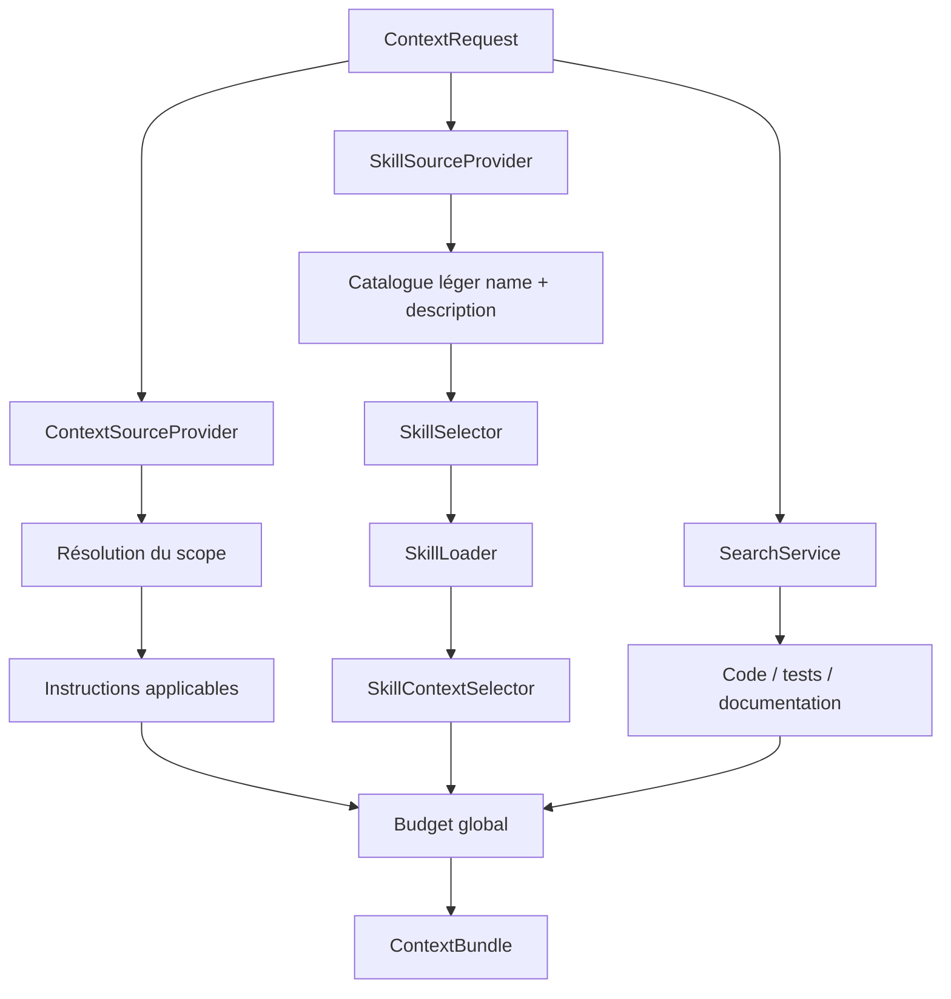

# Contexte natif des projets : instructions, documentation, skills et configurations d'agents

Ce chapitre explique comment NEXUS réutilise le contexte déjà présent dans un repository sans imposer de migration vers un format propriétaire.

Il couvre désormais deux familles de sources contextuelles actives :

```text
Instructions natives
→ applicabilité par scope

Agent Skills
→ découverte légère
→ sélection par métadonnées
→ activation progressive
```

Les configurations opérationnelles restent séparées.

## 1. Principe fondamental

NEXUS ne remplace pas la configuration existante d'une application.

> **Le contexte natif du repository reste la source de vérité pour ses propres conventions ; NEXUS le normalise afin de pouvoir le sélectionner et le budgéter avec le reste du contexte.**

Un projet peut donc conserver simultanément :

```text
repo/
├── AGENTS.md
├── CLAUDE.md
├── GEMINI.md
├── .github/
│   ├── copilot-instructions.md
│   ├── instructions/
│   ├── agents/
│   └── skills/
├── .claude/
│   ├── CLAUDE.md
│   ├── settings.json
│   ├── agents/
│   └── skills/
├── .agents/
│   └── skills/
├── docs/
└── src/
```

Aucune migration vers un fichier propriétaire NEXUS n'est nécessaire.

## 2. Matrice de traitement

| Convention | Traitement NEXUS | Injection automatique |
|---|---|---|
| `AGENTS.md` | instruction avec scope répertoire | oui si applicable |
| `AGENT.md` | alias compatible de `AGENTS.md` | oui si applicable |
| `.github/copilot-instructions.md` | instruction repository-wide | oui |
| `.github/instructions/**/*.instructions.md` | instruction avec `applyTo` | oui si applicable |
| `CLAUDE.md` | instruction repository/répertoire | oui si applicable |
| `.claude/CLAUDE.md` | instruction repository-wide | oui |
| `GEMINI.md` | instruction repository/répertoire | oui si applicable |
| Markdown ordinaire | documentation BM25 | oui si pertinent |
| `*/skills/**/SKILL.md` | Agent Skill | seulement après sélection |
| ressources d'un skill | métadonnées légères | non automatiquement |
| profils d'agents | personnalisation détectée | non |
| settings / permissions | configuration opérationnelle | non |
| hooks | configuration exécutable | non |
| MCP | configuration d'intégration | non |

## 3. Architecture générale



Les particularités d'un format restent derrière leur provider.

`DefaultContextBuilder` orchestre les résultats normalisés ; il ne contient pas de parser spécifique à Copilot, Claude ou au format `SKILL.md`.

## 4. Instructions repository-wide

Exemples :

```text
.github/copilot-instructions.md
.claude/CLAUDE.md
AGENTS.md à la racine
```

Ces instructions sont candidates pour toute demande concernant le repository.

Elles passent néanmoins par le budget d'instructions du `ContextBuilder`.

## 5. Instructions avec scope répertoire

Structure :

```text
repo/
├── AGENTS.md
├── src/
│   ├── api/
│   │   ├── AGENTS.md
│   │   └── OrderController.java
│   └── batch/
│       └── BatchJob.java
```

Pour une requête qui classe :

```text
src/api/OrderController.java
```

NEXUS peut sélectionner :

```text
/AGENTS.md
/src/api/AGENTS.md
```

L'instruction la plus proche reçoit une priorité supérieure.

Pour :

```text
src/batch/BatchJob.java
```

`src/api/AGENTS.md` n'est pas applicable.

## 6. Instructions Copilot `applyTo`

Exemple :

```markdown
---
applyTo: "src/main/java/**/*.java"
---

Toujours ajouter des tests pour une modification métier.
```

Le provider :

1. lit le frontmatter ;
2. extrait `applyTo` ;
3. normalise les chemins repository avec `/` ;
4. compare les motifs aux fichiers candidats ;
5. sélectionne l'instruction si au moins une cible correspond.

Une règle :

```text
applyTo: "frontend/**"
```

ne s'applique pas à un `OrderService.java` situé sous `src/main/java`.

## 7. Références `@fichier`

Les instructions peuvent référencer du contexte local :

```markdown
Consulter @docs/architecture.md avant une modification structurelle.
```

Le fichier référencé devient une source contextuelle liée à l'instruction.

Protections :

```text
@docs/architecture.md       ✅
@../outside-secret.txt      ❌ si sortie du repository
@C:/private/file.txt        ❌
@~/.claude/private.md       ❌
fichier .nexusignore        ❌
```

La récursion est limitée à cinq niveaux et les cycles sont arrêtés.

Les références dans des blocs Markdown fenced ne sont pas interprétées.

## 8. Déduplication des instructions

Une équipe peut temporairement recopier la même règle dans :

```text
AGENTS.md
CLAUDE.md
.github/copilot-instructions.md
```

`ContextSourceDiscoveryService` calcule une empreinte SHA-256 du contenu normalisé.

Les doublons apparaissent dans :

```text
metadata.nativeSourcesDeduplicated
```

La déduplication existe également entre une documentation explicitement référencée et la même documentation remontée par Lucene.

La métrique correspondante est :

```text
metadata.crossSourceDeduplicatedFragments
```

## 9. Budget des instructions

Politique actuelle :

```text
instructionBudget = min(
    budgetTotal,
    600,
    max(24, budgetTotal / 4)
)
```

Le budget non consommé revient au reste du contexte.

## 10. Documentation Markdown

Les fichiers `.md` ordinaires sont :

1. scannés ;
2. catégorisés `DOCUMENTATION` ;
3. analysés par `MarkdownLanguageAnalyzer` ;
4. stockés dans SQLite ;
5. indexés dans Lucene ;
6. retournés comme `CandidateType.DOCUMENTATION` lorsqu'ils sont pertinents.

Les fichiers situés sous un dossier de skill sont une exception : ils restent de catégorie `SKILL` et sont exclus de la recherche documentaire générique.

Cette exception empêche par exemple :

```text
.agents/skills/pdf-processing/references/forms.md
```

d'apparaître comme documentation avant activation du skill.

## 11. Agent Skills

Racines locales reconnues :

```text
.agents/skills/**/SKILL.md
.github/skills/**/SKILL.md
.claude/skills/**/SKILL.md
```

Le traitement est :

```text
Découverte
→ frontmatter seulement
→ name + description + métadonnées

Sélection
→ comparaison à la requête

Activation
→ lecture complète du SKILL.md sélectionné

Ressources
→ inventoriées
→ non chargées automatiquement
→ jamais exécutées par NEXUS
```

La documentation détaillée est dans [Agent Skills : découverte, sélection et divulgation progressive](agent-skills.md).

## 12. Instructions, profils d'agents et skills : ne pas confondre

### Instruction

```text
AGENTS.md
CLAUDE.md
copilot-instructions.md
```

Une instruction décrit des règles applicables à une zone du projet.

Elle peut être sélectionnée automatiquement en fonction du scope.

### Profil d'agent

```text
.github/agents/security-review.agent.md
```

Un profil décrit un spécialiste, éventuellement avec des outils et des serveurs MCP.

NEXUS le détecte mais ne l'applique pas automatiquement.

Un futur orchestrateur pourra décider de l'utiliser.

### Skill

```text
.agents/skills/testing/SKILL.md
```

Un skill décrit une capacité procédurale réutilisable.

NEXUS peut désormais :

```text
le découvrir
→ le sélectionner
→ inclure son SKILL.md complet
```

mais :

```text
NEXUS n'exécute pas le skill
NEXUS n'exécute pas ses scripts
NEXUS ne charge pas toutes ses ressources
```

## 13. Configuration Claude

Exemple :

```text
.claude/
├── CLAUDE.md
├── settings.json
├── settings.local.json
├── agents/
│   └── reviewer.md
└── skills/
    └── testing/
        └── SKILL.md
```

Traitement :

```text
CLAUDE.md
→ INSTRUCTION

settings*.json
→ nativeCustomizationsDetected
→ pas d'injection brute

agents/*.md
→ profil d'agent détecté

skills/**/SKILL.md
→ SkillSourceProvider
→ divulgation progressive
```

## 14. Configuration GitHub / Copilot

Exemple :

```text
.github/
├── copilot-instructions.md
├── instructions/
│   ├── java.instructions.md
│   └── frontend.instructions.md
├── agents/
│   └── documentation.agent.md
└── skills/
    └── testing/
        └── SKILL.md
```

Traitement :

```text
copilot-instructions.md
→ INSTRUCTION repository-wide

instructions/*.instructions.md
→ INSTRUCTION conditionnelle applyTo

agents/*.md
→ AGENT_PROFILE détecté, non injecté

skills/**/SKILL.md
→ SKILL découvert légèrement
→ activable si pertinent
```

## 15. Comment utiliser un projet déjà configuré

### Enregistrer

```powershell
.\scripts\nexus.ps1 project add N:\workspace-dev\mon-app mon-app
```

### Indexer

```powershell
.\scripts\nexus.ps1 index mon-app
```

### Construire un contexte

```powershell
.\scripts\nexus.ps1 context mon-app "extract PDF form with OrderService" --budget 2000 --explain
```

NEXUS :

1. classe le code et la documentation ;
2. résout les instructions applicables ;
3. découvre les skills via leurs métadonnées ;
4. sélectionne les skills pertinents ;
5. charge seulement les `SKILL.md` sélectionnés ;
6. applique les budgets ;
7. construit le bundle final.

## 16. Inspecter le résultat JSON

```powershell
$result = .\scripts\nexus.ps1 context mon-app "extract PDF form" --budget 2000 --explain --json |
    ConvertFrom-Json

$result.items | Select-Object type, path, estimatedTokens

$result.metadata.nativeSourcesDiscovered
$result.metadata.nativeSourcesDeduplicated
$result.metadata.nativeCustomizationsDetected

$result.metadata.skillsDiscovered
$result.metadata.skillsMatched
$result.metadata.skillsSelected
$result.metadata.skillResourcesDiscovered
$result.metadata.skillsExecuted
```

## 17. Exemple de bundle conceptuel

```text
ContextBundle 1 842 / 2 000 tokens
│
├── INSTRUCTION  AGENTS.md
├── INSTRUCTION  .github/instructions/java.instructions.md
├── SKILL        .agents/skills/pdf-processing/SKILL.md
├── SYMBOL       OrderService.java#createOrder
├── TEST         OrderServiceTest.java
└── DOCUMENTATION docs/order-processing.md
```

Le consommateur reçoit les règles applicables, les skills pertinents et le contexte métier — pas toute la configuration du repository.

## 18. Configuration opérationnelle détectée mais non injectée

Exemples :

```text
.claude/settings.json
.claude/settings.local.json
.mcp.json
mcp.json
.github/hooks/*.json
.claude/hooks/*.json
.github/agents/*.agent.md
.claude/agents/*.md
```

Ces éléments peuvent apparaître sous :

```text
metadata.nativeCustomizationsDetected
```

Ils ne sont pas interprétés comme instructions de contexte.

## 19. Sécurité

NEXUS conserve les règles suivantes :

```text
contenu hors repository              ❌
fichier ignoré                        ❌
settings injectés automatiquement     ❌
hook exécuté                          ❌
serveur MCP lancé                     ❌
script d'un skill exécuté             ❌
```

Les `SKILL.md` sélectionnés sont du contexte déclaratif. Leur exécution reste la responsabilité du consommateur.

## 20. Limites actuelles

- Les instructions utilisateur dans le home ne sont pas chargées.
- Les instructions d'organisation GitHub ne sont pas disponibles depuis un repository local seul.
- Les profils d'agents ne sont pas sélectionnés automatiquement.
- Les ressources de skills ne peuvent pas encore être demandées individuellement via la CLI.
- Les scripts de skills ne sont jamais exécutés.
- Le Markdown ordinaire n'a pas encore d'index structurel de titres.
- Les conflits sémantiques entre règles différentes sont arbitrés par priorité et budget, pas par raisonnement LLM.
- La sélection des skills est actuellement lexicale et déterministe sur `name` + `description`.

## 21. Références externes

- AGENTS.md : https://agents.md/
- Agent Skills specification : https://agentskills.io/specification
- GitHub Copilot repository instructions : https://docs.github.com/en/copilot/how-tos/copilot-on-github/customize-copilot/add-custom-instructions/add-repository-instructions
- GitHub Copilot Agent Skills : https://docs.github.com/en/copilot/how-tos/copilot-cli/customize-copilot/add-skills
- GitHub Copilot custom agents : https://docs.github.com/en/copilot/concepts/agents/cloud-agent/about-custom-agents
- Claude Code memory : https://docs.anthropic.com/en/docs/claude-code/memory

## 22. Décisions d'architecture

- ADR-0011 — normaliser les sources de contexte derrière des providers ;
- ADR-0012 — réutiliser les standards existants ;
- ADR-0032 — préserver et normaliser le contexte natif des projets ;
- ADR-0033 — séparer instructions contextuelles et configuration opérationnelle ;
- ADR-0034 — adopter la divulgation progressive pour les Agent Skills.
