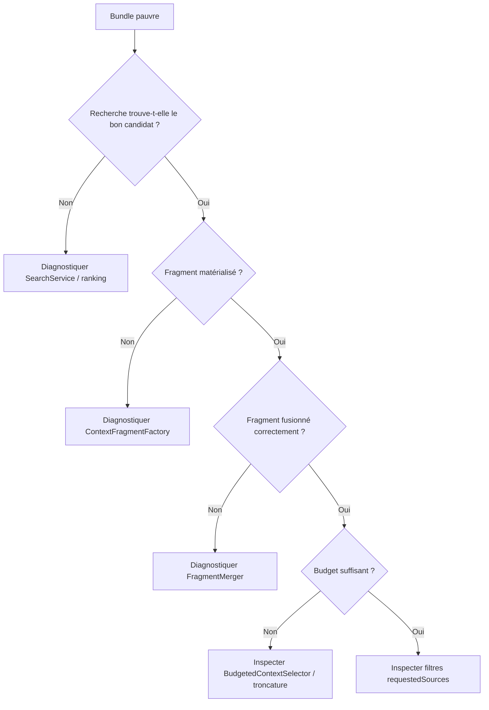
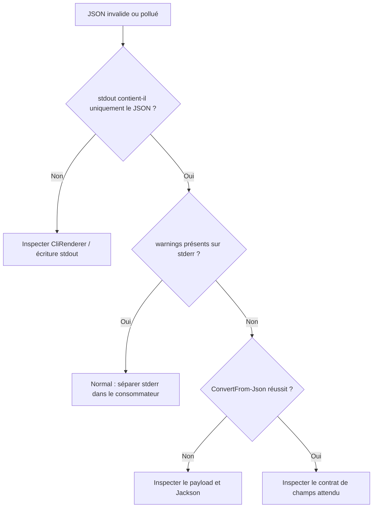

# Reproduire, tester et déboguer NEXUS

Ce chapitre permet de reconstruire les scénarios de développement depuis un poste Windows avec PowerShell et Maven.

## 1. Pré-requis

Le projet compile avec :

```text
Java --release 21
Maven
```

Un JDK plus récent peut être utilisé pour lancer Maven tant que le code compile avec la cible Java 21.

Vérification :

```powershell
java -version
mvn -version
```

## 2. Récupérer la dernière version

```powershell
cd N:\workspace-dev\nexus-context-engine
git pull --ff-only
```

## 3. Build complet

```powershell
mvn clean install
```

Ce build doit :

1. nettoyer `target` ;
2. copier les migrations SQL ;
3. compiler le code avec `release 21` ;
4. compiler les tests ;
5. exécuter JUnit ;
6. publier les métriques de qualité du corpus golden dans le log ;
7. générer le JAR bibliothèque ;
8. générer le JAR CLI autonome avec classifier `cli` ;
9. installer les artefacts Maven locaux.

Artefacts attendus :

```text
target/nexus-context-engine-0.1.0-SNAPSHOT.jar
target/nexus-context-engine-0.1.0-SNAPSHOT-cli.jar
```

Le second est directement exécutable :

```powershell
java -jar .\target\nexus-context-engine-0.1.0-SNAPSHOT-cli.jar --version
```

## 4. Avertissements connus non bloquants

Selon le JDK, vous pouvez observer :

### Maven / Guice

```text
sun.misc.Unsafe::staticFieldBase
```

Ce warning provient actuellement des bibliothèques utilisées par Maven/Guice, pas du code métier NEXUS.

### SQLite JDBC

```text
Use --enable-native-access=ALL-UNNAMED
```

Le driver SQLite charge une bibliothèque native. Le warning doit être surveillé pour les futures versions Java, mais il ne bloque pas actuellement le build.

### SLF4J

```text
No SLF4J providers were found
```

NEXUS n'a pas encore choisi de backend de logging. SLF4J utilise donc une implémentation NOP pour les dépendances concernées.

### Lucene Vector API

```text
Java vector incubator module is not readable
```

Le moteur lexical fonctionne sans le module vectoriel. Ce warning concerne une optimisation potentielle.

## 5. Lancer le self-smoke complet

```powershell
.\scripts\self-smoke.ps1 -KeepData
```

Le script utilise son propre `NEXUS_HOME` :

```text
target/nexus-self-smoke-home
```

Il valide maintenant dix étapes sur le **JAR autonome** :

```text
1. construire le JAR CLI autonome
2. valider --version --json
3. enregistrer NEXUS avec project add --json
4. vérifier project list --json
5. première indexation complète --json
6. seconde indexation attendue avec 0 changement
7. inspect --json avec état READY
8. search --explain --json
9. context --budget 180 --explain --json
10. vérifier la sortie humaine sans --json
```

Les sorties JSON sont réellement parsées avec :

```powershell
ConvertFrom-Json
```

Le résultat attendu est :

```text
SELF-SMOKE SUCCESS
```

Le script affiche aussi une section :

```text
=== METRICS ===
```

avec les latences observées pour :

- indexation complète ;
- indexation incrémentale ;
- recherche ;
- construction du contexte ;
- réduction du contexte candidat.

Avec `-KeepData`, les données SQLite/Lucene restent disponibles après le script.

## 6. Tester manuellement avec un NEXUS_HOME isolé

```powershell
$env:NEXUS_HOME = "$PWD\target\manual-nexus-home"
```

Supprimer ce répertoire permet de repartir de zéro :

```powershell
Remove-Item -Recurse -Force $env:NEXUS_HOME -ErrorAction SilentlyContinue
```

## 7. Choisir le mode d'exécution CLI

Après `mvn clean install`, le mode recommandé est :

```powershell
.\scripts\nexus.ps1 --help
```

Le script localise le dernier JAR `*-cli.jar` puis exécute :

```text
java -jar <jar-cli> ...
```

Le launcher CMD est également disponible :

```cmd
scripts\nexus.cmd --help
```

L'exécution Maven reste possible pendant le développement :

```powershell
mvn -q exec:java "-Dexec.args=--help"
```

mais elle n'est plus le chemin principal de validation du MVP.

## 8. Enregistrer le projet

```powershell
.\scripts\nexus.ps1 project add . nexus-manual
```

Vérifier :

```powershell
.\scripts\nexus.ps1 project list
```

Vous devez voir :

```text
<uuid>    nexus-manual    NOT_INDEXED    <chemin>
```

Version JSON :

```powershell
.\scripts\nexus.ps1 project list --json
```

## 9. Indexer

```powershell
.\scripts\nexus.ps1 index nexus-manual
```

Après succès :

```powershell
.\scripts\nexus.ps1 inspect nexus-manual
```

Le statut attendu est :

```text
READY
```

Version JSON :

```powershell
.\scripts\nexus.ps1 inspect nexus-manual --json
```

## 10. Vérifier l'idempotence

Relancer :

```powershell
.\scripts\nexus.ps1 index nexus-manual --json
```

Sans modification du repository :

```text
report.changedFiles = 0
report.removedFiles = 0
```

Si ce n'est pas le cas :

1. identifier le chemin considéré comme changé ;
2. comparer son SHA-256 ;
3. vérifier si un outil modifie le fichier pendant le build ;
4. vérifier `.gitignore` / `.nexusignore` ;
5. ajouter un test de non-régression avant correction.

## 11. Forcer la reconstruction Lucene

```powershell
.\scripts\nexus.ps1 index nexus-manual --rebuild
```

Utiliser cette commande lorsque :

- l'index Lucene a été supprimé ;
- une évolution de schéma d'index l'exige ;
- vous suspectez une incohérence entre SQLite et Lucene.

SQLite reste la source structurelle de référence.

## 12. Rechercher

```powershell
.\scripts\nexus.ps1 search nexus-manual ProjectIndexingService --limit 5 --explain
```

À vérifier :

- `ProjectIndexingService.java` remonte ;
- le score est affiché ;
- les raisons sont cohérentes ;
- une deuxième exécution sans changement produit le même ordre ;
- la latence en millisecondes est affichée.

Version JSON :

```powershell
$result = .\scripts\nexus.ps1 search nexus-manual ProjectIndexingService --limit 5 --explain --json | ConvertFrom-Json
$result.durationMs
$result.results[0]
```

## 13. Construire un contexte

```powershell
.\scripts\nexus.ps1 context nexus-manual ProjectIndexingService --budget 500 --explain
```

À vérifier :

```text
estimatedTokens <= 500
```

La sortie doit présenter :

- les items retenus ;
- le chemin relatif ;
- la plage de lignes ;
- le contenu ;
- le nombre de tokens estimés ;
- `[TRONQUÉ]` lorsque nécessaire ;
- les métadonnées et exclusions en mode `--explain` ;
- la latence de construction.

Version JSON :

```powershell
$context = .\scripts\nexus.ps1 context nexus-manual ProjectIndexingService --budget 500 --explain --json | ConvertFrom-Json
$context.estimatedTokens
$context.tokenBudget
$context.metadata.reductionRatio
```

## 14. Tester un petit budget

Pour provoquer les arbitrages :

```powershell
.\scripts\nexus.ps1 context nexus-manual ProjectIndexingService --budget 80 --explain
```

Observer :

- quels fragments sont retenus ;
- si un fragment est tronqué ;
- les exclusions ;
- `reductionRatio`.

Ce test est utile lors d'une modification de `BudgetedContextSelector`.

## 15. Vérifier les codes de sortie

Succès :

```powershell
.\scripts\nexus.ps1 --version
$LASTEXITCODE
# 0
```

Erreur d'utilisation :

```powershell
.\scripts\nexus.ps1 unknown-command --json
$LASTEXITCODE
# 2
```

Le JSON d'erreur est écrit sur `stderr` et contient :

```text
error
exitCode
message
```

Une erreur d'exécution inattendue utilise le code `1`.

## 16. Inspecter SQLite

Le fichier de base est résolu par `NexusPaths` sous `NEXUS_HOME`.

Avec un client SQLite, inspecter notamment :

```sql
SELECT id, name, root_path, index_status
FROM projects;
```

```sql
SELECT relative_path, content_hash, category
FROM indexed_files
ORDER BY relative_path;
```

```sql
SELECT f.relative_path, s.kind, s.qualified_name, s.start_line, s.end_line
FROM symbols s
JOIN indexed_files f ON f.id = s.file_id
ORDER BY f.relative_path, s.start_line;
```

```sql
SELECT kind, source_ref, target_ref, source_provider
FROM symbol_relations
ORDER BY source_ref, target_ref;
```

## 17. Comprendre un score de recherche

Pour un résultat donné :

```text
score =
    lexical × 0.40
  + exact   × 0.30
  + fuzzy   × 0.10
  + path    × 0.10
  + graph   × 0.10
```

Le mode `--explain` doit permettre de refaire le calcul à la main.

Si le score affiché ne correspond pas aux contributions :

1. vérifier `DeterministicContextRanker` ;
2. vérifier que les signaux sont bornés à `[0,1]` ;
3. vérifier `CandidateMerger` ;
4. ajouter un test.

## 18. Comprendre un ContextBundle trop pauvre

Diagnostic recommandé :



Cette méthode évite de modifier le ranking lorsqu'en réalité le problème vient du budget, ou inversement.

## 19. Diagnostiquer un problème JSON



Règle : les warnings JVM ou bibliothèques peuvent apparaître sur `stderr`, mais ne doivent jamais être concaténés au document JSON de succès sur `stdout`.

## 20. Encodage PowerShell 5.1

Windows PowerShell 5.1 peut afficher certains accents provenant des processus Java/Maven sous une forme incorrecte :

```text
modifiÚs
rÚsultat
```

Le self-smoke est écrit de manière ASCII-safe pour ses assertions et capture `stdout` / `stderr` dans des fichiers séparés.

Ce problème d'affichage ne signifie pas que les données SQLite ou Lucene sont corrompues.

## 21. Ajouter un test de non-régression

Ordre recommandé :

1. reproduire le bug dans un test ;
2. vérifier que le test échoue ;
3. corriger la classe la plus locale possible ;
4. exécuter `mvn clean install` ;
5. exécuter le self-smoke ;
6. mettre à jour la documentation si le comportement observable change ;
7. créer un ADR si la correction modifie une décision structurante.

## 22. Nettoyer l'environnement de test

```powershell
Remove-Item -Recurse -Force .\target\nexus-self-smoke-home -ErrorAction SilentlyContinue
Remove-Item Env:NEXUS_HOME -ErrorAction SilentlyContinue
```

Le prochain self-smoke recréera un environnement propre.

## 23. Matrice de diagnostic rapide

| Symptôme | Zone probable |
|---|---|
| fichier absent dès l'index | `ProjectScanner`, ignore rules |
| fichier toujours « modifié » | SHA-256 / contenu généré |
| symboles absents | `JavaParserLanguageAnalyzer` |
| SQLite correct, recherche absente | synchronisation / Lucene |
| fichier trouvé mais mal classé | signaux / `DeterministicContextRanker` |
| voisin pertinent absent | graphe d'imports |
| recherche correcte, contexte absent | `ContextFragmentFactory` |
| contenu dupliqué | `FragmentMerger` |
| budget dépassé | `BudgetedContextSelector` / `TokenEstimator` |
| bundle non déterministe | tri ou collection non ordonnée |
| JSON mélangé à des warnings | séparation stdout/stderr de la CLI ou du wrapper |
| `*-cli.jar` introuvable | phase Maven package / Shade Plugin |
| JAR autonome démarre mais SQLite échoue | services `META-INF/services` ou packaging natif |
