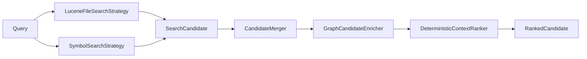
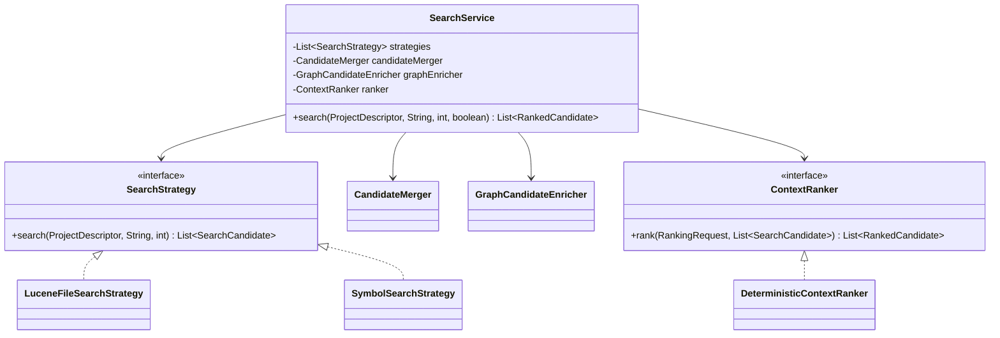
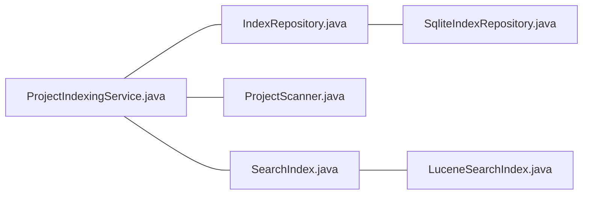
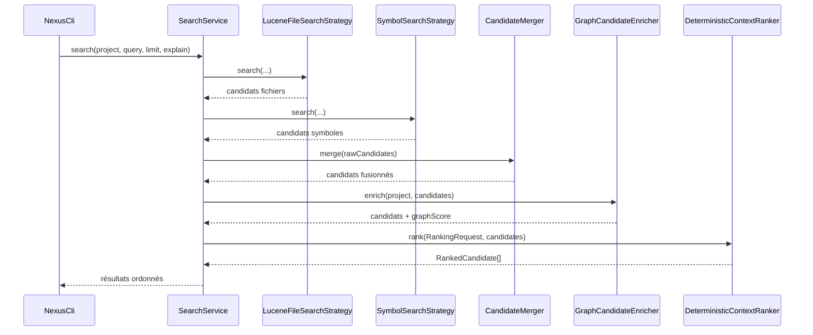

# Recherche, graphe et ranking explicable

Ce chapitre décrit l'Itération 2 telle qu'elle est implémentée et validée.

## 1. Objectif

À partir de :

```text
ProjectDescriptor + requête texte
```

produire :

```text
List<RankedCandidate>
```

avec :

- les fichiers et symboles pertinents ;
- un ordre stable ;
- un score composé ;
- les composantes exactes du score ;
- des raisons lisibles lorsque `explain=true`.

## 2. Pipeline général



Le service orchestrateur est `SearchService`.

## 3. Diagramme UML des principales classes



## 4. Recherche lexicale Lucene

`LuceneFileSearchStrategy` appelle `SearchIndex.search`.

L'implémentation `LuceneSearchIndex` utilise un `MultiFieldQueryParser` avec les boosts suivants :

| Champ | Boost Lucene |
|---|---:|
| `symbol_name` | 5.0 |
| `qualified_name` | 4.0 |
| `path_text` | 3.0 |
| `content` | 1.0 |

Lucene utilise son ranking BM25 par défaut pour produire le score brut.

Le score lexical brut est ensuite normalisé relativement au meilleur hit de la requête :

```text
lexicalScore = hit.score / maxHitScore
```

Ainsi le signal transmis au ranker est borné entre 0 et 1.

### Exemple

Pour :

```text
ProjectIndexingService
```

un fichier contenant exactement ce nom dans son chemin et ses symboles bénéficie :

- du score BM25 ;
- d'un `pathScore` ;
- potentiellement d'un `graphScore` ensuite.

## 5. Recherche de symboles SQLite

`SymbolSearchStrategy` lit les symboles via `IndexRepository.findSymbols(projectId)`.

Elle calcule deux signaux.

### `symbolExactScore`

Vaut `1.0` lorsque :

- le nom du symbole égale la requête ;
- le nom qualifié égale la requête ;
- un terme de la requête égale le nom ;
- un terme correspond à la fin du nom qualifié.

Sinon :

```text
symbolExactScore = 0.0
```

### `symbolFuzzyScore`

La stratégie conserve :

- `0.9` lorsqu'un nom contient directement un terme ;
- une similarité textuelle calculée par `SearchText.similarity` ;
- le meilleur score parmi les termes.

Seuls les candidats avec :

```text
symbolExactScore > 0
OU
symbolFuzzyScore >= 0.62
```

sont retenus.

## 6. Correspondance de chemin

Le signal `pathScore` mesure la proportion de termes de la requête présents dans le chemin normalisé.

Exemple :

```text
query = "project indexing service"
path  = "src/main/java/.../ProjectIndexingService.java"
```

Plus les termes sont présents dans le chemin, plus le score approche `1.0`.

## 7. Fusion des candidats

Lucene et SQLite peuvent retourner des éléments concernant le même fichier.

`CandidateMerger` combine leurs signaux au lieu de laisser les stratégies se concurrencer avec des représentations incohérentes.

La philosophie est :

```text
une source trouve un candidat
+ une autre source confirme sa pertinence
= candidat enrichi
```

Les signaux restent séparés ; ils ne sont pas additionnés à ce stade.

## 8. Construction du graphe

`ProjectGraphBuilder` utilise :

- les types définis dans `symbols` ;
- les relations `IMPORTS` dans `symbol_relations`.

### Étape 1 — propriétaire de type

Construction d'une table :

```text
qualifiedName → relativePath
```

Exemple :

```text
io.github.fturleque.nexus.search.SearchService
→ src/main/java/io/github/fturleque/nexus/search/SearchService.java
```

### Étape 2 — résolution des imports

Pour une relation :

```text
source_ref = chemin du fichier source
target_ref = type importé
```

NEXUS cherche le fichier qui définit `target_ref`.

Les imports externes qui ne correspondent à aucun type interne sont ignorés.

### Étape 3 — graphe non orienté

Le graphe final relie les fichiers internes dépendants.



Le graphe est actuellement rendu non orienté pour mesurer une proximité structurelle locale.

## 9. Propagation du signal de graphe

`GraphCandidateEnricher` part des candidats directs.

Le score direct utilisé comme graine est le maximum parmi :

```text
lexicalScore
symbolExactScore
symbolFuzzyScore
pathScore
```

Propagation :

```text
premier saut  = seedScore × 0.65
second saut   = seedScore × 0.35
```

Le résultat est borné à `1.0`.

Cette propagation est volontairement limitée. NEXUS n'implémente pas encore PageRank.

Le but est de disposer d'une baseline structurelle simple avant de mesurer si une propagation globale apporte un réel gain.

## 10. Ranking final

`DeterministicContextRanker` applique les poids suivants :

| Signal normalisé | Poids final |
|---|---:|
| `lexicalScore` | 0.40 |
| `symbolExactScore` | 0.30 |
| `symbolFuzzyScore` | 0.10 |
| `pathScore` | 0.10 |
| `graphScore` | 0.10 |

Formule :

```text
score =
    lexicalScore     × 0.40
  + symbolExactScore × 0.30
  + symbolFuzzyScore × 0.10
  + pathScore        × 0.10
  + graphScore       × 0.10
```

Chaque signal est borné entre 0 et 1 avant multiplication.

## 11. Déterminisme

Le tri final utilise :

1. score décroissant ;
2. ordre de type (`SYMBOL`, `TEST`, `FILE`, ...) ;
3. chemin ;
4. identifiant du candidat.

Cela garantit un résultat stable lorsque deux candidats ont le même score.

## 12. Explication du score

Lorsque `--explain` est demandé, chaque contribution positive produit une raison.

Exemple réel du self-smoke :

```text
ProjectIndexingService.java
score = 0.5585

correspondance lexicale BM25 : 1.000 → +0.400
correspondance du chemin      : 1.000 → +0.100
proximité dans le graphe      : 0.585 → +0.059
```

L'explication n'est pas générée par un LLM : elle est une projection directe du calcul.

## 13. Séquence d'une recherche



## 14. Corpus golden

NEXUS possède un corpus de requêtes de référence sous les ressources de test.

L'objectif n'est pas seulement de vérifier qu'une recherche retourne quelque chose, mais de vérifier que les chemins attendus remontent assez haut.

Les métriques disponibles sont :

### Precision@K

```text
nombre de résultats pertinents dans les K premiers
-------------------------------------------------
K
```

### Recall@K

```text
nombre de résultats pertinents retrouvés dans les K premiers
-----------------------------------------------------------
nombre total de résultats pertinents attendus
```

Ces métriques doivent guider les futurs changements de poids.

Changer un poids uniquement parce qu'un exemple « semble meilleur » n'est pas suffisant : il faut vérifier le corpus.

## 15. Reproduire une recherche

Après indexation :

```powershell
mvn -q exec:java "-Dexec.args=search nexus-local ProjectIndexingService --limit 5 --explain"
```

Le résultat doit montrer :

- le score total ;
- le type (`FILE`, `SYMBOL`, etc.) ;
- le chemin ou symbole ;
- les raisons si `--explain` est actif.

## 16. Ajouter un nouveau signal

Procédure recommandée :

1. créer le signal dans `SearchSignals` ;
2. produire une valeur normalisée `[0,1]` ;
3. préserver le signal dans `CandidateMerger` ;
4. définir son poids dans `DeterministicContextRanker` ;
5. ajouter son explication ;
6. mesurer le corpus golden avant/après ;
7. créer un ADR si le signal change significativement la stratégie de ranking.

## 17. Limites actuelles

Le graphe ne connaît pas encore :

- toutes les références de symboles ;
- les appels de méthodes fiables ;
- les implémentations résolues ;
- les dépendances dynamiques ;
- les relations multi-langages.

Ces enrichissements sont prévus via SCIP ou JDT sans changer le contrat du ranker.
